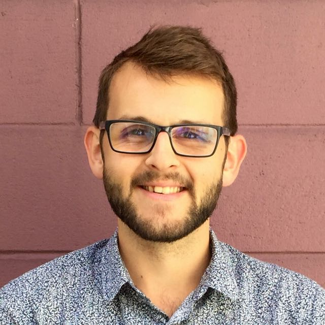

I'm a research analyst at [Motu](https://motu.nz), a non-profit economic  research institute in Wellington, New Zealand.
I work with [Dave Maré](https://motu.nz/about-us/people/dave-mare/) and [Adam Jaffe](https://motu.nz/about-us/people/adam-jaffe/) on a range of projects that combine economics with network science.

I joined Motu in 2018 after completing a BSc(Hons) in economics and mathematics at the University of Canterbury.
[I won the Sir Frank Holmes Prize](https://motu.nz/about-us/news/motu-news-december-2016/#frank) for being New Zealand's top undergraduate economics student.

I spend my leisure time reading, writing, playing guitar and staying fit.

### Contact

Get in touch with me by <a href="mailto:">email</a>, or find me on <a href="">GitHub</a> or <a href="">LinkedIn</a>.
