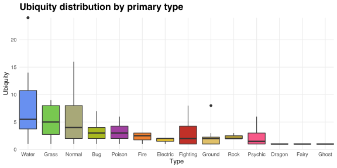
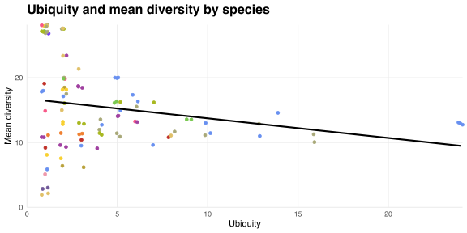
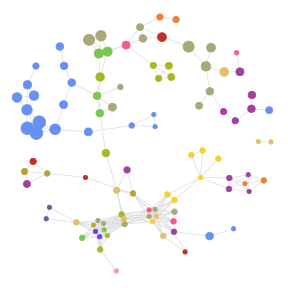
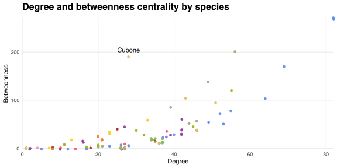
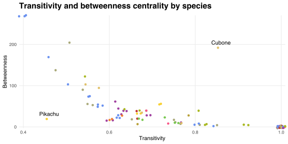

In this post, I use R's [igraph](http://igraph.org) package to analyse the cohabitation network among wild Pokémon species.
The underlying data come from [the GitHub repository](https://github.com/veekun/pokedex) behind [veekun](https://veekun.com).

## Matching species with their habitats

I infer habitats from random encounter events in the international versions of Pokémon Red, Blue and Yellow.[^random]
I store these events in a data frame named `encounters`.
Each encounter has three attributes: the `location`, the `species` encountered and that species' primary `type`.
I use these data to generate a species-location incidence matrix:

```r
habits <- table(encounters$species, encounters$location)
```

The rows and columns of `habits` count where species habitate.
For example, summing the rows of `habits` yields the number of unique habitats for each species.
I store these sums as follows:

```r
pokemon <- tibble(species = rownames(habits), ubiquity = rowSums(habits))
```

Goldeen, Magikarp and Poliwag are the most ubiquitous species.
Each habitate in 24 unique locations across the Kanto region.

The boxplots below show the distribution of `ubiquity` by species' primary type.
Water-types have the highest median ubiquity, closely followed by Grass- and Normal-types.
Species with Dragon, Fairy or Ghost as their primary type each habitate in a single location.



The column sums of `habits` count the number of unique species that habitate in each location.
I store these sums as follows:

```r
locations <- tibble(name = colnames(habits), diversity = colSums(habits))
```

I compute the mean value of `diversity` across the locations in which each species habitates via

```r
pokemon$mean_diversity <- colSums(t(habits) * locations$diversity) / pokemon$ubiquity
```

`ubiquity` and `mean_diversity` share a correlation coefficient of about -0.22, suggesting that they share a weak negative relationship.
Thus, on average, more ubiquitous species tend to live in less diverse locations.
However, this relationship is skewed by a large number of species that cohabitate in one or two locations as shown in the chart below.



The chart plots `mean_diversity` against `ubiquity`, along with the least-squares line of best fit.[^jitter]
The top-left cluster comprises species that exclusively habitate inside Cerulean Cave or the Kanto Safari Zone.
This cluster has a strong positive effect on `mean_diversity` among species with low `ubiquity` values, driving the negative relationship between the two attributes.

## The cohabitation network

Species reveal their preference toward spending time with each other through their choice of whether to share habitats.
The more frequently two species cohabitate, the stronger is their implied social connection.
The number of locations in which two species cohabitate is equal to the cross product of the two corresponding rows of `habits`.
I store these counts in a symmetric species-species adjacency matrix:

```r
cohabits <- habits %*% t(habits)
```

Each entry `cohabits[i, j]` is equal to the number of locations in which species `i` and `j` cohabitate, and each diagonal entry `cohabits[i, i]` is equal to the ubiquity of species `i`.

### Estimating the strength of species' social ties

The raw cohabitation counts are an imperfect measure of the strength of the social ties between species.
For example, ubiquitous species tend to have higher cohabitation counts with all other species and so appear to be more social.
However, having many social connections may indicate that a species "spreads itself thin" and that each of its connections are actually quite weak.
Strong connections arise when two species spend lots of their time together and little of their time apart.

The [Jaccard index](https://en.wikipedia.org/wiki/Jaccard_index) provides a convenient measure of the tendency for two species to spend most of their time in each others' company.
The index counts the number of locations in which two species cohabitate as a proportion of the locations in which at least one of those species habitates.
I define a function `jaccard` for computing Jaccard indices from an arbitrary cohabitation matrix `C` as follows.

```r
jaccard <- function (C) {
  U <- matrix(rep(diag(C), nrow(C)), ncol = nrow(C))
  H <- U + t(U) - C
  J <- C / H
  return (J)
}
```

If `C = cohabits` then each column of `U` is equal to the vector `pokemon$ubiquity`, and each entry `H[i, j]` of `H` counts the number of locations in which at least one of species `i` and `j` habitate.
The Jaccard index `J[i, j]` obtains its maximum value of unity when species `i` and `j` habitate in precisely the same locations, and its minimum value of zero when they never cohabitate.
The more similar two species' habitat choices, the higher is their shared Jaccard index.

I define the cohabitation network `net` as the weighted graph with adjacency matrix equal to `jaccard(cohabits)`:

```r
library(igraph)

net <- graph.adjacency(jaccard(cohabits), weighted = T, mode = 'undirected')
net <- simplify(net)  # Remove loops
```

### Identifying the strongest connections

The cohabitation network contains 1,549 (about 31%) of the 4,950 possible edges between its 100 vertices.
However, many of these edges have low weight and correspond to weak social connections between species, whereas I'm most interested in identifying which species share strong connections.

I identify an edge-induced subgraph of `net` that represents the strongest connections as follows.[^prod-space]
First, I find a maximum spanning forest (MSF) of `net`; that is, an edge-induced subgraph that

1. has the same vertex set as `net`,
2. has trees as components, and
3. obtains the maximum edge weight sum over all edge-induced subgraphs satisfying criteria 1 and 2.

The MSF joins each species with one of the species with which it most frequently cohabitates.
However, depending on the algorithm used, the MSF generally doesn't join every species with its most frequent cohabitant and therefore doesn't necessarily contain the strongest connections in `net`.[^prim]
Accordingly, I augment the MSF by taking its union with the subgraph induced by the edges in `net` of highest weight.
I choose the number of such edges to be equal to the order of `net` so as to achieve a mean vertex degree of about four.

I define a function `augmented_msf` for identifying the augmented MSF of a graph `G` as follows.

```r
augmented_msf <- function (G) {
  E(G)$id <- seq(gsize(G))
  msf_ids <- E(mst(G, -E(G)$weight))$id
  cutoff <- quantile(E(G)$weight, (gsize(G) - gorder(G)) / gsize(G))[1]
  aug_ids <- which(E(G)$weight >= cutoff)
  aug_msf <- subgraph.edges(G, eids = E(G)[unique(c(msf_ids, aug_ids))])
  return (aug_msf)
}
```

The third and fourth lines in the definition of `augmented_msf` identify the edges of `G` with which to augment its MSF.
For example, if `G` has order 20 and size 100 then the MSF of `G` is augmented by adding those edges in `G` with weights equal to or greater than the weight of the edge at the 80th percentile.
<!-- This approach adds 143 edges to the MSF of `net`, rather than the predicted 100, because the 100th highest-weight edge in `net` shares a weight of 0.5 with 128 other edges. -->

### Visualising the network

The augmented MSF of `net` contains 242 edges and is drawn below.
Each vertex is coloured according to the corresponding species' primary type and scaled according to that species' ubiquity.
I use [Fruchterman and Reingold's (1991)](http://onlinelibrary.wiley.com/doi/10.1002/spe.4380211102/abstract) force-directed algorithm for determining vertices' layout.



The cohabitation network has two components: one large component of 98 different species and many types, and one isolated pair of Ground-types.
The latter contains Diglett and Dugtrio, which habitate exclusively in Diglett's Cave.
Water-types are most socially connected to other Water-types, suggesting that there are few amphibious species in the Kanto region that spend most of their time in the water.
Poison-types tend to be closely connected to Ground- and Rock-types, which are, presumably, immune to toxicity.

The augmented MSF reveals two large, densely connected clusters of low ubiquity species.
These clusters represent Cerulean Cave and the Kanto Safari Zone, and are directly bridged by Chansey, Parasect and Rhyhorn.
There is also a small cluster of Fire- and Poison-types that cohabitate inside Pokémon Mansion, and a clique of four Bug-types found in Viridian Forest.

## Estimating species' social influence

The structure of `net` reveals information about species' social influence.
A simple measure of such influence is the [degree centrality](https://en.wikipedia.org/wiki/Centrality#Degree_centrality) of each species, which counts the number of other cohabitating species.
The table below displays the species with the highest six degree centralities in the cohabitation network.

| Species  |  Type  | Degree |
|:--------:|:------:|:------:|
| Goldeen  | Water  |   82   |
| Magikarp | Water  |   82   |
| Poliwag  | Water  |   82   |
|  Krabby  | Water  |   69   |
| Kingler  | Water  |   64   |
|  Ditto   | Normal |   56   |

The three most degree-central species are also the three most ubiquitous and cohabitate with 82 of the 99 other species in my sample.
Eight of the 10 most degree-central species are Water-types.

The [betweenness centrality](https://en.wikipedia.org/wiki/Centrality#Betweenness_centrality) of each species measures the frequency with which that species lies on the shortest path between others in the cohabitation network.
Intuitively, more betweenness-central species tend to have more control over the spread of information due to their relative criticality in other species' communication channels.

The six most betweenness-central species are tabulated below.
Goldeen, Magikarp and Poliwag are important conduits of information due to their high ubiquity.
Cubone takes fifth place because it is the only species through which Gastly and Haunter---both found exclusively inside Pokémon Tower---can communicate with species in the Safari Zone.

| Species  | Betweenness |
|:--------:|:-----------:|
| Goldeen  |   269.15    |
| Magikarp |   269.15    |
| Poliwag  |   269.15    |
|  Ditto   |   202.20    |
|  Cubone  |   190.00    |
|  Krabby  |   169.77    |

The chart below compares species' betweenness and degree centralities.
With the exception of Cubone, more betweenness-central species tend to have more cohabitants.
Water-types are relatively inefficient at accumulating betweenness centrality when they expand their social network, whereas Electric-types appear to gain a relatively large amount of betweenness centrality per extra cohabitant.



Species with densely connected social networks are unlikely to be very betweenness-central because their cohabitants can share information with each other directly.
The probability that two of a species' cohabitants also cohabitate is given by the [transitivity](https://en.wikipedia.org/wiki/Clustering_coefficient#Local_clustering_coefficient) of the corresponding vertex in `net`.

The chart below plots species' betweenness centralities against their transitivity within the cohabitation network.
The two attributes share a strong, negative and convex relationship.
Species whose cohabitants also cohabitate are less betweenness-central because the former lack exclusive control of their cohabitants' channels for sharing information.
The exceptions to this trend are Cubone and Pikachu, which have unusually high and low betweenness centralities, respectively.
Pikachu habitate in two locations (Viridian Forest and the Kanto Power Plant), each of which contain a small number of species that frequently cohabitate and that generally have much higher degree centralities.
As a result, Pikachu have an unusually low betweenness centrality because their cohabitants are able to communicate with each other directly and with other species indirectly through their wider social networks.



## The co-containment network

I recycle my method of analysing the cohabitation network among species in order to explore the co-containment network among locations.
In the latter network, two locations are adjacent if and only if they contain a common species.
I generate the co-containment network from a binary location-location adjacency matrix as follows.

```r
cocontains <- t(habits) %*% habits
cocontains <- pmin(cocontains, 1)  # Remove parallel edges
location_net <- graph.adjacency(cocontains, mode = 'undirected')
```

The graph `location_net` contains 542 (about 60%) of the 903 possible edges between its 43 vertices.

The locations with the six highest mean ubiquities are tabulated below.
Viridian City and Pallet Town have the least unique demographies; the few species that habitate in these locations tend to also habitate in many other locations.
That Viridian City's mean ubiquity and degree centrality are similar suggests that its four habitants usually cohabitate.

|    Location     | Mean Ubiquity | Degree | Diversity |
|:---------------:|:-------------:|:------:|:---------:|
|  Viridian City  |     21.25     |   25   |     4     |
|   Pallet Town   |     18.40     |   25   |     5     |
|  Celadon City   |     16.40     |   25   |     5     |
|  Cerulean City  |     16.17     |   25   |     6     |
| Cinnabar Island |     16.00     |   25   |     7     |
|     Route 1     |     16.00     |   24   |     2     |

Finally, the table below shows the top six most betweenness-central locations.
Route 10 appears to be an important junction for information flow between species.
This is likely due to the diversity of its contained species, and that Routes 10 and 11 boast the highest degree centralities in the co-containment network.
The Safari Zone, another highly diverse location, is also an important information relay.

|   Location    | Betweenness | Degree | Diversity |
|:-------------:|:-----------:|:------:|:---------:|
|   Route 10    |    58.54    |   39   |    18     |
|  Safari Zone  |    55.89    |   33   |    27     |
|   Route 11    |    23.03    |   39   |    15     |
| Cerulean Cave |    20.28    |   31   |    28     |
|    Route 6    |    18.38    |   38   |    16     |
| Sea Route 21  |    18.38    |   38   |    13     |

[^random]: Restricting to random encounters excludes starter Pokémon, species obtainable only through evolution and "special" encounters (e.g., the Electrodes inside the Kanto Power Plant and the legendary birds) from the sample.

[^jitter]: Observations in this and all other charts are coloured by the corresponding species' primary type, and are plotted with a small amount of noise in order to reveal coincident points that would otherwise be hidden.

[^prod-space]: This technique is based on [Hidalgo *et al.*'s (2007)](http://science.sciencemag.org/content/317/5837/482) method of representing the product space of internationally traded goods.

[^prim]: For example, consider applying a greedy algorithm such as [Prim's](https://en.wikipedia.org/wiki/Prim's_algorithm) to a cohabitation network that contains (i) a large clique of species that cohabitate in a single location and (ii) several species that are spread across many different locations. The algorithm will first connect each species in the clique and then, in order to avoid creating cycles, branch out to connect the relatively weakly connected species until a spanning forest is formed. The resulting subgraph will be a MSF but will contain edges that have lower weights than some of the omitted edges in the clique.
