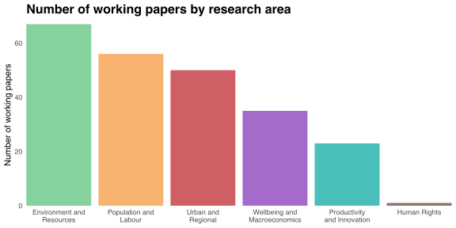
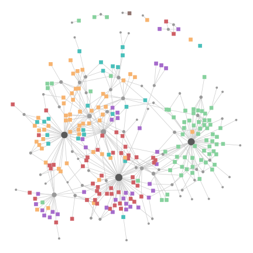
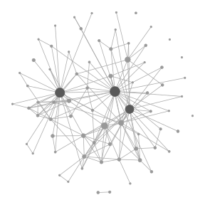

Earlier this year I joined [Motu](https://motu.nz), an economic and public policy research institute based in Wellington, New Zealand.
In this post, I analyse the coauthorship network among Motu researchers based on working paper publications.
The data used in my analysis are available [here][repo].

## Collecting and preparing the data

Bibliographic data are notoriously uncooperative.
Changes in author or institution names make it difficult to uniquely identify researchers across time, reducing data consistency and completeness.
Moreover, most bibliographic databases charge an access fee that discourages casual exploration.
Fortunately, [Motu's working paper directory](https://motu.nz/resources/working-papers/) is presented in a consistent format that makes it amenable to web scraping free of charge.

The R script [`data.R`](https://github.com/bldavies/motuwp/tree/8f4b1c02e04f8e5e45b4325195bb4f03ac0ee707/code/data.R) scrapes the directory for a list of working paper IDs and URLs.
Each URL points to a landing page for the corresponding paper, which I scrape for a list of authors.
I include only those authors with outgoing hyperlinks because

1. the hyperlinked URL provides a unique and persistent author ID, and
2. it is much easier to perform a regular expression search for `<a href="(.*?)">` than to distinguish different uses of commas case-by-case.

The resulting file [`authors.csv`](https://github.com/bldavies/motuwp/tree/8f4b1c02e04f8e5e45b4325195bb4f03ac0ee707/data/authors.csv) contains each unique author-paper pair.
It excludes the authors of five papers for which either (i) there is no landing page linked from the main directory or (ii) the landing page has no authors with outgoing hyperlinks.

I read in `authors.csv` and two other tables:
[`areas.csv`](https://github.com/bldavies/motuwp/tree/8f4b1c02e04f8e5e45b4325195bb4f03ac0ee707/data/areas.csv), which contains the name, ID and ambient colour for each of [Motu's six primary research areas](https://motu.nz/our-work/); and
[`papers.csv`](https://github.com/bldavies/motuwp/tree/8f4b1c02e04f8e5e45b4325195bb4f03ac0ee707/data/papers.csv), which links each paper to its research area.
I merge these data into a single tibble `data`:

```r
library(dplyr)

data <- authors %>%
  left_join(papers) %>%
  left_join(areas)
```

## The authorship network

I next construct an authorship network by pairing papers with their authors using the information contained in `data`.
I achieve this by defining an author-paper incidence matrix

```r
incidence <- table(data$author, data$paper)
```

and using that matrix to create a bipartite network `bip`:

```r
library(igraph)

bip <- graph.incidence(incidence)
```
 
The authorship network `bip` contains 74 authors who collectively wrote 232 working papers over the 2003--2018 sample period.
Those papers are distributed across Motu's research areas as shown in the chart below.



The variation in working paper counts reflects the variation in areas' tenure within Motu's research portfolio.
Environment and Resources, contributing 67 working papers, has been around since the series began; Human Rights, appearing only once in the series, is a relatively new research area for Motu.

The authorship network `bip` is drawn below using [Fruchterman and Reingold's (1991)](https://onlinelibrary.wiley.com/doi/abs/10.1002/spe.4380211102) force-directed algorithm.
Squares denote working papers and are coloured by research area.
Each circle denotes an author and is scaled according to the number of working papers (co)written by that author.



A striking feature of `bip` is the presence of three high-degree vertices, or *hubs*, each representing an author of at least 48 working papers.
These hubs are shaded in the map of `bip` shown above.
Another feature is the variation in area diversity within authors' individual corpuses.
Urban and Regional authors tend to also write papers on Wellbeing and Macroeconomics, while Environment and Resources authors are more specialised.

## The coauthorship network

Projecting `bip` onto the set of authors yields a coauthorship network in which two authors are adjacent if they have written a paper together.
I define such a projection via

```r
net <- bipartite.projection(bip)[[1]]
```

I use the [`jaccard`](https://github.com/bldavies/pokenet/blob/master/code/jaccard.R) function described in my previous post to determine the similarity between two authors from their authorship counts.
According to this measure, maximally similar authors always write together while maximally dissimilar authors never write together.
Again, I use the Fruchterman-Reingold algorithm for distributing vertices in the plane.
The resulting map of `net` is shown below.



The coauthorship network is sparse, containly only 168 (about 6%) of the 2,701 possible edges between its 74 vertices.
However, the largest connected component (LCC) of `net` contains all but six authors, two of whom write exclusively with each other and the remaining four having zero coauthors.
Such connectivity is facilitated by the three shaded hubs identified above.

### Hints of small-worldness

The sparsity of `net` implies that most pairs of authors aren't coauthors.
Indeed, the probability that two randomly selected authors are coauthors is given by `net`'s edge density: about 0.06.
However, it is not unusual for two randomly selected authors to share a common coauthor; within the LCC of `net`, the probability of such an event is about 0.46.
I calculate this probability by examining the distribution of (unweighted) [geodesic distances](https://en.wikipedia.org/wiki/Distance_(graph_theory)) between the vertices in `net` and determining the proportion of vertex pairs that are distance two apart.
The following function performs that calculation for an arbitrary connected graph `G`.

```r
common_neighbour_rate <- function (G) {
  B <- distances(G, weights = rep(1, gsize(G))) == 2
  num_pairs <- choose(gorder(G), 2)
  rate <- (sum(B) / 2) / num_pairs  # Mean within upper right triangle
  return (rate)
}
```

The function `common_neighbour_rate` works by computing the geodesic distances between each pair of vertices in `G`, defining binary indicator variables (as entries of the matrix `B`) for whether each distance is equal to two and taking the average of those variables over all possible vertex pairs.
Its name comes from recognising that "coauthor" is a context-specific synonym for "neighbouring vertex."

Within the LCC of `net`, the average distance between any two authors is equal to 2.5 while the maximum such distance---the *diameter* of the LCC---is equal to five.
These numbers suggest a smallness about the world inhabited by Motu working paper authors: if you ask anyone if they've written a paper with so-and-so, the answer you'll get is probably, "no, but I've written with someone who has written with someone that has."
It appears that, at least in terms of geodesic distances, Motu researchers are seldom far apart.

### Testing for small-worldness

[Watts and Strogatz (1998)](https://www.nature.com/articles/30918) formalise the idea of small-worldness.[^strogatz]
They identify small-world networks as those that are

> highly clustered ... yet have small characteristic path lengths.

The extent to which a network is clustered is determined by its [clustering coefficient](https://en.wikipedia.org/wiki/Clustering_coefficient#Global_clustering_coefficient), while the characteristic path length is simply the mean geodesic distance between pairs of vertices.
Intuitively, a network is small-world if it has local communities whose links are mostly internal but with a few external links that facilitate fast inter-community exchange.
For example, most flights undertaken by New Zealanders comprise travel within our dense domestic network, but a Cantabrian wanting to holiday in Bangkok or Dubai need only make a pitstop in Sydney.
The latter acts as a hub that connects many distant cities in the same way that the three shaded vertices in the map of `net` above connect many otherwise distant authors.

[Humphries and Gurney (2008)](http://journals.plos.org/plosone/article?id=10.1371/journal.pone.0002051) describe a method for determining small-worldness using random graphs.
Their strategy is to compare the clustering coefficient and mean distance between vertices in a network to the expected value of those attributes if edges are randomly distributed.
Concretely, they state that 

> A network with `n` nodes and `m` edges is a small-world network if it has a similar path length but greater clustering of nodes than an equivalent Erdös-Rényi random graph with the same `n` and `m`.

The [Erdös-Rényi model](https://en.wikipedia.org/wiki/Erdős–Rényi_model) is a simple method of generating random graphs with a fixed number of vertices and edges, the latter being placed between vertex pairs with uniform probability and without duplication.
Such graphs tend to have short mean distances because edges are as likely to traverse the network and bridge communities as they are to consolidate an already tight local community.
Likewise, random edge assignment disregards community formation, causing Erdös-Rényi graphs to have small clustering coefficients.

The function below computes the clustering coefficient (known to `igraph` users as `transitivity`) and characteristic path length for a sample of Erdös-Rényi random graphs that are equivalent to an arbitrary graph `G`.
The sample means of these attributes provide baselines against which to measure the corresponding values observed from `G`.

```r
small_world_baselines <- function (G, sample_size = 1000, seed = 0) {
  set.seed(seed)
  transitivity_samples <- rep(0, sample_size)
  mean_distance_samples <- rep(0, sample_size)
  for (i in 1 : sample_size) {
    er <- sample_gnm(gorder(G), gsize(G))
    transitivity_samples[i] <- transitivity(er)
    mean_distance_samples[i] <- mean_distance(er, directed = FALSE)
  }
  return (list(transitivity = mean(transitivity_samples),
               mean_distance = mean(mean_distance_samples)))
}
```

The coauthorship network `net` has clustering coefficient 0.24 and mean distance 2.49, with baseline comparators of 0.06 and 2.96.
Thus, `net` is about four times as clustered as is expected for a network with its density and has slightly shorter geodesic distances than would be obtained by allocating edges randomly.
These facts positively indicate small-worldness, and reflect widespread collaboration between authors within and between research areas.

Humphries and Gurney define a *small-world coefficient* by taking the ratio of observed and expected clustering coefficients, and dividing the result by the ratio of observed and expected mean distances.
This quotient is larger than one for small-world networks.
The coauthorship network `net` obtains a small-world coefficient of 4.67, thereby passing the Humphries-Gurney small-worldness test.

## Subsampling by research area

Finally, I analyse the coauthorship network within Motu's five largest research areas.
I filter the working papers from `data` that correspond to each area and recompute several statistics mentioned earlier using the subsample data.
The first set of statistics is shown in the table below.

|Area                         | Papers| Authors| Edge density| LCC order| LCC diameter|
|:----------------------------|------:|-------:|------------:|---------:|------------:|
|Environment and Resources    |     67|      37|         0.08|        29|            3|
|Population and Labour        |     56|      29|         0.13|        26|            4|
|Urban and Regional           |     50|      32|         0.09|        29|            4|
|Wellbeing and Macroeconomics |     35|      19|         0.13|        14|            2|
|Productivity and Innovation  |     23|      18|         0.20|        17|            4|

Environment and Resources boasts the largest number of authors as well as working papers. However, it has the least dense coauthorship network, containing only 8% of all possible edges.
The Productivity and Innovation coauthorship network is the most dense.
The largest connected component of the Wellbeing and Macroeconomics coauthorship network is the smallest among the five areas; however, every pair of authors within its LCC are coauthors or share a common coauthor.

I also test each area's coauthorship network for small-worldness using the Humphries-Gurney procedure.
The results are tabulated below.

|Area                         | Clustering coefficient (baseline)| Mean distance (baseline)| Small-world coefficient|
|:----------------------------|---------------------------------:|------------------------:|-----------------------:|
|Environment and Resources    |                       0.25 (0.08)|              1.93 (3.16)|                    5.13|
|Population and Labour        |                       0.33 (0.13)|              2.15 (2.56)|                    3.01|
|Urban and Regional           |                       0.17 (0.09)|              2.13 (3.04)|                    2.71|
|Wellbeing and Macroeconomics |                       0.19 (0.11)|              1.77 (2.88)|                    2.76|
|Productivity and Innovation  |                       0.39 (0.19)|              2.24 (2.31)|                    2.17|

All five areas have small-world coefficients greater than one, and therefore satisfy Humphries and Gurney's criterion.
However, the ratio of observed and baseline clustering coefficients is not as large in any area as it is in the full coauthorship network.
Moreover, only two areas have mean distances close to those expected in an equivalent Erdös-Rényi random graph.
The best candidate for a small world---that is, a world with high clustering and as-random geodesic distances---is the Productivity and Innovation coauthorship network, despite it having the lowest small-world coefficient.

I suspect that network size adds considerable noise to these estimates.
Even the full coauthorship network `net` is barely large enough to exhibit any global structure that can be distinguished from randomness.
Applying the Humphries-Gurney test to a larger network, or implementing a more robust procedure such as that proposed by [Telesford *et al.* (2011)](https://www.ncbi.nlm.nih.gov/pmc/articles/PMC3604768/), may yield cleaner results.

[^strogatz]: The linked article is locked behind a paywall. However, Strogatz hosts [a free copy](http://www.stevenstrogatz.com/articles/collective-dynamics-of-small-world-networks-pdf) on his website.

*Note: I updated this post on July 28, 2019 after revising the [source data][repo]. My results changed slightly due to retroactive author (re)assignments.*

[repo]: https://github.com/bldavies/motuwp/

