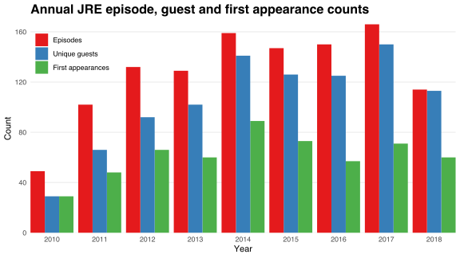
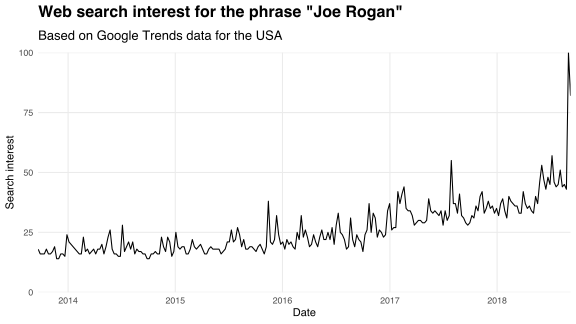
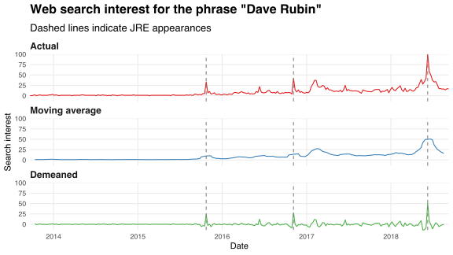
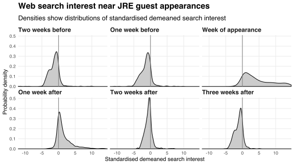
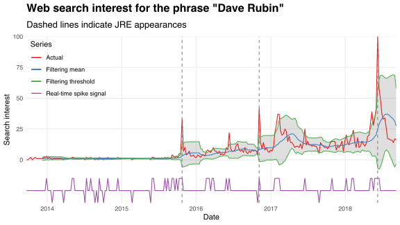

[*The Joe Rogan Experience*](https://www.joerogan.com/#jre-section) (*JRE*) is a podcast hosted by comedian and mixed martial arts (MMA) commentator Joe Rogan.
In this post, I analyse the relationship between *JRE* guest appearances and popularity using data from [Google Trends](https://trends.google.com/trends).
I find that guests typically experience a spike in popularity immediately after appearing on the podcast.

The data used in my analysis are available [here](https://github.com/bldavies/jre-guests).

## Collecting the data

I scrape [the *JRE* podcast directory](http://podcasts.joerogan.net) for a list of episode dates, numbers and titles.
The directory comprises a multi-page table that is dynamically updated using HTTP requests.
I use [this method](https://stackoverflow.com/a/46311833) to emulate such requests, allowing me to iterate over table pages and extract the raw episode metadata.
I clean these data by 

1. removing non-standard episodes (such as MMA Shows and Fight Companions),
2. fixing any missing, incorrect or duplicate episode numbers, and
3. removing non-ASCII characters from episode titles.

[The resulting file](https://github.com/bldavies/jre-guests/blob/master/data/episodes.csv) contains clean metadata for *JRE* episodes #1 through #1172.
I use these data to create [a list of guests](https://github.com/bldavies/jre-guests/blob/master/data/guests.csv) that appear in each episode, making several manual adjustments that correct for inconsistent or missing guest names.[^redban]

The barchart below plots the number of episodes, unique guests and first appearances by year for 2010 through 2018.
On average, the number of *JRE* episodes and guests increased each year, although the proportion of guests appearing on the show for the first time appears to be falling.

## Estimating popularity

I infer guests' popularity from Google Trends data on web searches in the United States.
These data index the proportion of total Google search queries attributable to particular keywords.
Google Trends provides data on a 0--100 scale, where 100 denotes the maximum search interest for the corresponding keyword in a given period and locale.[^trends-map]

I collect Google Trends data for each identified *JRE* guest and for Joe himself.
[My data](https://github.com/bldavies/jre-guests/blob/master/data/popularity.csv) provide weekly estimates of individuals' online popularity for the five years beginning September 2013.
I assume that these data are unbiased estimates of guests' actual popularity.

The chart below plots Joe's estimated popularity during my sample period.
Web search interest for the phrase "Joe Rogan" more than doubled between September 2013 and September 2018.
The spike during the first week of September 2018 marks [*JRE* episode #1169 with Elon Musk](https://www.youtube.com/watch?v=ycPr5-27vSI).

## Identifying popularity spikes

I align *JRE* guest appearance dates with my Google Trends data in order to determine whether such appearances coincide with popularity spikes.
I identify spikes as large, sudden deviations in search interest from its mean value.
I allow this mean to change over time by defining a moving average (MA) series, which I subtract from the actual interest series in order to construct a demeaned series that captures the idosyncratic variation in guests' popularity.[^ma-order]

For example, the chart below plots the actual, moving average and demeaned search interest series for Dave Rubin---political commentator and host of [*The Rubin Report*](https://www.rubinreport.com)---who appeared on *The Joe Rogan Experience* in the three weeks identified by the dashed vertical lines.
Dave's gradual rise in popularity since late 2015 is punctuated by three spikes in search interest that coincide with his *JRE* appearances.

I construct the demeaned search interest series for each guest who appears on *The Joe Rogan Experience* during my sample period.
I standardise each of these series to have zero mean and unit variance across the entire sample period in order to make the series comparable.
The distributions of guests' standardised demeanded search interest in the weeks surrounding their appearances are shown below.

In the two weeks prior to appearing on *The Joe Rogan Experience*, guests' popularities are centred about a standard deviation below their MA trend value, reflecting a rise in that value due to an impending upward shock.
Appearances coincide with a shift in probability density towards positive deviations from local means.
Traces of this shift disappear after about three weeks, at which time the distribution of standardised demeaned search interest mimics that observed five weeks prior.
These dynamics suggest that, on average, *JRE* guests experience an increase in popularity during the week in which they appear on the podcast.

## Detecting spikes in real-time

I obtain more rigorous results using [this real-time spike detection algorithm](https://stackoverflow.com/questions/22583391/peak-signal-detection-in-realtime-timeseries-data/22640362#22640362).
The algorithm builds a filtering series alongside the actual search interest series, and computes a rolling mean and standard deviation for the filtering series over the previous `lag` observations.
Spikes correspond to values in the actual series that deviate from the filtering mean by some `threshold` number of standard deviations.
A third parameter `influence` controls how sensitive the filtering series is to spikes.

The real-time algorithm defines a signal series that denotes super-threshold deviations above and below the filtering mean by 1 and -1, respectively, and sub-threshold deviations by 0.
Positive signals identify spikes in search interest relative to recent trends.
The rate at which such signals coincide with *JRE* guest appearances offers insight into whether such appearances herald popularity spikes.

For example, the chart below plots the actual, filtering and signal series for Dave Rubin's estimated popularity during my sample period, along with the dates of his three *JRE* appearances.
I compute the filtering means and standard deviations with `lag` equal to 12, and set the filtering threshold at two standard deviations from the filtering mean.
Positive signals register when the actual series deviates above the grey band.

The real-time algorithm identifies spikes coincident with each of Dave's appearances on *The Joe Rogan Experience*.
However, it also identifies false positives that reflect other sources of sudden popularity booms.

I compute the empirical probability that the real-time algorithm detects a spike in guests' popularity conditional upon their appearing on *The Joe Rogan Experience* in the same or previous week.[^lagged-signal]
The table below reports this probability for a range of `lag` and `threshold` values, and with `influence` equal to 0.5.[^influence-choice]

| Pr(Spike &#124; Appears) | `lag = 3` | `lag = 6` | `lag = 9` | `lag = 12` |
|:------------------------:|:---------:|:---------:|:---------:|:----------:|
|   **`threshold = 1`**    |   0.940   |   0.923   |   0.905   |   0.892    |
|   **`threshold = 2`**    |   0.896   |   0.866   |   0.845   |   0.824    |
|   **`threshold = 3`**    |   0.837   |   0.808   |   0.771   |   0.748    |
|   **`threshold = 4`**    |   0.791   |   0.753   |   0.725   |   0.696    |

Increasing `lag` or `threshold` lowers the detection rate, indicating that the real-time algorithm is more likely to identify guest appearances when it is more adaptive and less picky.
The negative relationship between detection rate and `lag` (with `threshold` held constant) suggests that, on average, guests' popularities are more volatile over longer horizons: the further back you look in search history, the more likely you are to remember shocks and so the larger new shocks must be to seem uncommon.

## Conclusion

In general, appearing on the *The Joe Rogan Experience* seems to coincide with a spike in popularity as measured by web search interest.
This result is robust to varying the definition of "spike," at least along the dimensions of the `lag` and `threshold` parameters used by the real-time detection algorithm.

While suggestive, my analysis does not identify causality because I do not compare my results with the counterfactual scenario in which treatments (i.e., *JRE* appearances) do not occur.
The false positives identified by the real-time algorithm are reminders that my results may be driven by other confounding factors.

It would be useful to compare guests' popularity dynamics near *JRE* appearances with those near appearances on other fora.
This comparison would help me separate the effect of increased online presense in general from the effect of appearing on *The Joe Rogan Experience* in particular, and may thereby provide stronger hints at causality.

[^redban]: I exclude Brian Redban's appearances prior to episode #674, when he returned as a guest for the first time after producing and co-hosting the show until late 2013.

[^trends-map]: [Google Trends' FAQ](https://support.google.com/trends/answer/4365533?hl=en&ref_topic=6248052) does not identify how the raw search proportions get mapped to [0, 100]. I assume that the map is linear so that, for example, an increase from 25 to 50 and from 50 to 100 both constitute a doubling in popularity.

[^ma-order]: I use an MA order of seven. Thus, each observation in the moving average series is equal to the mean value over the two surrounding months in the actual series. This choice seems to optimally suppress the impact of spikes on local means.

[^lagged-signal]: Google Trends provides data in weekly intervals with weeks starting on Saturdays. I include lagged weeks in the detection criterion to allow for latency between *JRE* episode transmission and audience response. For example, the web search activity attributable to an episode aired on a Friday may not occur until the Saturday that begins the following week.

[^influence-choice]: I obtain similar patterns with `influence` equal to 0.3 and 0.7.
