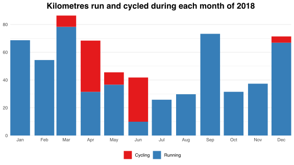
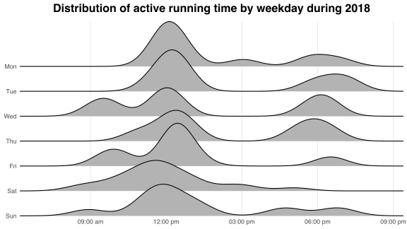
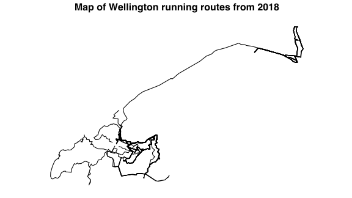

[Strava](https://www.strava.com/) is an online platform for storing and sharing fitness data.
Strava [provides an API](https://developers.strava.com) for accessing such data at the activity (e.g., run or cycle) level.
In this post, I explain how to extract data from the Strava API using R, and I analyse my running and cycling data from 2018.

## Setup and authentication

Strava uses [OAuth 2.0](https://oauth.net/2/) to authorise access to the API data.
The first step to becoming authorised is to register for access on [Strava's API settings page](https://www.strava.com/settings/api/).
I put "localhost" in the "Authorization Callback Domain" field.
Upon completing the registration form, the page provides two important values: an integer client ID and an alpha-numeric client secret.
I store these values in `credentials.yaml`, which I structure as

```yaml
client_id: xxxxxxxxx
secret: xxxxxxxxx
```

and import into R using the `read_yaml` function from the [`yaml`](https://cran.r-project.org/package=yaml) package.

Next, I create an OAuth application for interacting with the API and an endpoint through which to send authentication requests.
I use the `oauth_app` and `oauth_endpoint` functions from [`httr`](https://cran.r-project.org/package=httr):


```r
library(httr)

app <- oauth_app("strava", credentials$client_id, credentials$secret)
endpoint <- oauth_endpoint(
  request = NULL,
  authorize = "https://www.strava.com/oauth/authorize",
  access = "https://www.strava.com/oauth/token"
)
```

Finally, I create an OAuth access token to send the authentication request to my Strava account.
This token encapsulates the application and endpoint defined above.
Running


```r
token <- oauth2.0_token(endpoint, app, as_header = FALSE, cache = FALSE)
```

opens a browser window at a web page for accepting the authentication request.
Doing so redirects me to the callback domain ("localhost") and prints a confirmation message:

> Authentication complete. Please close this page and return to R.

## Extracting the data

After authenticating with Strava, I use a sequence of HTTP requests to extract activity data from the API.
The API returns multiple pages of data, each containing up to 200 activities.
I use a while loop to iterate over pages, using the `fromJSON` function from [`jsonlite`](https://cran.r-project.org/package=jsonlite) to parse the extracted data:


```r
library(jsonlite)

data_list <- list()
i <- 1
done <- FALSE
while (!done) {
  req <- GET(
    url = "https://www.strava.com/api/v3/athlete/activities",
    config = token,
    query = list(per_page = 200, page = i)
  )
  data_list[[i]] <- fromJSON(content(req, as = "text"), flatten = TRUE)
  if (length(content(req)) < 200) {
    done <- TRUE
  } else {
    i <- i + 1
  }
}
```

Finally, I use the `rbind_pages` function from `jsonlite` to collate the activity data into a single data frame:


```r
data <- rbind_pages(data_list)
```


## Analysing the data

The Strava API provides a wealth of data to analyse.
Running


```r
names(data)
```

prints the variables included in `data`, such as distance, moving time, elevation gain, and starting latitude and longitude coordinates.
These data reveal patterns of fitness effort.
For example, the bar chart below plots my total distance run and cycled during each month of 2018.
I ran less during New Zealand's winter months: June--August.
With more years of data, I could quantify my sensitivity to cold temperatures by identifying the seasonal component of my monthly distance series.



The temporal data provided by the API indicate the times of day at which athletes are most active.
For example, the density plots below show the distribution of my running activity for each weekday during 2018.
I ran mostly during lunch breaks or in the evenings on work days, and around midday on weekends.



The Strava API also provides spatial data on running and cycling routes.
Each activity is associated with an [encoded polyline](https://developers.google.com/maps/documentation/utilities/polylinealgorithm), which stores the geographic coordinates of points along each route.
Plotting these polylines reveals a map of where athletes travel during their runs and cycles.
For example, the image below maps my Wellington running routes from 2018.
These routes include coastal areas, such as Petone Beach in the northeast, and inland areas, such as the Zealandia fenceline in the southwest.



## Acknowledgements

This post is informed by several online resources.
[Mark Aberdour's blog post](http://www.open-thoughts.com/2017/01/the-quantified-cyclist-analysing-strava-data-using-r/) helped me understand the process for authenticating with Strava.
Reading [the `rStrava` package's source code](https://github.com/fawda123/rStrava) helped me understand how to extract data from the Strava API.
I got the idea for plotting active running time distributions from [this GitHub repository](https://github.com/marcusvolz/strava).


