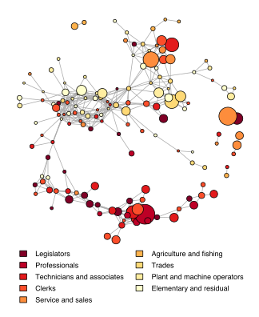

I recently wrote an article for [*Asymmetric Information*][ai-url] summarising [my paper with Dave Maré][motu-wp] on the relatedness and complexity of economic activities in New Zealand.
The full text for that article is quoted below.

> ## Introduction
> 
> Current European regional policy encourages regions to build on their strengths by diversifying into activities that draw upon existing knowledge bases.
> This "smart specialisation" approach encourages entrepreneurship, innovation and long-term growth by fostering local interactions between workers with complementary knowledge and skills.
> 
> [Balland et al. (2018)][balland-etal-2018] define a framework for analysing smart specialisation using the ideas of relatedness and complexity.
> Expanding into activities that are related to existing specialisations carries low growth risk because local workers already possess the knowledge and skills needed to conduct those activities.
> Expanding into complex activities delivers the highest expected economic returns because such activities "form the basis for long-run competitive advantage."
> Balland et al.'s framework identifies low-risk, high-return development opportunities as locally under-represented activities with high local relatedness and high complexity.
> 
> We examine the contribution of relatedness and complexity to urban employment growth in New Zealand.
> This allows us to evaluate the efficacy of implementing smart specialisation policies in New Zealand by identifying whether the associated mechanisms appear to influence employment dynamics.
> 
> ## Data and methods
> 
> Our analysis uses historical New Zealand census data aligned to current industry, occupation and urban area codes.
> We select 50 "cities" (urban areas) and 200 "activities" (industry-occupation pairs) with persistently high employment in census years 1981, 1991, 2001 and 2013.
> Our selected activities span 61 industries and nine occupations.
> 
> We recognise activities as being "related" if they require similar inputs.
> We infer such similarities from employee co-location patterns.
> These patterns reveal firms' shared preferences for using spatially heterogeneous resources, which encourage firms engaged in related activities to co-locate in order to benefit from agglomeration economies.
> 
> We measure activities' relatedness using weighted correlations of local employment shares.
> Our approach extends discrete measures used in previous studies by recognising variation in the extent of local specialisation and by adjusting for differences in employment data quality between geographic areas.
> 
> We recognise activities as being "complex" if they rely on specialised combinations of complementary inputs.
> For example, consulting is more complex than lecturing because consultants need local clients while lecturers do not rely as much on other activities being present locally.
> 
> We define activity complexity using the second eigenvector of the row-standardised activity relatedness matrix.
> Our approach generalises [Calderelli et al.'s (2012)][calderelli-etal-2012] eigenvector approximation of [Hidalgo and Hausmann's (2009)][hidalgo-hausmann-2009] Method of Reflections.
> We use a similar approach, applied to the transpose of the city-activity employment matrix, to estimate city complexity.
> 
> ## Mapping relatedness
> 
> We define an "activity space" that captures the network structure of activities based on our relatedness estimates.
> We describe activity space by a weighted network in which nodes correspond to activities and in which edges have weight equal to the relatedness between pairs of activities.
> The subnetwork induced by the 500 edges of largest weight is shown below, with nodes coloured by occupation.
> 
> 
> 
> At the centre of our map is a tightly connected, nest-shaped cluster of low-skill occupations in the distributive services sector.
> To the right of this cluster is a group of medium- to low-skill occupations in the construction, retail and healthcare sectors.
> These activities are ubiquitous and appear together as local relative specialisations in smaller, less diverse cities.
> In contrast, the lower wing of our network map comprises a cluster of high-skill occupations in the professional and information service sectors, which tend to concentrate in large cities and to have higher levels of complexity.
> 
> ## Do relatedness and complexity predict employment growth?
> 
> More complex activities grew faster during our period of study.
> On average and holding local relatedness constant at its weighted mean value, a one standard deviation increase in activity complexity is associated with a 0.89 percentage point increase in local employment growth per year.
> This effect rises to 0.98 percentage points when we control for city complexity.
> More locally related activities experienced slower growth, especially in complex cities.
> 
> Balland et al.'s (2018) framework suggests that complex activities with high local relatedness offer the strongest prospects for future growth.
> If this were true then we would expect a strong positive coefficient on the interaction of local relatedness and activity complexity.
> Our estimates show only a weak and insignificant interaction.
> 
> Relatedness appears to promote growth only in the largest and most complex cities.
> This result is consistent with the idea that cities are dense networks of interacting activities: the benefits of such interaction are more apparent in larger cities, where workers and firms engaged in related activities interact more frequently.
> 
> ## Conclusion
> 
> Complex activities grew faster during our period of study, especially in complex cities.
> However, this growth was not significantly stronger in cities more dense with related activities.
> Overall, we do not identify strong effects of relatedness and complexity on growth in local activity employment.
> It remains an open question whether the effects do not operate or whether New Zealand cities lack the scale for such operation.

Further details are available in [Motu Working Paper 19-01][motu-wp].

[ai-url]: https://www.nzae.org.nz/blog-page/nzae-newsletters/
[motu-wp]: https://motu.nz/our-work/urban-and-regional/regions/relatedness-complexity-and-local-growth/
[balland-etal-2018]: https://doi.org/10.1080/00343404.2018.1437900
[calderelli-etal-2012]: https://doi.org/10.1371/journal.pone.0047278
[hidalgo-hausmann-2009]: https://doi.org/10.1073/pnas.0900943106
