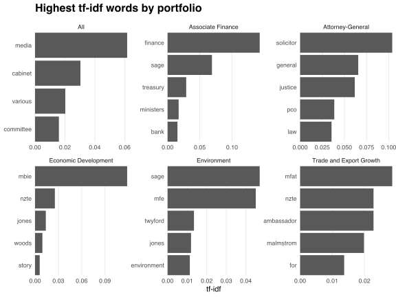

In December 2018, the New Zealand Government [announced](https://www.beehive.govt.nz/release/government-proactively-release-ministerial-diaries) that its ministers "will for the first time release details of their internal and external meetings."
The Government has since published these "ministerial diaries" as [a series of PDFs](https://www.beehive.govt.nz/search?f%5B0%5D=content_type_facet%3Aministerial_diary&f%5B1%5D=government_facet%3A6203&f%5B2%5D=ministers%3A6205).
In this post, I analyse the ministerial diary of [David Parker](https://www.beehive.govt.nz/minister/hon-david-parker), a ["pivotal cabinet minister"](https://www.odt.co.nz/news/election-2017/parker-emerges-pivotal-cabinet-minister) who wears a range of politically and economically significant hats:

* Attorney-General;
* Minister of Economic Development;
* Minister for the Environment;
* Minister of Trade and Export Growth;
* Associate Minister of Finance.

These roles, coupled with his scheduled activities for the 2018 calendar year being available in [a single, consistently formatted table](https://www.beehive.govt.nz/sites/default/files/2019-05/October%202017%20-%20December%202018_0.pdf), make Minister Parker's diary (hereafter "the diary") an interesting and relatively painless document to analyse.

## Parsing the data

I read the diary into R using the `pdf_data` function from [`pdftools`](https://cran.r-project.org/package=pdftools):

```r
library(pdftools)

path <- "https://www.beehive.govt.nz/sites/default/files/2019-05/October%202017%20-%20December%202018_0.pdf"
pages <- pdf_data(path)
```

`pdf_data` scans each page for distinct words, encloses these words in [bounding boxes](https://en.wikipedia.org/wiki/Minimum_bounding_box), and stores the coordinates and content of each box as a list of tibbles.
For example, the diary's first page contains the following data:

```r
library(dplyr)

pages[[1]]
```

```
## # A tibble: 336 x 6
##    width height     x     y space text    
##    <int>  <int> <int> <int> <lgl> <chr>   
##  1    46     20    72    75 TRUE  David   
##  2    52     20   122    75 TRUE  Parker  
##  3    42     20   179    75 TRUE  Diary   
##  4    77     20   226    75 FALSE Summary 
##  5    11     11    72   102 TRUE  26      
##  6    36     11    85   102 TRUE  October 
##  7    22     11   124   102 TRUE  2017    
##  8     3     11   149   102 TRUE  -       
##  9    11     11   155   102 TRUE  31      
## 10    46     11   168   102 TRUE  December
## # … with 326 more rows
```

The `x` and `y` columns provide the horizontal and vertical displacement, in pixels, of each bounding box from the top-left corner of the page.
The left-most boxes sit 72 pixels from the left page boundary, allowing me to identify table rows by the cumulative number of boxes for which `x` equals 72.

```r
pages[[1]] %>%
  arrange(y, x) %>%
  mutate(row = cumsum(x == 72)) %>%
  filter(cumsum(x == 72 & text == "Date") > 0)  # Remove preamble
```

```
## # A tibble: 91 x 7
##    width height     x     y space text         row
##    <int>  <int> <int> <int> <lgl> <chr>      <int>
##  1    21     11    72   355 FALSE Date          14
##  2    46     11   149   355 TRUE  Scheduled     14
##  3    22     11   198   355 FALSE Time          14
##  4    37     11   235   355 FALSE Meeting       14
##  5    38     11   390   355 FALSE Location      14
##  6    21     11   504   355 FALSE With          14
##  7    39     11   630   355 FALSE Portfolio     14
##  8    53     11    72   382 FALSE 26/10/2017    15
##  9    25     11   149   382 TRUE  11:00         15
## 10     3     11   177   382 TRUE  -             15
## # … with 81 more rows
```

The `x` values for which `row` equals 14 provide the left alignment points for the text in each of the diary's six columns.
These points remain unchanged across all 84 pages, allowing me to identify rows and columns throughout the diary within a single pipe:

```r
library(tidyr)

# Define column names and left alignment points
columns <- tibble(
  left_x = c(72, 149, 235, 390, 504, 630),
  name = c("date", "scheduled_time", "meeting", "location", "with", "portfolio")
)

# Identify page numbers
for (i in 1 : length(pages)) pages[[i]]$page <- i

# Process data
diary <- bind_rows(pages) %>%
  # Identify table rows
  arrange(page, y, x) %>%
  mutate(row = cumsum(x == columns$left_x[1])) %>%
  filter(cumsum(x == columns$left_x[1] & text == "Date") == 1) %>%
  filter(row > min(row)) %>%  # Remove header row
  # Identify table columns
  mutate(column = sapply(x, function(x){max(which(columns$left_x <= x))}),
         column = columns$name[column]) %>%
  # Concatenate text within table cells
  group_by(row, column) %>%
  summarise(text = paste(text, collapse = " ")) %>%
  ungroup() %>%
  # Clean data
  clean_data() %>%
  # Convert to wide format
  mutate(column = factor(column, levels = columns$name)) %>%
  spread(column, text) %>%
  select(-row)
```

I define the `clean_data` function in [the appendix](#appendix) below.

The resulting tibble `diary` contains 1,553 rows, each of which describes a unique entry scheduled between October 2017 and December 2018.
I select entries scheduled during the 2018 calendar year:

```r
(data <- filter(diary, grepl("2018", date)))
```

```
## # A tibble: 1,347 x 6
##    date    scheduled_time meeting          location    with         portfolio   
##    <chr>   <chr>          <chr>            <chr>       <chr>        <chr>       
##  1 15/01/… 10:00 - 11:00  Meeting with Fi… Beehive     Treasury of… Associate F…
##  2 15/01/… 14:00 - 14:30  Meeting with MF… Beehive     MFAT offici… Trade and E…
##  3 15/01/… 15:00 - 15:30  Meeting with MB… Beehive     MBIE offici… Economic De…
##  4 16/01/… 09:30 - 10:15  Meeting with En… Selwyn      Environment… Environment 
##  5 16/01/… 10:40 - 11:40  Meeting with Ng… Springston  Ngai Tahu r… Environment 
##  6 16/01/… 12:00 - 12:30  Meeting with fa… Canterbury  Farm owners… Environment 
##  7 16/01/… 12:40 - 13:40  Working Lunch w… Canterbury  Te Waihora … Environment 
##  8 16/01/… 13:50 - 14:45  Meeting with fa… Leeston     Farm owners… Environment 
##  9 16/01/… 16:30 - 17:30  Meeting with Sy… Middleton,… Syft Techon… Economic De…
## 10 17/01/… 09:30 - 10:00  Meeting with Ca… Beehive     Cabinet Off… All         
## # … with 1,337 more rows
```

According to [the official disclaimer](https://www.beehive.govt.nz/ministerial-diaries-full-disclaimer), the diary excludes personal and party political meetings, along with details published elsewhere such as time spent in the House of Representatives.
Moreover, some details are withheld under various sections of [the Official Information Act](http://legislation.govt.nz/act/public/1982/0156/latest/DLM64785.html).
I assume that the remaining entries provide a representative sample of Minister Parker's ministerial activities.

## Analysing word frequencies

I analyse the frequency of words used in the `with` column of `data`.
These frequencies provide insight into Minister Parker's interactions with different organisations.
I use the `unnest_tokens` function from [`tidytext`](https://cran.r-project.org/package=tidytext) to identify unique words and the `count` function from `dplyr` to count word frequencies.

```r
library(tidytext)

data %>%
  unnest_tokens(word, with) %>%
  anti_join(get_stopwords()) %>%  # Remove stop words
  count(word, sort = TRUE)
```

```
## # A tibble: 674 x 2
##    word          n
##    <chr>     <int>
##  1 attending   290
##  2 officials   272
##  3 minister    198
##  4 ministers   108
##  5 mfe          89
##  6 mbie         82
##  7 jones        76
##  8 sage         58
##  9 twyford      56
## 10 mfat         53
## # … with 664 more rows
```

The most frequent word, "attending," reflects cabinet meetings, media briefings and other general ministerial duties.
The next most frequent word, "officials," reflects Minister Parker's meetings with the Ministry for the Environment (MfE), the Ministry of Business, Innovation and Employment (MBIE), and the Ministry of Foreign Affairs and Trade (MFAT), along with other government departments.
Both "minister" and "ministers" reflect meetings with Ministers [Jones](https://www.beehive.govt.nz/minister/hon-shane-jones), [Sage](https://www.beehive.govt.nz/minister/hon-eugenie-sage), [Twyford](https://www.beehive.govt.nz/minister/hon-phil-twyford) and others.

### Computing tf-idf scores

Counting word frequencies across all portfolios masks portfolio-specific interactions.
I infer such interactions from the [*term frequency-inverse document frequency*](https://www.tidytextmining.com/tfidf.html) (tf-idf) scores of word-portfolio pairs.
I identify these pairs as follows.

```r
word_portfolio_pairs <- data %>%
  # Disambiguate portfolio names
  mutate(portfolio = gsub("Att.*?ral|AG", "Attorney-General", portfolio)) %>%
  # Split entries with multiple porfolios
  mutate(portfolio = gsub("[^[:alpha:] -]", "&", portfolio),
         portfolio = strsplit(portfolio, "&")) %>%
  unnest() %>%
  mutate(portfolio = trimws(portfolio)) %>%
  # Identify word-portfolio pairs
  filter(!is.na(portfolio)) %>%
  unnest_tokens(word, with) %>%
  select(word, portfolio)
```

tf-idf scores measure the "importance" of words in each document in a corpus.
The *term frequency*

`$$\mathrm{tf}(w, d)=\frac{\text{Number of occurrences of word}\ w\ \text{in document}\ d}{\text{Number of words in document}\ d}$$`

measures the rate at which word `\(w\)` occurs in a document `\(d\)`, while the *inverse document frequency*

`$$\mathrm{idf}(w) = -\ln\left(\frac{\text{Number of documents containing word}\ w}{\text{Number of documents}}\right)$$`

provides a normalisation factor that penalises ubiquitous words.
The tf-idf score

`$$\text{tf-idf}(w,d) = \mathrm{tf}(w, d) \cdot \mathrm{idf}(w)$$`

thus measures the prevalence of word `\(w\)` in document `\(d\)`, normalised by that word's prevalence in other documents.
I interpret the set of entries associated with each portfolio as a document and use the `bind_tf_idf` function from `tidytext` to compute word-portfolio tf-idf scores:

```r
word_portfolio_pairs %>%
  count(word, portfolio) %>%
  bind_tf_idf(word, portfolio, n)
```

```
## # A tibble: 1,066 x 6
##    word        portfolio                   n       tf   idf   tf_idf
##    <chr>       <chr>                   <int>    <dbl> <dbl>    <dbl>
##  1 a           Associate Finance           1 0.00285  0.693 0.00197 
##  2 a           Environment                 1 0.000739 0.693 0.000512
##  3 a           Trade and Export Growth     2 0.00277  0.693 0.00192 
##  4 accelerator Economic Development        1 0.00137  1.79  0.00245 
##  5 acting      Attorney-General            1 0.00215  1.79  0.00385 
##  6 action      Trade and Export Growth     1 0.00139  1.79  0.00248 
##  7 adrian      Economic Development        1 0.00137  1.79  0.00245 
##  8 advisory    Economic Development        2 0.00273  0.693 0.00189 
##  9 advisory    Environment                 1 0.000739 0.693 0.000512
## 10 advisory    Trade and Export Growth     1 0.00139  0.693 0.000960
## # … with 1,056 more rows
```

The `idf` column identifies both language-specific stop words (e.g., "a") and context-specific stop words (e.g., "advisory") that are common across portfolios.

The chart below presents the highest tf-idf words for each portfolio.
These words reveal organisations (e.g., the Parliamentary Counsel Office) and individuals (e.g., [Cecilia Malmström](https://ec.europa.eu/commission/commissioners/2014-2019/malmstrom_en)) that are missing from the diary-wide word frequencies computed above.



The chart also reveals which interactions correspond to which portfolios.
For example, Minister Parker's frequent interactions with MBIE officials appear to be most associated with the Economic Development portfolio, while his interactions with Minister Sage appear to involve both the Environment and Associate Finance portfolios.
([Minister Sage's diary](https://www.greens.org.nz/sites/default/files/Eugenie%20Sage%27s%20July-Sept%202018%20Diary.pdf) suggests that such cross-portfolio interactions relate to the Overseas Investment Office, for which Ministers Parker and Sage are jointly responsible.)

##  Acknowledgements

[The pdftools 2.0 release notes](https://ropensci.org/technotes/2018/12/14/pdftools-20/) helped me interpret `pdf_data`'s output.
[Julia Silge](https://juliasilge.com) and [David Robinson](http://varianceexplained.org)'s book [*Text Mining with R*](https://www.tidytextmining.com) provided useful background reading, especially [the chapter on tf-idf scores](https://www.tidytextmining.com/tfidf.html).

## Appendix

### Source code for `clean_data()`

```r
clean_data <- function (df) {
  df %>%
    # Replace non-ASCII characters with ASCII equivalents
    mutate(text = iconv(text, "", "ASCII", sub = "byte"),
           text = gsub("<c3><a7>", "c", text),
           text = gsub("<c3><a9>", "e", text),
           text = gsub("<c3><b1>", "n", text),
           text = gsub("<c4><81>", "a", text),
           text = gsub("<c5><ab>", "u", text),
           text = gsub("<e2><80><93>", "-", text),
           text = gsub("<e2><80><99>", "'", text),
           text = gsub("<e2><80><9c>|<e2><80><9d>", "\"", text)) %>%
    # Fix linebroken data ranges
    spread(column, text) %>%
    mutate(split_date = is.na(scheduled_time) & grepl("-", paste(date, lag(date))),
           row = cumsum(!split_date)) %>%
    select(-split_date) %>%
    gather(column, text, -row) %>%
    group_by(row, column) %>%
    summarise(text = gsub("NA", "", paste(text, collapse = " "))) %>%
    ungroup() %>%
    mutate(text = trimws(text),
           text = ifelse(text == "", NA, text)) %>%
    # Fix transcription errors
    mutate(text = gsub("Minster", "Minister", text),
           text = ifelse(column == "portfolio" & text == "Minister Little", "Attorney-General", text))
}
```

