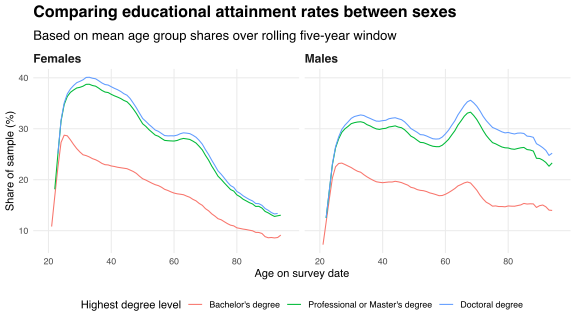
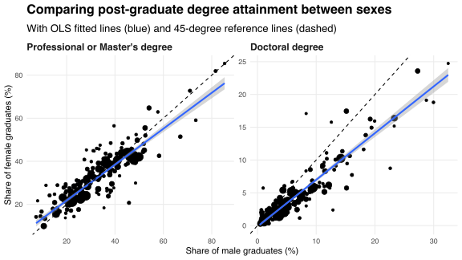
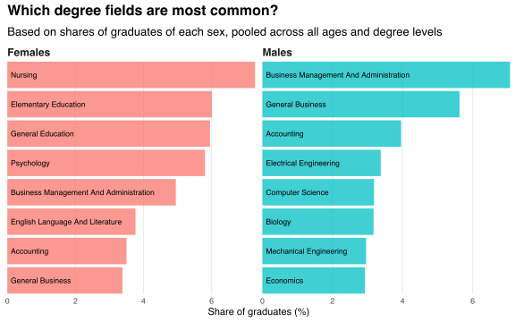
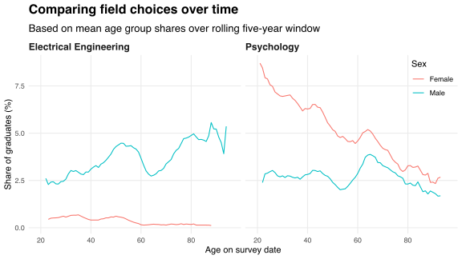
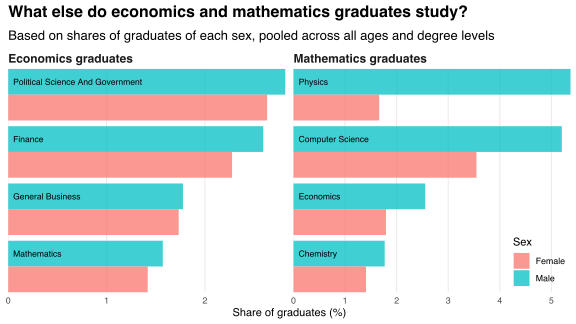

Each year, the US Census Bureau [publishes](https://www.census.gov/programs-surveys/acs/data/pums.html) a set of Public Use Microdata Sample (PUMS) files containing responses to the American Community Survey (ACS).
In this post, I use the 2016 ACS PUMS data to explore the variation in educational attainment and degree field choices between demographic groups.
The source data are available on [GitHub][repo-url].

## Educational attainment

The table below reports educational attainment rates for each sex, pooled across all ages and degree fields.
Overall, a randomly selected female is more likely to have a college degree than a randomly selected male.
However, fewer females pursue doctoral degrees than males; male graduates are about 1.4 times more likely to have a doctorate than female graduates.

|Degree level                    | % of females| % of males|
|:-------------------------------|------------:|----------:|
|No college degree               |        76.95|      78.62|
|Bachelor's degree               |        14.66|      13.46|
|Professional or Master's degree |         7.64|       6.82|
|Doctoral degree                 |         0.75|       1.10|

Pooling across all ages masks variation in educational attainment rates between age groups.
I present this variation in the line chart below, which compares educational attainment by age and sex.
The chart presents mean age group shares over a rolling five-year window, muting some of the noise in attainment rates caused by random fluctuations between consecutive years of age.

Young females have higher educational attainment rates than young males, but the decline in such rates with age is steeper among females than males.
Both sexes experience a spike in attainment between the ages of 60 and 70, corresponding to graduation dates during the late 1960s and early 1970s.
This spike could be due to the [Higher Education Act of 1965](https://en.wikipedia.org/wiki/Higher_Education_Act_of_1965), which "strengthen[ed] the educational resources of [US] colleges and universities" and "provide[d] financial assistance for students in post-secondary and higher education."
The spike is most apparent among males.

Differences in educational attainment could reflect differences in degree field choices.
For example, to the extent that (i) there are more male science graduates than female science graduates, and (ii) science graduates tend to pursue doctoral degrees more often than non-science graduates, we would expect to see more doctorates among males than females.
If field selection is the only source of differences in educational attainment then there should be no difference in the within-field shares of male and female graduates with post-graduate degrees.
I compare such shares in the scatterplots below, in which points correspond to degree fields and have radii proportional to the number of graduates in each field.

The gap between the OLS fitted lines and 45-degree reference lines imply that, on average, male graduates are more likely to hold post-graduate degrees than female graduates in the same field.
This discrepancy appears to be larger for doctorates than for other post-graduate degrees.

## Degree fields

The bar chart below plots the eight most common degree fields among male and female graduates.
Both business and accounting rank among the most common fields for graduates of each sex.
Nursing and education are more common among females, while computer science and engineering are more common among males.

The frequency at which people graduate with degrees in different fields may vary over time due to changes in social preferences or labour market conditions.
The line chart below plots the shares of graduates who studied electrical engineering or psychology, statified by age and sex.
The chart presents mean age group shares over a rolling five-year window.

The trough in male electrical engineering graduates and spike in psychology graduates between the ages of 60 and 70 both coincide with the spike in educational attainment following the Higher Education Act of 1965.
The Act may have encouraged males to substitute from electrical engineering (or from not studying) to psychology by changing the relative benefits and costs of becoming qualified in each field.
For example, increasing access to federal loans may have encouraged students to pursue degrees with less certain job prospects by delaying the private burden of paying tuition.

The PUMS data report up to two degree fields for each respondent, allowing me to estimate the frequency of field pairings within the US population.
For example, the bar chart below shows the fields most frequently paired with economics and mathematics among graduates of each sex.
Males economics graduates appear to make similar pairing choices to female economics graduates.
Males pair mathematics with physics about as often as with computer science, while females do so only about half as often.

Field pair frequencies provide insight into the intellectual connections between fields.
Such connections may reflect fields using similar techniques (e.g., economics and finance) or providing complementary skills (e.g., mathematics and computer science).
I plan to explore these connections in future posts.

[repo-url]: https://github.com/bldavies/college-degrees/

