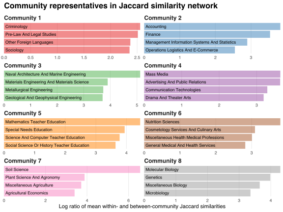

In my last [post][prev-post], I compared measures of  similarity among college degree fields.
My goal in this post is to partition the set of fields such that each field has greater within-part similarities than between-part similarities.
One approach is to [hierarchically cluster](https://en.wikipedia.org/wiki/Hierarchical_clustering) fields based on their similarities, producing a dendrogram that can be cut at different heights to obtain different partitions.
Generating the dendrogram restricts my choice set but, ultimately, I still have to choose which partition is "best."

The intellectually honest way forward is to define an objective function on the set of partitions and choose the partition that obtains the function's maximum.
One such function is network [modularity](https://en.wikipedia.org/wiki/Modularity_(networks)), which captures the extent to which groups of nodes are intra-connected densely but inter-connected sparsely.
Ranking partitions by modularity removes the need for supervision: rather than making a subjective, potentially biased judgment on which partition is "best," I simply choose the partition that maximises modularity.

Unfortunately, [maximising modularity is hard](https://arxiv.org/abs/physics/0608255).
In most cases, finding the globally optimal partition is infeasible and a heuristic algorithm must be used to find an approximate solution.
[Clauset et al. (2004)](https://arxiv.org/abs/cond-mat/0408187) suggest a [greedy](https://en.wikipedia.org/wiki/Greedy_algorithm) algorithm:

1. Assign every node to a unique "community."
2. Find the pair of communities whose union delivers the greatest increase in modularity. Replace these communities with their union.
3. Repeat step 2 until the modularity gain is negative or only one community remains.

The term "community" refers to a set of nodes and stems from the use of network science to probe the [community structure](https://en.wikipedia.org/wiki/Community_structure) of social interactions.

I apply Clauset et al.'s algorithm to the networks defined using the co-occurrence, Dice, Jaccard, Ochiai and overlap measures discussed in [my previous post][prev-post], as well as the unweighted network in which fields are adjacent if at least one graduate studied them both.
The table below presents the number and size of communities detected in each network, and the corresponding maximised modularity values.

|    Network     | Communities | Fields | Community sizes (millions of graduates) | Modularity |
|:--------------:|:-----------:|:------:|:---------------------------------------:|:----------:|
| Co-occurrences |      6      | 19--51 |                6.4--19.3                |   0.380    |
|      Dice      |      8      | 11--50 |                1.7--16.7                |   0.456    |
|    Jaccard     |      8      | 11--50 |                1.7--19.8                |   0.457    |
|     Ochiai     |      8      | 13--40 |                1.4--15.8                |   0.433    |
|    Overlap     |      8      | 9--30  |                0.9--17.6                |   0.423    |
|   Unweighted   |      3      | 11--84 |                3.5--42.2                |   0.118    |

Clauset et al.'s algorithm detects eight communities in the Dice, Jaccard, Ochiai and overlap similarity networks, with each community containing at least nine fields and at most 50 fields.
The Jaccard measure delivers the greatest maximum modularity.
Ignoring edge weights makes within- and between-part connections harder to separate, leading to few communities being detected.

I identify the "representives" of each community as the fields with the largest ratios of mean within- and between-community similarities.
I transform these ratios by taking their natural logarithm in order to rein in the extreme values caused by near-zero divisors.
The following bar chart presents the representatives of each community detected in the Jaccard similarity network.

Communities 2, 3, 4, 5, 7 and 8 appear to capture business, engineering, media, education, agriculture and biology-related fields.
Communities 1 and 6 are less clearly classifiable.

The table below presents the demographic compositions of the eight communities detected in the Jaccard similarity network.
Community 3 contains nearly 30% of degree fields but only about 20% of graduates, and is the most male-dominated among the eight communities detected.
Community 5 is the most female-dominated and has the highest mean age.
Educational attainment is lowest in communities 2 and 4, and highest in community 8.

| Community | Fields | Total graduates (millions) | Mean graduate age | % of graduates female | % of graduates with post-graduate degree |
|:---------:|:------:|:--------------------------:|:-----------------:|:---------------------:|:----------------------------------------:|
|     1     |   28   |            19.8            |       48.4        |         64.6          |                   39.7                   |
|     2     |   11   |            14.4            |       47.8        |         41.6          |                   26.5                   |
|     3     |   50   |            14.1            |       47.6        |         28.4          |                   42.9                   |
|     4     |   18   |            9.6             |       45.1        |         60.8          |                   27.6                   |
|     5     |   16   |            6.5             |       54.7        |         76.7          |                   49.0                   |
|     6     |   18   |            3.6             |       43.4        |         70.8          |                   33.6                   |
|     7     |   17   |            2.1             |       47.3        |         35.4          |                   33.8                   |
|     8     |   15   |            1.7             |       45.6        |         54.6          |                   51.7                   |
|  Overall  |  173   |            71.8            |       47.9        |         52.7          |                   36.7                   |

[prev-post]: /blog/college-degrees-similarity-measures/

