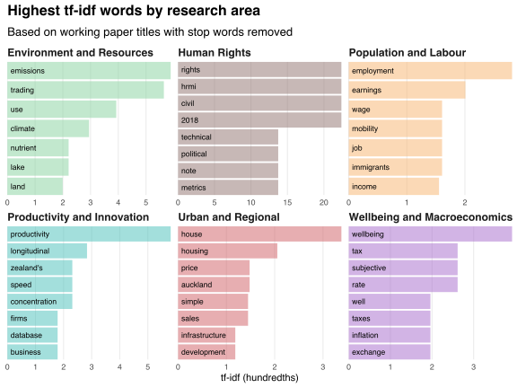

Today I updated the [motu-wp](https://github.com/bldavies/motu-wp) GitHub repository, which stores data on Motu working papers and their authors.
I made three main changes:

First, I switched from [BeautifulSoup](https://www.crummy.com/software/BeautifulSoup/) to [rvest](https://rvest.tidyverse.org) for scraping the working paper directory.
My original Python [script](https://github.com/bldavies/motu-wp/blob/97c9074908367154fcdddb33d377feb45528e4ae/code/urls.py) used a bunch of regex commands to build the list of working paper URLs, despite warnings that [regular expressions and HTML generally don't cooperate](https://stackoverflow.com/questions/1732348/regex-match-open-tags-except-xhtml-self-contained-tags).
I should have just used CSS selectors, which I now do using [`data.R`](https://github.com/bldavies/motu-wp/blob/master/code/data.R).

Second, I implemented a caching mechanism for passing information between runs of `data.R`.
The script queries only papers released since the last run, so adding new papers is faster and requires fewer HTTP requests.

Third, I added working paper titles to the information collected.
This allows me to, for example, use [tf-idf scores](/blog/reading-ministerial-diaries/#computing-tf-idf-scores) to characterise research areas:

