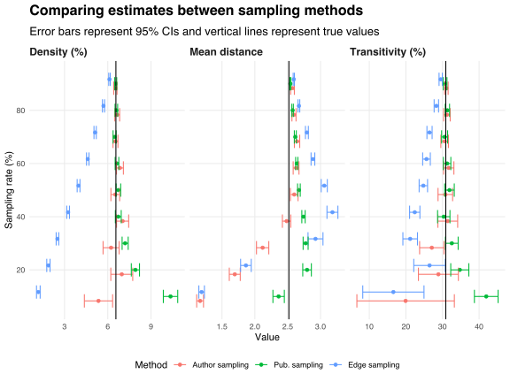

Suppose I have some data that describe a bipartite author-publication network.
I want to analyse the underlying coauthorship network---that is, the bipartite projection onto the set of authors---but I can't compute that network because the data are too large to fit into memory.
Instead, I estimate [properties](https://en.wikipedia.org/wiki/Graph_property) of the full coauthorship network by sampling the author-publication incidence data before computing the bipartite projection.

If the incidence data are stored as a matrix then I can sample its rows or columns, which corresponds to sampling the author or publication sets.
If the incidence data are stored as a list of author-publication pairs then I can sample these pairs, which corresponds to sampling edges in the bipartite network.

Which of these three methods---author, publication and edge sampling---most reliably estimates the full coauthorship network's properties?

To develop some intuition, I apply each sampling method to [the coauthorship network among Motu researchers](/blog/coauthorship-networks-motu/).
The [data](https://github.com/bldavies/motuwp) describing this network are small enough that I can compute the true values of various network properties, which I compare with the sampling distributions of such values generated by each sampling method.

The table below reports the 95% confidence intervals for each property under each method, in all cases sampling (uniformly at random and without replacement) about half of the corresponding entities (i.e., authors, publications or edges) before computing the bipartite projection onto the set of authors.[^deletion]

|Property         | True value| Author sampling| Pub. sampling| Edge sampling|
|:----------------|----------:|---------------:|-------------:|-------------:|
|Order            |      82.00|    42.00 ± 0.00|  64.40 ± 0.60|  64.90 ± 0.60|
|Size             |     218.00|    56.10 ± 2.60| 137.40 ± 3.40|  81.80 ± 1.40|
|Density (%)      |       6.56|     6.50 ± 0.30|   6.70 ± 0.20|   4.00 ± 0.10|
|Mean distance    |       2.52|     2.60 ± 0.10|   2.70 ± 0.00|   3.10 ± 0.00|
|Transitivity (%) |      30.91|    30.80 ± 2.00|  31.90 ± 1.30|  24.80 ± 1.20|

All three methods under-estimate the order and size of the full coauthorship network.
However, this is partly by construction: sampling any proportion of authors will always deliver that proportion of nodes in the coauthorship network, and taking a strict subset of publications or edges will generally omit some inter-author connections.

Author and publication sampling deliver accurate density and transitivity estimates.
Edge sampling is less accurate: it produces relatively sparse networks in which authors are more distant, and less likely to share common coauthors, than in the full network.

The chart below plots the sample means and 95% confidence intervals generated by each sampling method for varying sampling rates.
(A sampling rate of p% means that I randomly select p% of the corresponding entities before computing the coauthorship network.)
As the sampling rate rises, the sample means converge to the true value.
I vertically nudge the plotted points to prevent overlaps and make it easier to compare methods at each sampling rate.

Publication sampling over-estimates the coauthorship network's density at low sampling rates.
This could be because most working papers are written by authors in the densely connected core of the coauthorship network, so publication sampling is more likely to recover this core than the less connected and less productive periphery.

Edge sampling appears to generate biased density and transitivity estimates.
Intuitively, pairs of sampled edges are unlikely to be incident with the same publication and thus unlikely to form an edge in the bipartite projection.

All three methods under-estimate the mean distance between authors at low sampling rates but over-estimate this distance at high sampling rates.
This pattern arises because the distance calculation considers connected nodes only.
At low sampling rates, most connected components are dyads or triads, and so the distances between connected nodes are small.
The number of nodes in each component rises with the sampling rate, which leads to mean distance over-estimates until the number of edges within each component catches up.

[^deletion]: Within each sample, I delete authors with no publications and publications with no authors.

