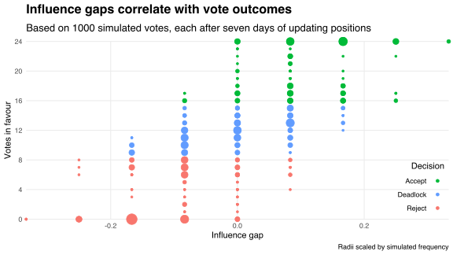

Last week *Nature* published "[Information Gerrymandering and Undemocratic Decisions](https://doi.org/10.1038/s41586-019-1507-6)," an article analysing the effect of peer influences on the outcome of collective decisions.

Suppose, for example, that a 24-member committee must collectively decide whether to adopt a new policy.
The committee agrees to make the decision by vote, and will action whichever choice---accept or reject---wins a two-thirds majority.
One week before the vote, half of the committee members support the policy and half want it rejected.
Fearing stagnation, each member updates their position daily to match the majority among their six most trusted colleagues.
This update process allows committee members to influence each others' positions, potentially shifting the split vote to a decisive majority.

Assuming trust is pairwise mutual, the "influence network" among committee members can be modelled as a 6-regular graph on 24 vertices, with edges connecting influencers.
The function below uses this regular graph model to simulate the outcome of many votes:

```r
simulate_votes <- function(n_votes, committee_size, n_influences, n_days) {
  
  # Create regular graph and identify neighbours
  net <- igraph::k.regular.game(committee_size, n_influences)
  nb <- igraph::neighborhood(net)
  
  # Define function for simulating one vote
  simulate_one <- function(vote) {
    accepts <- vector('double', n_days)
    init_positions <- sample(rep(c(0, 1), committee_size %/% 2), replace = F)
    positions <- init_positions
    for (day in seq_len(n_days)) {
      positions <- purrr::map_dbl(nb, ~(1 * (mean(positions[.]) >= 0.5)))
      accepts[day] <- committee_size * mean(positions)
    }
    list(init_positions = init_positions, accepts = accepts)
  }
  
  # Simulate many votes
  votes <- lapply(seq_len(n_votes), simulate_one)
  
  # Return results
  list(network = net, results = votes)
}
```

`simulate_one` randomises committee members' initial positions---encoding "accept" as one and "reject" as zero---before updating these positions based on neighbouring majorities.
Running `simulate_one` many times allows me to simulate the committees's decision for an ensemble of randomly generated influence networks.
The last few lines of `simulate_votes` generate this ensemble and output the simulation results.

Let's simulate the committee's vote 1000 times, including one week of daily position updates, and tabulate the simulated decision frequencies:

```r
# Run simulations
committee_size <- 24
set.seed(0)
votes <- simulate_votes(1000, committee_size, 6, 7)

# Define function for converting vote counts to committee decisions
get_decision <- function(accepts) {
  dplyr::case_when(
    accepts >= committee_size * 2 / 3 ~ 'Accept',
    accepts <= committee_size / 3 ~ 'Reject',
    TRUE ~ 'Deadlock'
  )
}

# Tabulate decision frequencies
tibble(accepts = map(votes$results, ~tail(.$accepts, 1))) %>%
  mutate(Decision = get_decision(accepts)) %>%
  count(Decision, name = 'Frequency') %>%
  knitr::kable(align = 'c')
```

| Decision | Frequency |
|:--------:|:---------:|
|  Accept  |    292    |
| Deadlock |    429    |
|  Reject  |    279    |

Variation in decisions comes from variation in the influence network's structure.
To see how, let `$\Delta_i$` denote the proportion of committee member `$i$`'s influencers with the same initial position on the policy as member `$i$`, and define
`$$ a_i = \begin{cases} \Delta_i & \text{if}\ \Delta_i\ge 1/2\\ -(1 - \Delta_i) & \text{otherwise}. \end{cases} $$`
The variable `$a_i$` captures the "influence assortment" of committee member `$i$`.
Positive influence assortment means that they mainly agree with their influencers; negative influence assortment means that they mainly disagree.

Now let `$\mathcal{A}$` and `$\mathcal{R}$` be the sets of committee members whose initial positions are to accept and reject the policy, and consider the difference
`$$ G = \frac{1}{\lvert\mathcal{A}\rvert}\sum_{i\in\mathcal{A}} a_i - \frac{1}{\lvert\mathcal{R}\rvert}\sum_{j\in\mathcal{R}} a_j $$`
in mean influence assortments between these sets.
The "influence gap" `$G$` is greater than zero precisely when committee members in `$\mathcal{A}$` are, on average, more positively influence assorted than committee members in `$\mathcal{R}$`.

The scatter plot below shows that `$G$` correlates positively with the probability that the committee accepts the policy.
Intuitively, positive influence gaps characterise influence networks with disproportionately many neighbouring majorities in favour of acceptance, which, consequently, makes voting to accept the policy more likely.



The relationship between influence gaps and vote outcomes creates an incentive to [gerrymander](https://en.wikipedia.org/wiki/Gerrymandering) the influence network to make preferred outcomes more likely.
For example, a subset of committee members wanting to accept the policy could cooperate to gain the trust of specific members so as to construct a positive influence gap.
In political (e.g., elections) and legal (e.g. jury votes) contexts, bad actors may act on the incentive to gerrymander voters' influences and, in doing so, pervert the democratic process.

The *Nature* article extends my model in three ways:

1. it generalises to directed influence networks by relaxing the assumption of pairwise mutual trust;
2. it uses a more elaborate rule for updating positions;
3. it introduces stubborn committee members ("zealots") who never change their position.

However, none of these extensions change the model's prediction: gerrymandering influence networks can lead to undemocratic decision-making by biasing the outcome of otherwise-split votes.

