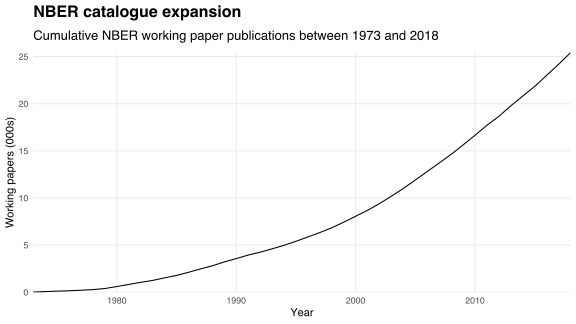

Today I published [nberwp][nberwp], an R package providing data on [NBER](https://www.nber.org) working papers published between 1973 and 2018.
It can be installed from GitHub via [remotes](https://github.com/r-lib/remotes):

```r
library(remotes)
install_github('bldavies/nberwp')
```

nberwp provides a data frame `papers`, each row describing a unique working paper:

```r
papers
```

```
## # A tibble: 25,413 x 4
##    number  year month title                                                     
##     <int> <int> <int> <chr>                                                     
##  1      1  1973     6 Education, Information, and Efficiency                    
##  2      2  1973     6 Hospital Utilization: An Analysis of SMSA Differences in …
##  3      3  1973     6 Error Components Regression Models and Their Applications 
##  4      4  1973     7 Human Capital Life Cycle of Earnings Models: A Specific S…
##  5      5  1973     7 A Life Cycle Family Model                                 
##  6      6  1973     7 A Review of Cyclical Indicators for the United States: Pr…
##  7      7  1973     8 The Definition and Impact of College Quality              
##  8      8  1973     9 Multinational Firms and the Factor Intensity of Trade     
##  9      9  1973     9 From Age-Earnings Profiles to the Distribution of Earning…
## 10     10  1973     9 Monte Carlo for Robust Regression: The Swindle Unmasked   
## # … with 25,403 more rows
```

`number` uniquely identifies working papers by their positions in the series, while `year` and `month` capture papers' publication dates.
The chart below uses these dates to show the NBER catalogue's expansion.



`title` facilitates simple text mining, such as determining which words are used in working paper titles most frequently:

```r
library(tidytext)

words <- papers %>%
  unnest_tokens(word, title) %>%
  anti_join(get_stopwords()) %>%
  filter(nchar(gsub('[a-z.]', '', word)) == 0) %>%
  distinct(number, word)

words %>%
  count(word, sort = T)
```

```
## # A tibble: 11,636 x 2
##    word         n
##    <chr>    <int>
##  1 evidence  2615
##  2 policy    1350
##  3 market    1322
##  4 effects   1193
##  5 trade     1052
##  6 capital    979
##  7 labor      940
##  8 economic   910
##  9 u.s        882
## 10 health     875
## # … with 11,626 more rows
```

Many papers discuss capital and labour markets, and the effects of public policies.
The word "evidence" appears in twice as many titles as any other (non-stop) word, which I suspect reflects the growing use of the "\<Issue\>: Evidence from \<context\>" title format:


The NBER's [RePEc index](https://www.nber.org/RePEc/nbr/nberwo/), from which I derive `papers`, also contains data linking papers to their authors.
I plan to include these data in a future version of nberwp once I've disambiguated authors' names.

[nberwp]: https://github.com/bldavies/nberwp
