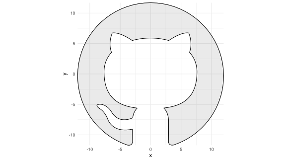
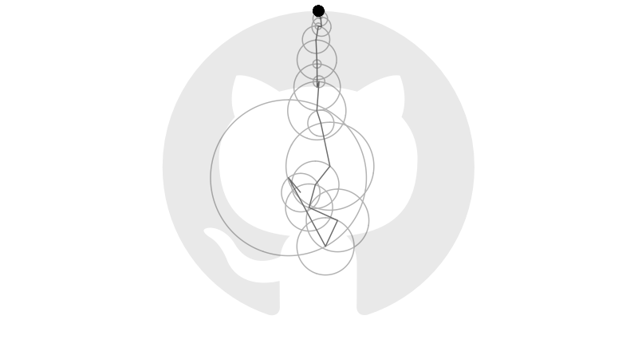

Earlier this year Grant Sanderson, creator of the YouTube channel [3blue1brown](https://www.3blue1brown.com), posted a [video](https://www.youtube.com/watch?v=r6sGWTCMz2k) explaining how [Fourier series](http://mathworld.wolfram.com/FourierSeries.html) approximate periodic functions using sums of sines and cosines.
In the video and its [companion](https://www.youtube.com/watch?v=-qgreAUpPwM), Grant animates sets of vectors that rotate on circular orbits and, when summed together, reproduce a range of images defined by closed curves.

Consider, for example, the boundary of GitHub's logo:

Let `$\gamma:[0,1]\to\mathbb{R}^2$` be the closed curve in `$\mathbb{R}^2$` defining the logo's boundary.
Suppose there is an integer `$n$` such that
`$$ \gamma(t) = \sum_{k=-n}^n \gamma_k(t) $$`
for some set of circular orbits `$\gamma_{-n},\ldots,\gamma_n:[0,1]\to\mathbb{R}^2$` and for all times `$t\in[0,1]$`.
(Negative and positive subscripts correspond to clockwise and anti-clockwise orbits.
Both may be necessary to reconstruct `$\gamma$`.)
Each orbit `$\gamma_k$` has time `$t$` position defined by the vector
`$$ \gamma_k(t) = \begin{bmatrix} r_k \cos(2\pi k t + \theta_k) \\ r_k \sin(2\pi k t + \theta_k) \end{bmatrix} $$`
for some radius `$r_k$`, angular speed `$2\pi k$` rad/s and initial phase `$\theta_k$`.
Consequently, the curves `$x,y:[0,1]\to\mathbb{R}$` defining the horizontal and vertical components of `$\gamma$` must satisfy the system
`$$ \begin{align} x(t) &= \sum_{k=-n}^n r_k\cos(2\pi k t + \theta_k) \\ y(t) &= \sum_{k=-n}^n r_k\sin(2\pi k t + \theta_k) \end{align} $$`
of identities.
Let `$z:[0,1]\to\mathbb{C}$` be the curve with `$z(t)=x(t)+iy(t)$` for all `$t\in[0,1]$`.
[Euler's formula](http://mathworld.wolfram.com/EulerFormula.html) gives
`$$ \begin{align} z(t) &= \sum_{k=-n}^n r_k(\cos(2\pi k t + \theta_k) + i \sin(2\pi k t + \theta_k)) \\ &= \sum_{k=-n}^n r_k \exp(2\pi i k t + i\theta_k) \\ &= \sum_{k=-n}^n c_k \exp(2\pi i k t), \end{align} $$`
where each Fourier coefficient `$c_k=r_k\exp(i\theta_k)$` has modulus `$\lvert c_k\rvert=r_k$` and (principal) argument `$\mathrm{Arg}(c_k)=\theta_k$`.
Now, notice that
`$$ \begin{align} \int_0^1 z(t) \exp(-2\pi i k t)\, \mathrm{d}\,t &= \int_0^1\left(\sum_{j=-n}^n c_j \exp(2\pi i j t)\right)\exp(-2\pi i k t)\, \mathrm{d}\,t \\ &= \int_0^1c_k\, \mathrm{d}\,t + \sum_{j\not=k} c_j \int_0^1 \exp(2\pi i (j - k)t)\, \mathrm{d}\,t \\ &= c_k \end{align} $$`
for each `$k$` because
`$$ \int_0^1 \exp(2\pi i (j - k)t)\, \mathrm{d}\,t = 0 $$`
for all integers `$j\not=k$` by the `$2\pi i$`-periodicity of the complex exponential function.
Thus
`$$ c_k = \int_0^1 z(t) \exp(-2\pi i k t)\, \mathrm{d}\, t, $$`
which can be calculated using Riemann sums given sample points along the component curves `$x$` and `$y$`.
Doing this calculation for each `$k$`, and computing the corresponding moduli `$r_{-n},\ldots,r_n$` and arguments `$\theta_{-n},\ldots,\theta_n$`, provides enough information to generate the animation below.

