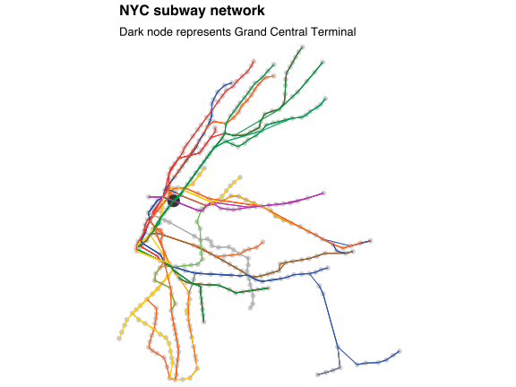
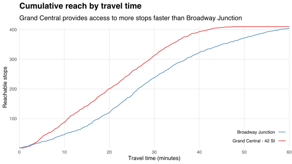
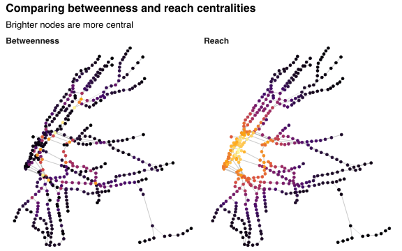

I spent most of October travelling in the United States.
I visited a range of large cities with correspondingly large subway systems.
New York City's is the most extensive, containing [more stops than any other subway system in the world](https://www.citymetric.com/transport/what-largest-metro-system-world-1361).
Its [crown jewel](http://www.grandcentralterminal.com), Grand Central Terminal, provides access to many cultural and commercial attractions in Midtown Manhattan.

But just how central is Grand Central?

To help me answer this question, I created an R package [nyctrains][nyctrains] that provides data on the NYC subway network.
These data include scheduled travel times between subway stops.
I use these times to construct a travel-time-weighted directed network in which stops are adjacent if they occur consecutively along any route.
I exclude stops along the Staten Island Railway, which is disconnected from the rest of the system.
The plot below maps the resulting network, with nodes positioned by latitude/longitude and with edges coloured by route.
(Some routes overlap.)

Estimating Grand Central's centrality requires choosing a measure.
One candidate is [betweenness centrality](https://en.wikipedia.org/wiki/Betweenness_centrality).
Stops are more betweennness-central if trains are more likely to pass through them when taking the fastest route between other stops.

Another candidate measure is [closeness centrality](https://en.wikipedia.org/wiki/Closeness_centrality).
Stops are more (out-)closeness-central if they have shorter mean fastest travel times to all other stops.
In the NYC subway network, some of these times are infinite because the network is not [strongly connected](https://en.wikipedia.org/wiki/Strongly_connected_component).
For example, it is not possible to get from Grand Central to [Aqueduct Racetrack](https://subwaynut.com/ind/aqueduct_racetracka/index.php) without exiting the subway system.

Closeness centrality measures the extent to which stops provide fast access to other stops.
Another way to measure such access is to count the number of stops that can be reached within a specified time.
For example, the chart below shows the number of stops that can be reached from Grand Central and Broadway Junction within an hour.

The number of stops reachable from Grand Central dominates the corresponding number from Brooklyn Junction for all but the smallest travel time allowances.
One way to operationalise this fact is to observe that the area below the red curve exceeds the area below blue curve.
In general, the area below the cumulative reach curve is larger for stops that provide access to more stops in less time.
I compute this area for each stop as a measure of what I call "reach" centrality.[^reach]

The table below reports betweenness and reach centralities for the ten most betweenness-central stops in the NYC subway network, excluding stops on Staten Island.
I normalise centralities to have maximum values equal to unity.

|           Stop           |  Borough  | Betweenness rank (value) | Reach rank (value) |
|:------------------------:|:---------:|:------------------------:|:------------------:|
|   Lexington Av / 59 St   | Manhattan |        1 (1.000)         |     23 (0.973)     |
|          125 St          | Manhattan |        2 (0.975)         |    118 (0.870)     |
|    Jay St - MetroTech    | Brooklyn  |        3 (0.959)         |     46 (0.951)     |
|          86 St           | Manhattan |        4 (0.952)         |     81 (0.926)     |
| Atlantic Av-Barclays Ctr | Brooklyn  |        5 (0.851)         |     92 (0.914)     |
| 149 St - Grand Concourse |   Bronx   |        6 (0.794)         |    158 (0.814)     |
|  Grand Central - 42 St   | Manhattan |        7 (0.777)         |     3 (0.991)      |
|     14 St - Union Sq     | Manhattan |        8 (0.774)         |     1 (1.000)      |
|     Court Sq - 23 St     |  Queens   |        9 (0.763)         |     42 (0.953)     |
|    Broadway Junction     | Brooklyn  |        10 (0.747)        |    172 (0.802)     |

Grand Central is the third most reach-central stop but only the seventh most betweeness-central, contributing to 22% fewer shortest paths than Lexington Avenue/59th Street station.
Broadway Junction is less reach-central than Grand Central---consistent with the chart above---but almost as betweeness-central.
The figure below shows the distribution of betweenness and reach centrality across the 424 stops in the network.

Betweenness-central nodes belong to many shortest paths, and so tend to congregate along bottlenecks and highways.
For example, seven of the ten most betweenness-central stops in the NYC subway network provide access to the Lexington Avenue Express (routes 4, 5 and 5X), which is the fastest---but not only---route between Brooklyn and the Bronx.
In contrast, reach centrality emanates from mid/lower Manhattan, which (i) is geographically dense with mutually nearby subway stops and (ii) contains the fastest inter-borough connections.

[nyctrains]: https://github.com/bldavies/nyctrains

[^reach]: This approach could be improved by adjusting for variation in stops' access to unique amenities so that some stops are more valuable to reach than others. However, this variation is not observable in my data.
