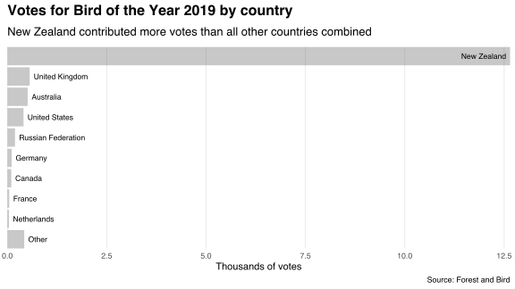

Since 2005, [Forest and Bird](https://www.forestandbird.org.nz) has run annual elections for New Zealand's [Bird of the Year](https://www.birdoftheyear.org.nz).
This week Radio New Zealand [announced](https://www.rnz.co.nz/news/national/402986/bird-of-the-year-2019-hoiho-takes-the-winning-title) the [yellow-eyed penguin](https://en.wikipedia.org/wiki/Yellow-eyed_penguin) as 2019's winner.
A follow-up [tweet](https://twitter.com/Forest_and_Bird/status/1193720097283567616) by Forest and Bird [raised suspicions](https://www.rnz.co.nz/news/national/403085/bird-of-the-year-russian-interest-in-contest-piques-suspicions-online) about possible Russian interference into the vote's outcome.

Forest and Bird's tweet includes a world map with countries coloured by voter turnout.
The bar chart below presents the same information in a less exciting format.[^data]

Russian votes account for 193 of the 15,044 votes with known country of origin.
New Zealand contributed 12,651 such votes.
Fully 28,416 votes had unknown origin and were excluded from the set of votes used to determine the winning bird.

This year's election used an [instant-runoff](https://en.wikipedia.org/wiki/Instant-runoff_voting) system.
Voters reported up to five of their favorite birds, ranked in order of preference.
Beginning with voters' first preferences, birds with the least votes were eliminated sequentially and their votes reallocated to voters' next favorites.
This process continued until one bird remained.

The table below reports the last five birds eliminated by the instant-runoff process among the votes cast from anywhere, from known countries, from New Zealand, from Russia, and from known countries excluding Russia.
The bracketed percentages represent the share of voters from each country who preferred the top two candidates in the final round.
For example, 61.6% of New Zealanders with preferences over the yellow-eyed penguin and the kākāpō preferred the former.

| Place |        All countries        |       Known countries       |         New Zealand         |        Russia        | Known countries ex. Russia  |
|:-----:|:---------------------------:|:---------------------------:|:---------------------------:|:--------------------:|:---------------------------:|
|   1   | Yellow-eyed penguin (52.4%) | Yellow-eyed penguin (58.7%) | Yellow-eyed penguin (61.6%) |    Kākāpō (52.0%)    | Yellow-eyed penguin (59.0%) |
|   2   |       Kākāpō (47.6%)        |       Kākāpō (41.3%)        |       Kākāpō (38.4%)        | Black Robin (48.0%)  |       Kākāpō (41.0%)        |
|   3   |         Black Robin         |       Banded Dotterel       |       Banded Dotterel       |       Barn Owl       |       Banded Dotterel       |
|   4   |       Banded Dotterel       |         Black Robin         |         Black Robin         | Antipodean Albatross |         Black Robin         |
|   5   |           Fantail           |            Kākā             |           Fantail           | Southern Brown Kiwi  |            Kākā             |

Excluding votes from unknown countries did not affect which bird won.
New Zealand voters got the outcome for which they voted, whereas Russian voters would have crowned the kākāpō.
Removing Russian votes wouldn't have changed the election outcome---to the extent that Russians did interfere with the vote, their interference was not successful.

[^data]: The data used in this post are copyright Forest and Bird, and are released under a [CC BY 4.0](https://creativecommons.org/licenses/by/4.0/) license. They are available [here](https://www.dragonfly.co.nz/news/2019-11-12-boty.html).
