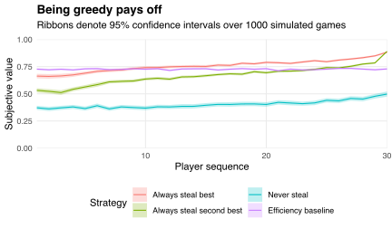

Motu's staff Christmas party is this Friday.
We're planning a [white elephant gift exchange](https://en.wikipedia.org/wiki/White_elephant_gift_exchange): everyone contributes a wrapped gift to a common pool and sequentially chooses to either (i) unwrap a gift or (ii) steal a previously unwrapped gift.
"Victims" of theft make the same choice, but previously stolen gifts cannot be re-stolen until a new gift is unwrapped.
The exchange ends when the last gift is unwrapped.

Suppose I want to maximise the subjective value of the gift in my possession when the exchange ends.
I must overcome two strategic challenges:
I don't know the subjective values of wrapped gifts, and
I don't know other players' subjective values of wrapped *or unwrapped* gifts.
Therefore, any strategy I adopt must account for uncertainty both in wrapped gifts' subjective values and in the propensity of other players to steal unwrapped gifts I covet.

One strategy could be to always steal the unwrapped gift with the highest subjective value.
This strategy is risky because my subjective valuations might correlate with those of other players, making it more likely I will become a victim of theft.
I could hedge this risk by instead always stealing the unwrapped gift with the *second* highest subjective value (unless I'm the last player, in which case I would be better off stealing the most subjectively valuable gift because it can't be re-stolen).
Alternatively, I could play as a pacifist and never steal (unless I'm the last player).

I compare these three strategies---greediness, hedged greediness, and pacifism---via simulation.
I assume gifts' subjective values are determined as the mean of two [standard uniform](https://en.wikipedia.org/wiki/Continuous_uniform_distribution#Standard_uniform) random variables: one describing an underlying value common to all players, and one describing an idiosyncratic component unique to each player.
I simulate 1000 games among 30 players, randomising the strategies adopted by each player in each game.

For each simulated game, I compute the subjective value of the gift in each player's possession when the exchange ends.
I also compute the allocation that maximises aggregate (i.e., the sum of) subjective values.
I refer to the subjective values in this allocation as "efficiency baselines," and use them to compare strategies' tendencies to deliver socially optimal allocations.
I summarise my simulation results in the plot below.

Across all strategies, players whose turns arrive later in the game tend to be better off.
Such players have more choices of gifts to steal and fewer opportunities to become victims of theft.
Greedier players tend to end up with more subjectively valuable gifts, while pacifists---who never use victimisation as an opportunity to "trade up"---typically possess the least subjectively valuable gifts when the exchange ends.
Only late and/or greedy players tend to do better than under the socially optimal allocation.

Choosing not to steal is risky because it may result in unwrapping a low-value gift that no other players want to steal.
The first player, who cannot steal, is particularly exposed to this risk.
The game could be made fairer by allowing the first player (and subsequent victims) to unilaterally swap gifts when everyone else has had their turn.
This adjustment shifts the disadvantage to the second player, who, in the game's pre-swap phase, has only two choices: steal from the first player or unwrap a new gift.
Giving more players a second turn could improve the final gift allocation by giving early players a larger choice set.

The table below shows how the efficiency and equity of the final gift allocation varies with the number of early players given a second turn.
I measure efficiency by the ratio of aggregate subjective values to aggregate efficiency baselines.
I define equity as one minus the [Gini coefficient](https://en.wikipedia.org/wiki/Gini_coefficient) for the distribution of subjective values.
The table reports 95% confidence intervals across 1000 simulated games.

| Players given second turn | Efficiency (%) | Equity (%) |
|:-------------------------:|:--------------:|:----------:|
|             0             |   83.9 ± 0.2   | 80.3 ± 0.2 |
|             1             |   88.8 ± 0.2   | 83.0 ± 0.2 |
|             2             |   88.7 ± 0.2   | 82.8 ± 0.2 |
|             3             |   88.6 ± 0.2   | 82.7 ± 0.2 |
|             4             |   88.6 ± 0.2   | 82.6 ± 0.2 |
|             5             |   88.3 ± 0.2   | 82.4 ± 0.2 |

Giving the first player a second turn makes the final allocation more efficient and more equitable.
That player gets a chance to improve upon their initial endowment, and subsequent victims get a chance to reconsider their choices with more information about the distribution of gifts' subjective values.
However, on average, giving further players a second turn appears to push efficiency and equity back down.

