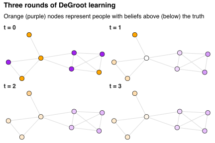

The first book on my reading list for 2020 was [Matthew Jackson](https://web.stanford.edu/~jacksonm/)'s *The Human Network*.
Its seventh chapter discusses [DeGroot learning](https://en.wikipedia.org/wiki/DeGroot_learning) as a process for building consensus among members of a social network.

Consider a (strongly) connected social network among `\(n\)` people.
These people have private information that they use to form independent initial beliefs `\(b_1^{(0)},\ldots,b_n^{(0)}\)` about the value of some parameter `\(\theta\)`.
Recognising that their information sets may be incomplete, everyone updates their beliefs in discrete time steps by iteratively adopting the mean belief among their friends.
This process spreads the information available to each individual throughout the network, allowing peoples' beliefs to converge to a consensus estimate `\(\hat\theta\)` of `\(\theta\)`.[^connected]

[^connected]: Convergence is guaranteed if the social network is strongly connected [(Golub and Jackson, 2005)](https://doi.org/10.1257/mic.2.1.112).

The figure below presents an example of this setup.
It shows the social network among eight people after zero, one, two, and three time steps.
Nodes represent people, and are coloured according to the deviation of peoples' beliefs above (orange) or below (purple) `\(\theta\)`'s true value (white).
Edges represent mutual friendships.
Over time, the information embedded in peoples' initial beliefs diffuses throughout the network and the variation in beliefs around `\(\hat\theta\)` collapses to zero.

People with more friends have more influence on the consensus estimate because they have more avenues through which to spread information.
One can formalise this claim as follows.
Let `\(b^{(t)}=(b_1^{(t)},\ldots,b_n^{(t)})\)` be the `\(n\times 1\)` vector of time `\(t\)` beliefs.
This vector evolves according to
`$$b^{(t+1)}=Wb^{(t)},$$`
where `\(W=(W_{ij})\)` is a row-stochastic `\(n\times n\)` matrix with entries `\(W_{ij}\)` equal to the (time-invariant) weight that person `\(i\)` assigns to the beliefs of person `\(j\)` at each time step.
Notice that `\(b^{(t)}=W^tb^{(0)}\)` and so the `\(n\times1\)` vector `\(b^{(\infty)}=(\hat\theta,\ldots,\hat\theta)\)` of consensus estimates is given by
`$$b^{(\infty)}=\lim_{t\to\infty}W^tb^{(0)}.$$`

In the context of DeGroot learning in social networks, we have
`$$W_{ij}=\frac{A_{ij}+I_{ij}}{d_i+1},$$`
where `\(A=(A_{ij})\)` is the adjacency matrix for the social network,
`\(d_i=\sum_{j=1}^nA_{ij}\)` is person `\(i\)`'s degree in that network,
and `\(I=(I_{ij})\)` is the `\(n\times n\)` identity matrix.
Adding one in the numerator (if `\(i=j\)`) and denominator reflects person `\(i\)` including their own beliefs when computing the mean among their friends.

The matrix `\(W\)` describes a [Markov chain](https://en.wikipedia.org/wiki/Markov_chain) `\(\mathcal{M}\)` on the set of `\(n\)` people.
Assuming that the social network is (strongly) connected implies that `\(\mathcal{M}\)` is irreducible and aperiodic.
It follows from the [Perron-Frobenius theorem](https://en.wikipedia.org/wiki/Perron–Frobenius_theorem) that
`$$\lim_{t\to\infty}W^t=1_n\pi,$$`
where `\(1_n\)` is the `\(n\times1\)` vector of ones and `\(\pi\)` is a `\(1\times n\)` row vector corresponding to the unique stationary distribution of `\(\mathcal{M}\)`; that is, `\(\pi\)` uniquely solves
`$$\pi W=\pi$$`
subject to the constraints that `\(\pi_j\ge0\)` for each `\(j\)` and `\(\sum_{j=1}^n\pi_j=1\)`.

Now, let `\(v\)` be the `\(1\times n\)` row vector with entries `\(v_j=(d_j+1)/\sum_{k=1}^n(d_k+1)\)`.
Then `\(v_j\ge0\)` for each `\(j\)` and `\(\sum_{j=1}^nv_j=1\)`.
Moreover, since `\(A\)` is symmetric (and so `\(d_j=\sum_{i=1}^nA_{ij}\)`),
`$$\begin{align}
(v W)_j
&=\sum_{i=1}^nv_iW_{ij}\\
&=\sum_{i=1}^n\frac{d_i+1}{\sum_{k=1}^n(d_k+1)}\frac{A_{ij}+I_{ij}}{{d_i+1}}\\
&=\frac{d_j+1}{\sum_{k=1}^n(d_k+1)}\\
&=v_j
\end{align}$$`
for each `\(j\)` so that `\(vW=v\)` and therefore `\(\pi=v\)` by uniqueness.
Thus, the consensus estimate is given by
`$$\hat\theta=\frac{\sum_{k=1}^n(d_k+1)b_k^{(0)}}{\sum_{k=1}^n(d_k+1)}.$$`
Finally, the influence that person `\(i\)` has on `\(\hat\theta\)` is captured by the partial derivative
`$$\frac{\partial\hat\theta}{\partial b_i^{(0)}}=\frac{d_i+1}{\sum_{k=1}^n(d_k+1)},$$`
which is an increasing linear function of person `\(i\)`'s degree `\(d_i\)` in the social network.

