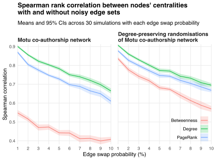

Suppose I want to rank the centralities of nodes in a network.
The network's node set is correct, but its edge set is "noisy" in that it includes some false edges and excludes some true edges.
How sensitive to this noise are the rankings of nodes from most to least central?

One way to answer this question empirically is to perturb an observable "true" network by adding and deleting edges randomly.
This can be achieved by generating an [Erdös-Rényi (ER) random network](https://en.wikipedia.org/wiki/Erd%C5%91s%E2%80%93R%C3%A9nyi_model) with the same node set as the true network, and defining a "noisy" network with edge set equal to the symmetric difference of the true and ER networks' edge sets.
This method "swaps" the states (from "present" to "not present", or vice versa) of the true network's edges at random.
Varying the edge creation probablity in the ER network varies the amount of noise in the noisy network's edge set.

I demonstrate this "random edge swapping" method by applying it to the [Motu working paper co-authorship network](/blog/coauthorship-networks-motu/).
First, I generate 30 ER networks and 30 corresponding noisy networks for a range of edge swap probabilities.
I then compute nodes' betweenness, degree and PageRank centralities in the co-authorship networks with and without noise, and calculate the [Spearman rank correlation](https://en.wikipedia.org/wiki/Spearman%27s_rank_correlation_coefficient) between the true and noisy centralities using each of the three measures.
Finally, I compute the sample means and 95% confidence intervals for the measure-specific rank correlations across the simulation runs associated with each edge swap probability.
I present these means and confidence intervals in the left panel of the plot below.
The right panel presents similar information, but with a [degree-preserving randomisation](https://en.wikipedia.org/wiki/Degree-preserving_randomization) of the co-authorship network within each simulation run before introducing noise.
This randomisation allows me to control for the effect of the co-authorship network's structure on my rank correlation estimates.

Increasing the edge swap probability decreases the consistency between the true and noisy centrality rankings for each of the three centrality measures I analyse.
Intuitively, the more noise there is in the edge set, the less similar are the true and noisy co-authorship networks, and so the less correlated are the centrality rankings of the nodes in these networks.

Degree centrality rankings are the least sensitive to edge noise.
Adding or deleting edges moves the incident nodes up or down the degree rank order, but leaves the relative ranks among non-incident nodes intact.
Degree-preserving randomisation, by definition, does not affect nodes' degree centrality rankings and so does not change the sensitivity of those rankings to noise.

PageRank centrality rankings are more sensitive to edge noise.
Since nodes' PageRank centralities depend on the PageRank centralities of their neighbours, the effect of adding or deleting edges spills over to some non-incident nodes and, consequently, disrupts the PageRank rank order more than the degree rank order.
Controlling for network structure increases the influence that degree has on PageRank centrality and, consequently, decreases the sensitivity of PageRank centrality rankings to errant edges.

Betweenness centrality rankings are the most sensitive to edge noise.
Adding or deleting edges can create or destroy short(est) paths between nodes, leading to radical changes in betweenness centrality for nodes on these paths.
Controlling for network structure suppresses these changes by reducing the initial inequality in betweenness centralities.
About 71% of nodes in the true co-authorship network have betweenness centralities equal to zero, whereas 20% of nodes in the randomised networks have betweenness centralities equal to zero.
Consequently, nodes in the randomised networks typically have "less betweenness to gain or lose" than nodes in the true network, diminishing the effect of errant edges on betweenness centrality rankings.

