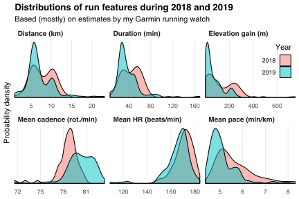

This week I created an R package [stravadata](https://github.com/bldavies/stravadata/) that provides convenient access to my [Strava](https://www.strava.com/) activity data.
These data document my running patterns since the start of 2018.

The table below aggregates my total distance, time, and elevation gain across my runs in each of the past two years.
I ran almost twice as far in 2019 as in 2018, but with only a 79% increase in total time and 23% increase in total elevation gain.

|                          |   2018|    2019|
|:-------------------------|------:|-------:|
|Total distance (km)       | 543.78| 1084.70|
|Total time (hours)        |  52.14|   93.56|
|Total elevation gain (km) |   8.42|   10.35|

I ran on 67 distinct days in 2018 and 143 distinct days in 2019.
The chart below shows the distribution of these days within each year, with tiles shaded in proportion to the distance run on each day.
The dark tile on the 10th Saturday of 2019 represents me [completing my goal](/blog/goals-2019-update/) to run a half marathon.
I didn't run often during the winter of 2018 or at all while I was in the USA in October 2019.

My Strava activity data describe several "features" for each run, such as my mean pace and heart rate.
Most of these features are estimates by sensors contained within my Garmin running watch.[^most]
The chart below presents the distributions of several features for my runs during 2018 and 2019.
In both years I ran mostly five or 10 kilometres at a time, with proportionally more short runs in 2019.

[^most]: I started using the watch in February 2018. Features for earlier runs are estimates by sensors contained within my iPhone.

On average, I took faster steps, maintained lower heart rates, and ran at faster paces in 2019 than in 2018.
These differences could be due to increased fitness or to running proportionally fewer hills.
One way to separate these two effects is to compare annual feature distributions after removing the variation in features' values that is explained by variation in elevation gain.
I present this comparison in the chart below.
The mean cadence and heart rate distributions look similar to before controlling for elevation gain, but the improvement in my mean paces is more pronounced.

