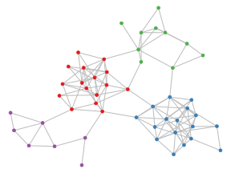

Suppose I want to generate some random graphs that exhibit [community structure](https://en.wikipedia.org/wiki/Community_structure).
For example, I might be interested in simulating how information or diseases spread in social networks, and I suspect---but lack data to confirm---that people sort into communities based on their personal and professional interests.

One approach is to use the [stochastic block model](https://en.wikipedia.org/wiki/Stochastic_block_model).
In this model, each vertex belongs to one of `\(r\)` disjoint communities `\(C_1,C_2,\ldots,C_r\)`, and vertices `\(u\in C_i\)` and `\(v\in C_j\)` are adjacent with probability `\(p_{ij}\)`.
Varying `\(p_{ij}\)` across `\((i,j)\)` pairs varies the level of connectivity within and between communities.
For example, choosing
`$$p_{ij}=\begin{cases} p & \text{if}\ i=j \\ q & \text{otherwise} \end{cases}$$`
for some probabilities `\(p\)` and `\(q<p\)` delivers random graphs that tend to contain more edges within communities than between communities.
We can simulate this special case---known as the "planted partition model" (PPM)---in R using the `sample_ppm` function defined below.

```r
library(igraph)

sample_ppm <- function(memb, p, q) {
  mat <- t(combn(seq_along(memb), 2))
  prob <- c(q, p)[1 + (memb[mat[, 1]] == memb[mat[, 2]])]
  el <- mat[which(runif(nrow(mat)) < prob), ]
  graph_from_edgelist(el, directed = FALSE)
}
```

`sample_ppm` takes as arguments a vector `memb` of community memberships, and the edge probabilities `\(p\)` and `\(q\)`.
The function constructs a matrix `mat` of vertex pairs, determines the probabilities that these pairs are adjacent, and uses these probabilities to create a random edge list `el` and corresponding random graph.

For example, let's simulate a PPM random graph with 50 vertices and four communities, and with edge probabilities `\(p=1/3\)` and `\(q=0.01\)`:

```r
set.seed(0)
memb <- sample(1:4, 50, replace = TRUE)
G <- sample_ppm(memb, 1/3, 0.01)
```

We can visualise `G` using [ggraph](https://cran.r-project.org/package=ggraph):

```r
library(ggraph)

G %>%
  ggraph() +
  geom_edge_link0(colour = 'grey75') +
  geom_node_point(aes(col = factor(memb)), show.legend = FALSE) +
  scale_colour_brewer(palette = 'Set1') +
  theme_void()
```



The communities in `G`---identified by vertices' colours---contain many internal edges but few external edges.
Thus, if informed or infected vertices spread information or disease among their neighbours with equal probabilities, then we would expect faster diffusion within communities than between communities.

