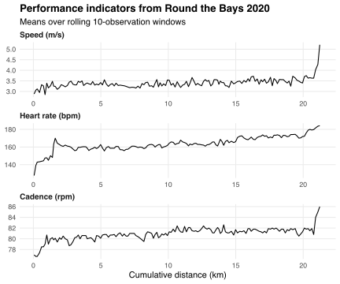
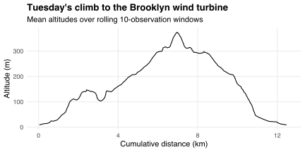

[stravadata](https://github.com/bldavies/stravadata) now provides data on activity streams, which are "the raw measurement sequences that define" Strava activities ([source](https://medium.com/strava-engineering/from-data-streams-to-a-data-lake-b6ca17c00a23)).
For example, here are some of the streams from when I ran [Round the Bays](https://wellingtonroundthebays.co.nz) in February:

```r
library(dplyr)
library(stravadata)

rtb_streams <- activities %>%
  filter(name == 'Round the Bays' & grepl('2020', start_time)) %>%
  select(id) %>%
  left_join(streams) %>%
  select(distance, time, speed, hr, cadence)

rtb_streams
```

```
## # A tibble: 1,543 x 5
##    distance  time speed    hr cadence
##       <dbl> <dbl> <dbl> <dbl>   <dbl>
##  1      0       0   0     110       0
##  2      1.7     1   1.7   110       0
##  3     12.5     6   2.1   109      76
##  4     22.2    10   2.3   113      75
##  5     27.3    12   2.5   112      77
##  6     30.1    14   2.2   117      76
##  7     33.2    15   2.2   119      76
##  8     39.4    17   2.4   123      76
##  9     42.9    18   2.6   126      76
## 10     53.4    21   3.4   130      79
## # … with 1,533 more rows
```

The `distance` and `time` columns report cumulative distance travelled and time elapsed, while the other three columns provide (unevenly spaced) time series of performance indicators.
I smooth these series by computing means over rolling 10-observation windows, and plot the smoothed series together in the chart below.
The chart shows the gradual increase in my speed and cadence---and, consequently, heart rate---throughout the race, and my final sprint near the finish line.

```r
library(ggplot2)
library(tidyr)

rtb_streams %>%
  mutate_at(c('speed', 'hr', 'cadence'), zoo::rollmean, 10, na.pad = T) %>%
  filter(row_number() %% 10 == 0) %>%  # Prevent over-plotting
  select(distance, `Speed (m/s)` = speed,
         `Heart rate (bpm)` = hr, `Cadence (rpm)` = cadence) %>%
  gather(key, value, -distance) %>%
  ggplot(aes(distance / 1e3, value)) +
  geom_line() +
  facet_wrap(~forcats::fct_rev(key), scales = 'free', ncol = 1) +
  labs(x = 'Cumulative distance (km)',
       y = NULL,
       title = 'Performance indicators from Round the Bays 2020',
       subtitle = 'Means over rolling 10-observation windows')
```



As another example, on Tuesday I ran from the Wellington CBD to the [Brooklyn wind turbine](https://en.wikipedia.org/wiki/Brooklyn,_New_Zealand#Wind_turbine) and back.
That run included 447 metres of total elevation gain.
`streams` disaggregates this total into a sequence of `altitude` values, allowing me to plot the activity's elevation profile:

```r
activities %>%
  filter(grepl('2020-04-07', start_time)) %>%
  select(id) %>%
  left_join(streams) %>%
  mutate(altitude = zoo::rollmean(altitude, 10, na.pad = T)) %>%
  filter(row_number() %% 10 == 0) %>%
  ggplot(aes(distance / 1e3, altitude)) +
  geom_line() +
  labs(x = 'Cumulative distance (km)',
       y = 'Altitude (m)',
       title = 'Tuesday\'s climb to the Brooklyn wind turbine',
       subtitle = 'Mean altitudes over rolling 10-observation windows')
```



Having disaggregated stream data makes it possible to determine how Strava computes aggregate activity-level features.
For example, suppose I want to reconstruct the `mean_hr` column of `activities` using the `hr` column of `streams`.
The naive approach is to group `streams` by `id` and compute within-activity means.
However, this approach may generate biased estimates of `mean_hr` because the observations in `streams` are unevenly spaced with respect to time.
For example, if I stop to recover at the end of a short sprint or uphill climb then my measured heart rate spike (which, in my experience, tends to lag the corresponding effort spike) will be concentrated within a single observation, and subsequent observations will have relatively low heart rates.
This will bias naive estimates downwards.

I can correct for this potential bias in the naive estimator by weighting observations by how much they increase my total time.
Similarly, Strava may estimate mean heart rates based on moving time only, which I can replicate by weighting observations in `streams` by the boolean values in its `moving` column when computing within-activity means.

I compute the naive `mean_hr` estimates, and the estimates based on total and moving times, as follows:

```r
hr_estimates <- streams %>%
  group_by(id) %>%
  mutate(dt = time - lag(time)) %>%
  filter(cumsum(moving) > 0) %>%  # Ignore idle starts
  summarise(est_naive = mean(hr),
            est_total = sum(hr * dt) / sum(dt),
            est_moving = sum(hr * moving * dt) / sum(moving * dt)) %>%
  ungroup() %>%
  mutate_all(round, 1)  # Strava reports mean HRs to 1dp
```

Finally, I compute the frequency with which each type of estimate equals, almost equals, and falls below the corresponding activity's `mean_hr` value in `activities`:

```r
hr_estimates %>%
  drop_na() %>%  # Ignore activities with no HR data
  left_join(activities) %>%
  select(mean_hr, starts_with('est')) %>%
  gather(type, value, -mean_hr) %>%
  group_by(type) %>%
  summarise(equal = mean(value == mean_hr),
            almost = mean(abs(value - mean_hr) < 1),
            below = mean(value < mean_hr)) %>%
  mutate_if(is.double, round, 3)
```

```
## # A tibble: 3 x 4
##   type       equal almost below
##   <chr>      <dbl>  <dbl> <dbl>
## 1 est_moving 1      1     0    
## 2 est_naive  0.023  0.425 0.924
## 3 est_total  0.548  0.856 0.384
```

Computing mean heart rates based on moving time recovers all of the 341 non-missing `mean_hr` values in my copy of `activities`.
In contrast, computing mean heart rates based on total time recovers 55% of these values only.
The total-time estimates get within a heart beat per second of the "true" value about twice as often as the naive estimates, which appear to be biased downwards (possibly due to the phenomenon described above).

