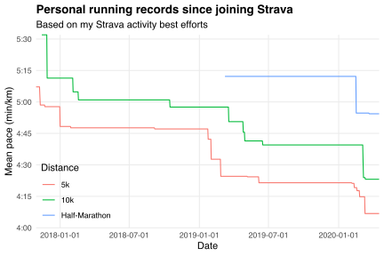

[stravadata](https://github.com/bldavies/stravadata) now provides data on "best efforts"---fastest times over a range of benchmark distances within each Strava activity---via `best_efforts`:

```r
library(dplyr)
library(stravadata)

head(best_efforts)
```

```
## # A tibble: 6 x 4
##           id effort   start_index end_index
##        <dbl> <chr>          <int>     <int>
## 1 1253004287 1 mile            15       447
## 2 1253004287 1/2 mile          11       232
## 3 1253004287 1k                12       284
## 4 1253004287 2 mile            11       876
## 5 1253004287 400m              11       120
## 6 1253004287 5k                11      1342
```

The `id` column stores activity IDs and the `effort` column stores effort descriptions.
The `start_index` and `end_index` columns store each effort's start and end indices in the corresponding activity's [stream](/blog/activity-streams-stravadata).
These indices can be used to compute the distance travelled, time elapsed, and mean pace achieved during each effort:

```r
best_effort_paces <- streams %>%
  left_join(best_efforts) %>%
  group_by(id, effort) %>%
  mutate(index = row_number()) %>%
  filter(index == start_index | index == end_index) %>%
  summarise(distance = max(distance) - min(distance),
            time = max(time) - min(time)) %>%
  ungroup() %>%
  mutate(mean_pace = (time / 60) / (distance / 1e3))

head(best_effort_paces)
```

```
## # A tibble: 6 x 5
##           id effort   distance  time mean_pace
##        <dbl> <chr>       <dbl> <dbl>     <dbl>
## 1 1253004287 1 mile      1609    478      4.95
## 2 1253004287 1/2 mile     806.   230      4.76
## 3 1253004287 1k          1001.   292      4.86
## 4 1253004287 2 mile      3219    976      5.05
## 5 1253004287 400m         400.   111      4.62
## 6 1253004287 5k          5000.  1536      5.12
```

The values in the `distance` column of `best_effort_paces` differ slightly from the distances described in its `effort` column because there is not always a sequence of consecutive stream observations that cover such distances exactly.
However, I expect that, on average, the multiplicative error in `distance` equals the multiplicative error in `time`, so that the `mean_pace` column provides unbiased estimates of my true mean paces.
The chart below uses these estimates to track my personal record 5k, 10k, and half-marathon mean paces since joining Strava in late 2017.



I improved my 5k and 10k personal records significantly while training for, and competing in, the [Wellington Waterfront 5k series](https://waterfront5k.nz) during the 2018/19 and 2019/20 summers.
My mean pace during [Round the Bays](https://wellingtonroundthebays.co.nz) in February 2020 improved on my previous half-marathon record by 17 seconds per kilometre, but the fastest of the half-marathons I have run since improved on my Round the Bays pace by one second per kilometre only.

