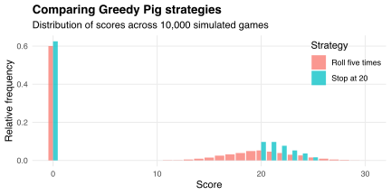

[Greedy Pig](https://nzmaths.co.nz/resource/greedy-pig-1) is a game used to teach probability and statistics to primary school students.
The game comprises a set of rounds in which players roll a fair six-sided die until they choose to stop, in which case their score for that round is equal to the sum of rolled values, or they roll a one, in which case their score for that round is zero.
The player with the highest total score across all rounds wins.

Since the scores obtained in each round are independent, players can maximise their total score across all rounds by maximising their score in each round independently.
One strategy is to commit to rolling the die `\(n\)` times in each round, where `\(n\)` is chosen to maximise the expected resulting score.
We can make this choice as follows.
First, let `\(X_k\)` be the outcome of the `\(k^\text{th}\)` die roll.
This outcome has probability distribution
`$$\Pr(X_k=x)=\begin{cases}1/6&\text{if}\ x\in\{1,2,3,4,5,6\}\\ 0&\text{otherwise}.\end{cases}$$`
Next, let `\(1_{X_k>1}\)` be the indicator variable for the event in which `\(X_k>1\)`.
Then the score after `\(n\)` rolls is given by
`$$S_n=\sum_{k=1}^nX_k\pi_n,$$`
where
`$$\pi_n=\prod_{k=1}^n1_{X_k>1}$$`
is the indicator variable for the event in which all of the first `\(n\)` rolls exceed unity.
Now, by the linearity of the expectation operator and the [law of total expectation](https://en.wikipedia.org/wiki/Law_of_total_expectation), the score `\(S_n\)` has expected value
`$$\begin{align}
\mathrm{E}[S_n]
&= \sum_{k=1}^n\mathrm{E}[X_k\pi_n] \\
&= \sum_{k=1}^n\left(\mathrm{E}[X_k\pi_n\,\vert\,\pi_n=1]\Pr(\pi_n=1)+\mathrm{E}[X_k\pi_n\,\vert\,\pi_n=0]\Pr(\pi_n=0)\right) \\
&= \sum_{k=1}^n\mathrm{E}[X_k\,\vert\,\pi_n=1]\Pr(\pi_n=1).
\end{align}$$`
Since `\(\pi_n=1\)` if and only if `\(X_k>1\)` for each `\(k\in\{1,2,\ldots,n\}\)`, and since die rolls are independent, we have
`$$\begin{align}
\mathrm{E}[X_k\,\vert\,\pi_n=1]
&= \mathrm{E}[X_k\,\vert\,X_k>1] \\
&= \frac{2+3+4+5+6}{5} \\
&= 4
\end{align}$$`
and
`$$\Pr(\pi_n=1)=\left(\frac{5}{6}\right)^n.$$`
Hence
`$$\mathrm{E}[S_n]=4n\left(\frac{5}{6}\right)^n$$`
for each `\(n\)`, which obtains its maximum value of 8.04 when `\(n\in\{5,6\}\)`.
Therefore, players who commit to a fixed number of rolls should commit to five or six rolls in each round to maximise their expected score.

Another strategy is to continue rolling until reaching some target score `\(S^*\)`.
This strategy allows players to respond to their realised sequence of rolls.
Intuitively, players who realise a run of high-value rolls have more to lose by rolling again and so may be less willing to do so.
To determine the value of `\(S^*\)`, let `\(Y_k\)` denote the payoff from the `\(k^\text{th}\)` roll and notice that this payoff has expected value
`$$\begin{align}
\mathrm{E}[Y_k]
&= \mathrm{E}[X_k\,\vert\,X_k>1]\Pr(X_k>1)-S_{k-1}\Pr(X_k=1) \\
&= \frac{20-S_{k-1}}{6}.
\end{align}$$`
Thus, rolling again delivers a positive expected payoff if and only if `\(S_{k-1}<20\)`, and so players seeking to maximise their expected score should stop rolling when their score reaches `\(S^*=20\)`.
This argument also clarifies why both `\(n=5\)` and `\(n=6\)` maximise `\(\mathrm{E}[S_n]\)`: players with a non-zero score after five rolls have a conditional expected score of `\(\mathrm{E}[S_5\,\vert\,\pi_5=1]=20\)`, so the expected gain in score for such players from a sixth roll is zero.

We can compare the "roll five times" and "stop at 20" strategies via simulation.
First, define a function `simulate_strategy` that takes as arguments either a fixed number of rolls `n` or a target score `t`, and simulates the player's score from adopting their chosen strategy:

```r
simulate_strategy <- function(n = NULL, t = NULL) {
  if (is.null(n) & is.null(t)) stop('`n` or `t` must be non-NULL')
  score <- 0
  k <- 0
  done <- F
  while (!done) {
    x <- sample(1:6, 1)
    if (x == 1) {
      score <- 0
      done <- T
    } else {
      score <- score + x
      k <- k + 1
      done <- ifelse(!is.null(n), k >= n, score >= t)
    }
  }
  score
}
```
Next, define two wrapper functions for simulating each strategy separately:

```r
simulate_n <- function(n) simulate_strategy(n = n)
simulate_t <- function(t) simulate_strategy(t = t)
```
Finally, we can simulate 10,000 games using each strategy and store the realised scores:

```r
set.seed(0)
scores_n <- sapply(rep(5, 1e4), simulate_n)
scores_t <- sapply(rep(20, 1e4), simulate_t)
```

The "stop at 20" strategy delivers a mean score of 8.13, which is 1.69% higher than the mean score delivered by the "roll five times" strategy.
However, the "stop at 20" strategy is also 4.12% more likely to deliver a score of zero than the "roll five times" strategy.
We can see this by plotting the distributions of simulated scores delivered by the two strategies:

```r
library(dplyr)
library(ggplot2)
library(tidyr)

tibble(`Roll five times` = scores_n, `Stop at 20` = scores_t) %>%
  gather(Strategy, Score) %>%
  count(Strategy, Score) %>%
  ggplot(aes(Score, n / 1e4)) +
  geom_col(aes(fill = Strategy), alpha = 0.75, position = 'dodge') +
  labs(y = 'Relative frequency',
       title = 'Comparing Greedy Pig strategies',
       subtitle = 'Distribution of scores across 10,000 simulated games')
```



The distribution of non-zero scores under the "stop at 20" strategy is asymmetric about its conditional mean of 21.69, and is bounded below by 20 and above by 25.
In contrast, the distribution of non-zero scores under the "roll five times" strategy is symmetric about its conditional mean of 20, and is bounded below by 10 and above by 30.

The "roll five times" and "stop at 20" strategies are heuristics for maximising players' scores in each round.
These heuristics may be sub-optimal in some situations.
For example, if one player remains in the last round and has accumulated enough total score to win the game then they should always stop rolling.

