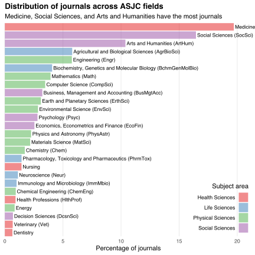
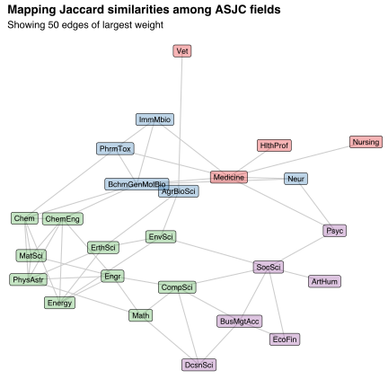

Research often draws on multiple fields, each contributing field-specific ideas and techniques to the production of new knowledge.
The more similar are two fields, the easier it is to combine their ideas and techniques, the more frequently such combination occurs, and the more demand there is for ways to publish the consequent research.
Likewise, the more similar are two fields, the easier it is to attract (subscription fee-paying) readers to journals covering those fields, and so the more willing publishers are to supply such journals.
Thus, in equilibrium, the frequency with which journals cover pairs of research fields rises with the similarity between those fields.

This argument suggests that we can estimate research field similarities from data on journals and the fields they cover.
One source of such data is the [Scopus](https://www.scopus.com/home.uri) source list, which matches journals to fields within Scopus' [All Science Journal Classification (ASJC)](https://service.elsevier.com/app/answers/detail/a_id/15181/supporthub/scopus/) system.
The Scopus source list covers 24,039 active journals, each assigned to one or more of 26 ASJC fields.[^multidisciplinary]
Each of these fields belongs to one of four subject areas: Health, Life, Physical, and Social Sciences.
The bar chart below presents the distribution of journals across fields, with bars coloured by subject area.[^fractional]

[^multidisciplinary]: I exclude the 27th field, "Multidisciplinary," from my analysis.

[^fractional]: I count journals "fractionally" so that, for example, journals assigned to four fields contribute a quarter to each field's count.

I estimate the similarity between ASJC fields as follows.
First, I count the number of journals assigned to each pair of fields.
I then divide these co-assignment counts by the number of journals assigned to at least one of the paired fields.
This normalisation delivers the [Jaccard similarities](https://en.wikipedia.org/wiki/Jaccard_index) between the sets of journals assigned to each field.

On average, each ASJC field pair shares 62.43 co-assignments and a Jaccard similarity of 0.02.
About 83% of pairs share at least one journal co-assignment.
The table below presents the ten field pairs with the greatest Jaccard similarities.

|               Field 1                |               Field 2               | Co-assignments | Jaccard similarity |
|:------------------------------------:|:-----------------------------------:|:--------------:|:------------------:|
|         Arts and Humanities          |           Social Sciences           |     2,247      |        0.29        |
|          Materials Science           |        Physics and Astronomy        |      403       |        0.23        |
|         Chemical Engineering         |              Chemistry              |      222       |        0.19        |
|             Engineering              |          Materials Science          |      564       |        0.18        |
| Business, Management and Accounting  | Economics, Econometrics and Finance |      359       |        0.18        |
| Agricultural and Biological Sciences |        Environmental Science        |      459       |        0.16        |
|           Computer Science           |             Mathematics             |      395       |        0.15        |
|              Chemistry               |          Materials Science          |      252       |        0.15        |
|           Computer Science           |             Engineering             |      492       |        0.14        |
|             Engineering              |        Physics and Astronomy        |      383       |        0.12        |

We can visualise the similarities between ASJC fields by constructing a network in which (i) nodes represent fields and (ii) edges have weights proportional to incident nodes' similarities.
I present this network below, restricting my visualisation to the sub-network induced by the 50 edges of largest weight.
To improve readability, I label some nodes using the field abbreviations given in parentheses in the bar chart above.
I draw fields with greater similarities closer together.

Overall, fields tend to be most similar to other fields in the same subject area.
The proximities among nodes, reflecting fields' pairwise similarities, seem intuitive:
Chemistry (Chem) and Chemical Engineering (ChemEng) are obviously similar, the biological sciences are clustered together, and Astronomy researchers probably don't read many Nursing journals---indeed, there are no journal co-assignments between Physics and Astronomy (PhysAstr) and Nursing.

The paths between fields also make sense.
For example, Social Science (SocSci) relies on Neuroscience (Neur) to the extent it helps explain how people think and behave, which suggests the fields should be connected via Psychology (Psyc).
Likewise, Business, Management and Accounting (BusMgtAcc) rely on Mathematics (Math) to the extent that it helps model how people make decisions, which suggests that the fields should be connected via Decision Science (DscnSci).

