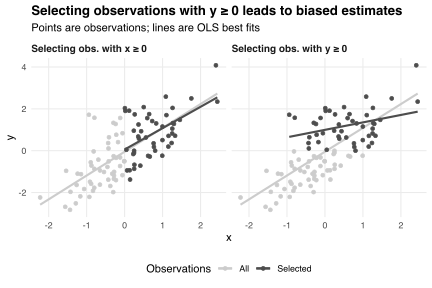

Suppose we have data `\(\{(x_i,y_i):i\in\{1,2,\ldots,n\}\}\)` generated by the process
`$$y_i=\beta x_i+u_i,$$`
where the `\(u_i\)` are random errors with zero means, equal variances, and zero correlations with the `\(x_i\)`.
This data generating process (DGP) satisfies the [Gauss-Markov](https://en.wikipedia.org/wiki/Gauss–Markov_theorem) assumptions, so we can obtain an unbiased estimate `\(\hat\beta\)` of the coefficient `\(\beta\)` using ordinary least squares (OLS).

Now suppose we restrict our data to observations with `\(x_i\ge0\)` or `\(y_i\ge0\)`.
How will these restrictions change `\(\hat\beta\)`?

To investigate, let's create some toy data:

```r
library(dplyr)

n <- 100
set.seed(0)
df <- tibble(x = rnorm(n), u = rnorm(n), y = x + u)
```
Here `\(x_i\)` and `\(u_i\)` are standard normal random variables, and `\(y_i=x_i+u_i\)` for each observation `\(i\in\{1,2,\ldots,100\}\)`.
Thus `\(\beta=1\)`.
The OLS estimate of `\(\beta\)` is
`$$\DeclareMathOperator{\Cov}{Cov}\DeclareMathOperator{\Var}{Var}\hat\beta=\frac{\Cov(x,y)}{\Var(x)},$$`
where `\(x=(x_1,x_2,\ldots,x_{100})\)` and `\(y=(y_1,y_2,\ldots,y_{100})\)` are data vectors, `\(\Cov\)` is the covariance operator, and `\(\Var\)` is the variance operator.
For these data, we have

```r
cov(df$x, df$y) / var(df$x)
```

```
## [1] 1.138795
```
as our estimate with no selection.

Next, let's introduce our selection criteria:

```r
df <- df %>%
  tidyr::crossing(criterion = c('x >= 0', 'y >= 0')) %>%
  rowwise() %>%  # eval is annoying to vectorise
  mutate(selected = eval(parse(text = criterion))) %>%
  ungroup()

df
```

```
## # A tibble: 200 x 5
##        x       u      y criterion selected
##    <dbl>   <dbl>  <dbl> <chr>     <lgl>   
##  1 -2.22 -0.0125 -2.24  x >= 0    FALSE   
##  2 -2.22 -0.0125 -2.24  y >= 0    FALSE   
##  3 -1.56 -1.12   -2.68  x >= 0    FALSE   
##  4 -1.56 -1.12   -2.68  y >= 0    FALSE   
##  5 -1.54  0.577  -0.963 x >= 0    FALSE   
##  6 -1.54  0.577  -0.963 y >= 0    FALSE   
##  7 -1.44 -1.39   -2.83  x >= 0    FALSE   
##  8 -1.44 -1.39   -2.83  y >= 0    FALSE   
##  9 -1.43 -0.543  -1.97  x >= 0    FALSE   
## 10 -1.43 -0.543  -1.97  y >= 0    FALSE   
## # … with 190 more rows
```
Now `df` contains two copies of each observation---one for each selection criterion---and an indicator for whether the observation is selected by each criterion.
We can use `df` to estimate OLS coefficients and their standard errors among observations with `\(x_i\ge0\)` and `\(y_i\ge0\)`:

```r
df %>%
  filter(selected) %>%
  group_by(criterion) %>%
  summarise(n = n(),
            estimate = cov(x, y) / var(x),
            std.error = sd(y - estimate * x) / sqrt(n))
```

```
## # A tibble: 2 x 4
##   criterion     n estimate std.error
##   <chr>     <int>    <dbl>     <dbl>
## 1 x >= 0       48    1.02      0.136
## 2 y >= 0       47    0.356     0.110
```
The OLS estimate among observations with `\(x_i\ge0\)` approximates the true value `\(\beta=1\)` well.
However, the estimate among observations with `\(y_i\ge0\)` is much smaller than one.
We can confirm this visually:


What's going on?
Why do we get biased OLS estimates of `\(\beta\)` among observations with `\(y_i\ge0\)` but not among observations with `\(x_i\ge0\)`?

The key is to think about the errors `\(u_i\)` in each case.
Since the `\(x_i\)` and `\(u_i\)` are independent, selecting observations with `\(x_i\ge0\)` leaves the distributions of the `\(u_i\)` unchanged---they still have zero means, equal variances, and zero correlations with the `\(x_i\)`.
Thus, the Gauss-Markov assumptions still hold and we still obtain unbiased OLS estimates of `\(\beta\)`.

In contrast, the `\(x_i\)` and `\(u_i\)` are negatively correlated among observations with `\(y_i\ge0\)`.
To see why, notice that if `\(y_i=x_i+u_i\)` then `\(y_i\ge0\)` if and only if `\(x_i\ge-u_i\)`.
So if `\(x_i\)` is low then `\(u_i\)` must be high (and vice versa) for the observation to be selected.
Thus, among selected observations, we have
`$$u_i=\rho x_i+\varepsilon_i,$$`
where `\(\rho<0\)` indexes (and, in this case, equals) the correlation between the `\(x_i\)` and `\(u_i\)`, and where the residuals `\(\varepsilon_i\)` are uncorrelated with the `\(x_i\)`.
Our DGP then becomes
`$$y_i=(\beta+\rho)x_i+\varepsilon_i.$$`
The `\(\varepsilon_i\)` have equal variances (equal to `\(1+\rho^2\)` in this case) and, again, are uncorrelated with the `\(x_i\)`.
Therefore, the OLS estimate
`$$\hat\rho=\frac{\Cov(u,x)}{\Var(x)}$$`
of `\(\rho\)` is unbiased[^rho-hat], and for our toy data equals `\(\hat\rho\approx-0.644\)` among observations with `\(y_i\ge0\)`.
Subtracting `\(\hat\rho\)` from `\(\hat\beta\)` then gives
`$$\begin{align}
\hat\beta-\hat\rho
&\approx 0.356 - (-0.644) \\
&= 1,
\end{align}$$`
recovering the true value `\(\beta=1\)`.

[^rho-hat]: We can rewrite `\(\varepsilon_i=\alpha+(\varepsilon_i-\alpha)\)`, where `\(\alpha\)` is the mean of the `\(\varepsilon_i\)`, and where the `\((\varepsilon_i-\alpha)\)` have zero means, equal variances, and zero correlations with the `\(x_i\)`.

The table below reports 95% confidence intervals for `\(\hat\beta\)`, `\(\hat\rho\)`, and `\((\hat\beta-\hat\rho)\)`, estimated by simulating the DGP `\(y_i=x_i+u_i\)` described above 100 times.
The table confirms that the OLS estimate `\(\hat\beta\)` of `\(\beta=1\)` is unbiased among observations with `\(x_i\ge0\)` but biased negatively among observations with `\(y_i\ge0\)`.

|Observations   |  `\(\hat\beta\)`  |   `\(\hat\rho\)`   | `\(\hat\beta-\hat\rho\)` |
|:--------------|:-------------:|:--------------:|:--------------------:|
|All            | 1.005 ± 0.002 | 0.005 ± 0.002  |    1.000 ± 0.000     |
|With `\(x_i\ge0\)` | 1.001 ± 0.004 | 0.001 ± 0.004  |    1.000 ± 0.000     |
|With `\(y_i\ge0\)` | 0.547 ± 0.003 | -0.453 ± 0.003 |    1.000 ± 0.000     |

The estimate `\(\hat\beta\)` always differs from `\(\beta\)` by `\(\hat\rho\)`, which is significantly non-zero among observations with `\(y_i\ge0\)`.
However, this pattern is not useful empirically because we generally don't observe the `\(u_i\)` and so can't estimate `\(\hat\rho\)` to back out the true value of `\(\beta=\hat\beta-\hat\rho\)`.
Instead, we may use the [Heckman correction](https://en.wikipedia.org/wiki/Heckman_correction) to adjust for the bias introduced through non-random selection.

In empirical settings, selecting observations with `\(x_i\ge0\)` may lead to biased estimates when (i) there is heterogeneity in the relationship between `\(y_i\)` and `\(x_i\)` across observations `\(i\)`, and (ii) OLS is used to estimate an [average treatment effect](https://en.wikipedia.org/wiki/Average_treatment_effect).[^shakked]
In particular, if the `\(x_i\)` are correlated with the observation-specific treatment effects then restricting to observations with `\(x_i\ge0\)` changes the distribution, and hence the mean, of those effects non-randomly.

[^shakked]: Thanks to [Shakked](http://shakkednoy.com) for pointing this out.

