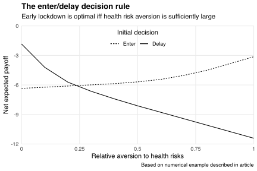

When the COVID-19 pandemic began, the New Zealand government faced uncertainty around the virus' health and economic consequences.
Amid this uncertainty, the government had two choices: enter lockdown immediately or delay its decision.
Delaying preserved the option to enter lockdown if its necessity became clearer.
However, a delayed lockdown would be less effective if many people caught the virus while the government waited for clarifying information.

We know now that the government chose to enter lockdown early.
Was this the best choice given information available at the time?
To help answer this question, [Arthur Grimes](https://motu.nz/about-us/people/arthur-grimes/) and I analyse the government's decision in [an article][doi] published last week in the *New Zealand Economic Papers*.
Our analysis formalises, and builds on, ideas discussed in [my blog post on policymaking under uncertainty](/blog/policymaking-under-uncertainty/) and [Arthur's commentary on the lockdown at *Newsroom*](https://www.newsroom.co.nz/pro/was-lockdown-the-right-choice).

Arthur and I present a two-period model of the government's choice problem.
In the first period, the government decides whether to enter lockdown given random future health and economic outcomes.
These outcomes are realised in the second period, at which time the government decides whether to maintain or reverse its initial decision.
That initial decision influences the joint probability distribution of health and economic outcomes, and the payoffs associated with each choice in the second period.
The government's decision rule in the first period is to choose the policy that generates the greatest net expected payoff, given the dynamic consequences of the policy chosen.

We allow the payoffs from each choice to vary with a parameter capturing the government's aversion to health risks vis-à-vis economic risks.
The chart below shows how this parameter affects the payoff from each choice available in the first period.
As health risk aversion rises, the government increasingly prefers policies that insure against bad health outcomes.
Consequently, the value of entering lockdown rises while the value of delaying falls.
The non-linearity in the payoff curves reflects the non-linearity of health and economic costs under each policy choice: delaying lockdown suppresses economic costs but exposes the government to potentially exponential health costs if the virus spreads rampantly.

See Arthur and my article, "[COVID-19, lockdown and two-sided uncertainty][doi]," for further discussion.

[doi]: https://doi.org/10.1080/00779954.2020.1806340

