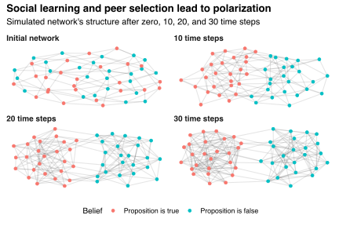
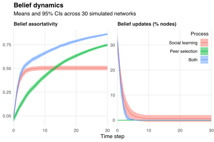

Suppose 50 people each have four friends.
Everyone believes that some proposition---say, "corporate tax rates should be higher"---is either true or false, with equal probability and independently of everyone else.
Consequently, the social network among the 50 people is unsorted with respect to peoples' beliefs.
However, the network's structure changes over time, in discrete time steps, according to two rules:

1. everyone updates their belief to match the majority within their friend group (comprised of themselves and their neighbours in the network), defaulting to their previous belief to break ties;
2. edges appear between people who hold the same belief and disappear between people who hold different beliefs, both with probability 0.01.

The first rule describes a "social learning" process: people update their beliefs to match the majority among their friends.[^degroot]
The second rule describes a "peer selection" process: people choose friends who share the same beliefs.
These two processes can lead to polarized beliefs, even if there is no polarization before the processes begin.
I demonstrate this phenomenon in the figure below, which plots the beliefs and connections in a simulated network after zero, 10, 20, and 30 time steps.
The figure shows how people grow increasingly connected to others with the same belief and decreasingly connected to others with the opposing belief.

[^degroot]: See [my blog post on DeGroot learning](/blog/degroot-learning-social-networks/) for more discussion of social learning processes.

The social learning and peer selection processes can lead to polarization both together and separately.
I justify this claim in the figure below.
The left-hand panel plots the network's "assortativity coefficient," which measures the overall correlation among friends' beliefs.[^newman-2003]
This coefficient equals one when all neighbours share the same beliefs (complete polarization) and equals zero when edges are "as random."
The right-hand panel plots the proportion of people in the network who update their belief at each time step.
Both panels present means and 95% confidence intervals across 30 simulated networks, each with randomized initial beliefs.

[^newman-2003]: See [Newman (2003)](https://arxiv.org/abs/cond-mat/0209450v2) for a definition and discussion of the assortativity coefficient.

The social learning process leads to positive sorting because, by construction, people increasingly share the same beliefs as their friends.
The peer selection process leads to positive sorting because, by construction, edges increasingly connect people with common beliefs only.
The two processes work together to isolate the subnetworks of people who believe the proposition is true and false.
Interestingly, most belief updates occur very early: after about five time steps, most of the structural changes in the social network result from edge creations and deletions rather than from belief updates.

