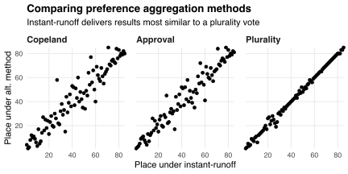

Earlier this month the [kākāpō](https://www.birdoftheyear.org.nz/kakapo) was elected [Bird of the Year](https://www.birdoftheyear.org.nz) for 2020.
The news prompted me to review the results of [last year's election](/blog/birds-voting-russian-interference/), in which the kākāpō lost narrowly to the yellow-eyed penguin.
In particular, I wanted to determine whether the 2019 results were sensitive to the method used to aggregate voters' preferences.
This post summarises my findings: different methods deliver (slightly) different outcomes, and at least one method would have crowned the kākāpō.

Bird of the Year elections run as follows.
Each voter selects up to five birds, ranks their selections in order of preference, and submits their ranking on the election website.
These submissions determine the winning bird via the [instant-runoff](https://en.wikipedia.org/wiki/Instant-runoff_voting) (IR) method:

1. Count the ballots on which each bird is ranked first.
2. If one bird is ranked first on a majority of ballots then elect it.
   Otherwise, eliminate the bird ranked first on the fewest ballots and return to step 1.

Using the IR method, rather than a [plurality vote](https://en.wikipedia.org/wiki/Plurality_voting) (in which the bird listed first on the most ballots wins), mitigates [vote-splitting](https://en.wikipedia.org/wiki/Vote_splitting) because voters can list multiple birds on their ballots.
However, the IR method violates the [Condorcet criterion](https://en.wikipedia.org/wiki/Condorcet_criterion): a bird may lose the election even if it would beat every other bird in a head-to-head plurality vote.
One way to satisfy this criterion is to use [Copeland's method](https://en.wikipedia.org/wiki/Copeland%27s_method), which ranks birds by the number of pairwise plurality votes they win minus the number of such votes they lose.

The IR method and Copeland's method both rely on noiseless within-ballot rankings.
I suspect this property does not hold for Bird of the Year elections.
After selecting up to five birds, voters are asked to rearrange their selections from most to least preferred before submitting their ballots.
It seems likely that this rearrangement does not occur, either because voters can't be bothered or because they are approximately indifferent among their selections.
In either case, voters' preferences might be better aggregated using an [approval](https://en.wikipedia.org/wiki/Approval_voting)-based system: each bird earns one point for each ballot appearance, and the bird with the most points wins.

One obvious problem with the approval-based system is that voters may approve of more than five birds, but cannot signal such approval because the "up to five" constraint binds.
On the other hand, some voters may feel obliged to list five birds on their ballots even if they approve of only four birds or fewer.[^ballot-sizes]
The most defensible way to deal with these possibilities seems (to me) to be to use a plurality vote, which assumes the minimal completeness of voters' individual preferences by treating only their first choices as informative.[^first-choices]

[^ballot-sizes]: Of the 43,460 ballots cast in last year's election, 91.3% listed five birds, 1.4% listed four birds, 1.2% listed three birds, 0.8% listed two birds, and 5.2% listed one bird.

[^first-choices]: Nominating a "first choice" requires only that a voter can identify at least one bird that they prefer to at least one other bird.

The table below presents the top-placing birds in the 2019 election using the IR method, and those birds' places under the other preference aggregation methods described above.
The kākāpō was actually the Condorcet winner; it would have beaten every other bird in a head-to-head plurality vote.
Nevertheless the IR method crowned the yellow-eyed penguin, as would have the approval-based system and a simple plurality vote.

|Bird                | IR place | Copeland place | Approval place | Plurality place |
|:-------------------|:--------:|:--------------:|:--------------:|:---------------:|
|Yellow-eyed penguin |    1     |       4        |       1        |        1        |
|Kākāpō              |    2     |       1        |       2        |        2        |
|Black Robin         |    3     |       2        |       3        |        5        |
|Banded Dotterel     |    4     |       8        |       5        |        3        |
|Fantail             |    5     |       12       |       9        |        4        |
|New Zealand Falcon  |    6     |       10       |       10       |        9        |
|Kererū              |    7     |       11       |       11       |        8        |
|Blue Duck           |    8     |       9        |       8        |        7        |
|Kea                 |    9     |       6        |       6        |       10        |
|Kākā                |    10    |       3        |       4        |       11        |

The figure below compares all candidate birds' places using the IR method to their places obtained using the alternative methods.
The IR method delivers results most similar to a plurality vote and least similar to Copeland's method, as shown by the relative deviations of points from the 45-degree line.
These patterns suggest that voters' second through fifth choices for Bird of the Year didn't affect the 2019 election outcome materially.

