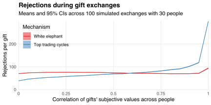

Last December [I compared strategies for playing white elephant](/blog/white-elephant-gift-exchanges/), a game in which people take turns either unwrapping a gift or stealing a previously unwrapped gift.
It turned out that players' best strategy was to be "greedy" by stealing the most subjectively valuable unwrapped gift.
Intuitively, this strategy helps players obtain the gift they want most, provided no other players also want that gift and steal it later in the game.

White elephant exchanges are a fun, but not necessarily optimal, way to match people with gifts.
Another way is to use the [top trading cycle](https://en.wikipedia.org/wiki/Top_trading_cycle) (TTC) algorithm:

1. Give everyone a random unwrapped gift.
2. Ask everyone to point at the most subjectively valuable gift (which may be their own).
3. If there is a closed cycle of people pointing at each others' gifts, give everyone in that cycle the gift at which they're pointing, and remove those people and gifts from consideration.
4. If there are no gifts remaining then stop. Otherwise, return to step 2.

The allocation delivered by this algorithm has several desirable properties.
First, it is [Pareto efficient](https://en.wikipedia.org/wiki/Pareto_efficiency): every cycle identifies a mutually beneficial exchange, and the algorithm stops when no such exchanges remain.
Second, it is [strategy-proof](https://en.wikipedia.org/wiki/Strategyproofness): people cannot get better gifts by lying about their preferences (see [Roth, 1982](https://doi.org/10.1016/0165-1765(82)90003-9)).
Third, it is [core-stable](https://en.wikipedia.org/wiki/Core_(game_theory)): no group of people can cooperate to improve their allocations, for otherwise they would have formed a cycle before the algorithm stopped.

However, the TTC algorithm may not deliver the allocation that maximizes the sum of gifts' subjective values.
This allocation corresponds to a [maximum-weight matching](https://en.wikipedia.org/wiki/Maximum_weight_matching) in the bipartite graph connecting people to gifts, with each edge's weight equal to the incident player's subjective value of the incident gift.[^practice]

[^practice]: The maximum-weight matching is hard to find in practice because it requires complete information about peoples' preferences. In contrast, white elephant games and the TTC algorithm elicit peoples' preferences by asking them to choose explicitly which gifts they want.

The chart below compares the mean subjective value of the gifts allocated using a game of white elephant, using the TTC algorithm, and by finding a maximum-weight matching.
I compute these allocations as follows.
First, I define person `\(i\)`'s subjective value of gift `\(j\)` as
`$$V_{ij}=\rho X_j+(1-\rho)Y_{ij},$$`
where `\(X_i\)` and `\(Y_{ij}\)` are iid uniformly distributed on the unit interval.
The parameter `\(\rho\)` determines the correlation of gifts' subjective values across people: if `\(\rho=0\)` then everyone's valuations are independent, whereas if `\(\rho=1\)` then everyone has the same valuation of each gift.
For a range of `\(\rho\)` values, I simulate 100 valuation sets `\(\{V_{ij}:i,j\in\{1,2,\ldots,30\}\}\)`, and apply each gift exchange mechanism to each set.
In the white elephant games, I assume all players adopt the greedy strategy described above unless the best unwrapped gift has subjective value less than `\(\mathrm{E}[V_{ij}]=0.5\)`, in which case players unwrap a new gift.

All three gift exchange mechanisms get worse as gifts' subjective values become more correlated.
Intuitively, as the correlation increases, there are fewer Pareto-improving trades and so people get stuck with their random endowments.[^random]
The allocations delivered via white elephant games and the TTC algorithm have similar allocative efficiencies, even though white elephant players can't assign subjective values to gifts until they are unwrapped.

[^random]: In white elephant games, the randomness comes from the order in which people take their turns choosing whether to unwrap or steal.

Yet white elephant games are much more popular at Christmas parties than the TTC algorithm.
One explanation could be that the algorithm tends to reveal a lot of information about peoples' preferences and, in particular, may make people more upset about contributing a gift no-one wants.
I justify this claim in the following chart, which plots the number of times someone rejects each gift for another in my simulated exchanges.
For example, I add one to gift A's rejection count if

1. a white elephant player could steal gift A but instead steals gift B, or
2. I'm running the TTC algorithm and someone could point at gift A but instead points at gift B.

Intuitively, these rejection events reveal that gift A has subjectively lower value than other gifts, and the more often this happens the more likely is the person who contributed gift A to feel bad about their contribution.

Most Christmas parties set a target amount to be spent on each gift, so---to the extent that cost correlates positively with value---the empirically relevant region of the chart is where the correlation of subjective values is high.
In this region, running the TTC algorithm tends to generate many more rejection events than running a game of white elephant.
Intuitively, if the correlation of subjective values is high then people will tend to all point at the same gifts, there will be fewer cycles, more iterations will be required before the TTC algorithm stops, and hence the algorithm will force people to reveal more about their preferences as the market slowly clears.
On the other hand, the unobservability of wrapped gifts' subjective values means that white elephant players have fewer opportunities to reveal their preferences, regardless of whether those preferences are shared by other players.

---

*Thanks to Mohamad Adhami, [Nick Cao](https://nickcao.com/), and Spencer Pantoja for commenting on a draft version of this post.*

