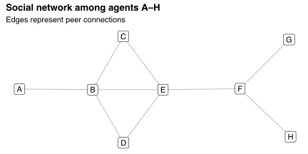

[Pancs (2020)](https://papers.ssrn.com/sol3/papers.cfm?abstract_id=3746231) proposes an auction for vaccines in which people can bid on others' behalf.
This format allows people to internalize the externalities they enjoy from their peers being vaccinated.

For example, suppose there are two vaccines to be allocated among agents A--H, who are connected socially via the network shown below.

Everyone submits bids totaling \$60, spread evenly among themselves and their peers.
For example, agent A bids \$30 towards vaccinating themself and agent B, while agent B bids \$15 towards vaccinating themself and agents A, C, and D.
Intuitively, agent A values vaccinating B highly because it protects A fully from viruses transmitted among agents C--H.
In contrast, B has more peers and so values vaccinating any one of those peers less because it doesn't protect B fully from the rest of the network.

The "aggregate bid" for each agent equals the sum of bids submitted towards that agent's vaccination.
The agents with the highest aggregate bids receive the vaccines.
In this example, agents B and F receive the vaccine, with aggregate bids equal to \$94 and \$87.

Each agent receives surplus equal to their subjective valuation of the vaccine allocation minus their payment towards that allocation's provision.
This payment equals the increase in aggregate surplus that other agents would receive if the agent's bids were ignored.
Thus, the vaccine auction is a type of [Vickrey-Clarke-Groves (VCG) auction](https://en.wikipedia.org/wiki/Vickrey–Clarke–Groves_auction) in which each agent pays the harm they inflict on other agents.
Consequently, the vaccine auction inherits the properties of VCG auctions; in particular, bids equal subjective valuations.
This property makes it easy to compute pre-payment surpluses: simply sum each agent's bids towards vaccinated agents.

The table below presents the aggregate bid for, payment made by, and surplus delivered to each agent under the optimal vaccine allocation.
Agents B and F don't have to pay for the vaccines they receive because others are willing to pay on their behalf.
Agent A pays \$15 because their bid towards vaccinating B shifts the optimal allocation away from E, which lowers F's surplus by \$15.
Likewise, agents G and H pay because their preference to vaccinate F, rather than E, makes B--D worse off.

| Agent | Aggregate bid (\$) | Payment (\$) | Surplus (\$) |
|:-----:|:------------------:|:------------:|:------------:|
|   A   |         42         |      15      |      15      |
|   B   |         94         |      0       |      12      |
|   C   |         44         |      0       |      20      |
|   D   |         44         |      0       |      20      |
|   E   |         79         |      0       |      24      |
|   F   |         87         |      0       |      15      |
|   G   |         45         |      22      |      8       |
|   H   |         45         |      22      |      8       |

In this example, every agent wants to be vaccinated.
But this common desire may not hold in reality: some people may prefer not to be vaccinated because they fear potential side-effects.
Such people may refuse to participate in the auction, reducing social welfare by preventing some externalities from being internalized.

