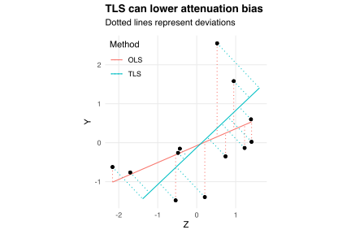
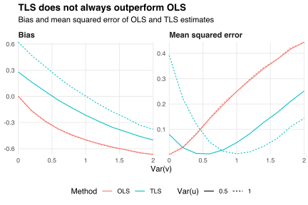

Suppose `\(X\)` and `\(Y\)` are random variables with
`$$\DeclareMathOperator{\E}{E}
\DeclareMathOperator{\Cov}{Cov}
\DeclareMathOperator{\Var}{Var}
\newcommand{\abs}[1]{\lvert#1\rvert}
Y=\beta X+u,$$`
where `\(u\)` has zero mean and zero correlation with `\(X\)`.
The coefficient `\(\beta\)` can be estimated by collecting data `\((Y_i,X_i)_{i=1}^n\)` and regressing the `\(Y_i\)` on the `\(X_i\)`.
Now suppose our data collection procedure is flawed: instead of observing `\(X_i\)`, we observe `\(Z_i=X_i+v_i\)`, where the `\(v_i\)` are iid with zero mean and zero correlation with the `\(X_i\)`.
Then the ordinary least squares (OLS) estimate `\(\hat\beta_{\text{OLS}}\)` of `\(\beta\)` obtained by regressing the `\(Y_i\)` on the `\(Z_i\)` suffers from [attenuation bias](https://en.wikipedia.org/wiki/Regression_dilution):
`$$\begin{align*}
\DeclareMathOperator*{\plim}{plim}
\plim_{n\to\infty}\hat\beta_{\text{OLS}}
&=\frac{\Cov(Y,Z)}{\Var(Z)} \\
&=\frac{\Cov(\beta X+u,X+v)}{\Var(X+v)} \\
&= \frac{\beta\Var(X)}{\Var(X)+\Var(v)} \\
&= \frac{\beta}{1+\Var(v)/\Var(X)}
\end{align*}$$`
and so `\(\abs{\hat\beta_{\text{OLS}}}<\abs{\beta}\)` asympotically whenever `\(\Var(v)>0\)`.
Intuitively, the measurement errors `\(v_i\)` spread out the independent variable, flattening the fitted regression line.

One way to reduce attenuation bias is to replace OLS with total least squares (TLS), which accounts for noise in the dependent *and* independent variables.
As a demonstration, the chart below compares the OLS and TLS lines of best fit through some randomly generated data `\((Y_i,Z_i)_{i=1}^n\)` with `\(\beta=1\)`.
The OLS estimate `\(\hat\beta_{\text{OLS}}=0.43\)` minimizes the sum of squared *vertical* deviations of the data from the fitted line.
In contrast, the TLS estimate `\(\hat\beta_{\text{TLS}}=0.95\)` minimizes the sum of squared *perpendicular* deviations of the data from the fitted line.
For these data, the TLS estimate is unbiased because `\(u\)` and `\(v\)` have the same variance.

However, if `\(u\)` and `\(v\)` have different variances then the TLS estimate of `\(\beta\)` is biased.
I demonstrate this phenomenon in the chart below, which compares the OLS and TLS estimates of `\(\beta=1\)` for varying `\(\Var(u)\)` and `\(\Var(v)\)` when `\(X\)` is standard normal.
I plot the bias `\(\E[\hat\beta-\beta]\)` and mean squared error `\(\E[(\hat\beta-\beta)^2]\)` of each estimate `\(\hat\beta\in\{\hat\beta_{\text{OLS}},\hat\beta_{\text{TLS}}\}\)`, obtained by simulating the data-generating process 100 times for each `\((\Var(u),\Var(v))\)` pair.

If `\(\Var(u)>\Var(v)\)` then the TLS estimate `\(\hat\beta_{\text{TLS}}\)` is biased upward because the data are relatively stretched vertically; if `\(\Var(u)<\Var(v)\)` then `\(\hat\beta_{\text{TLS}}\)` is biased downward because the data are relatively stretched horizontally.
The OLS estimate is biased downward whenever `\(\Var(u)>0\)` due to attenuation.
The TLS estimate is less biased and has smaller mean squared error than the OLS estimate when `\(\Var(u)<\Var(v)\)`, suggesting that TLS generates "better" estimates than OLS when the measurement errors `\(v_i\)` are relatively large.

One problem with TLS estimates is that they depend on the units in which variables are measured.
For example, suppose `\(Y_i\)` is person `\(i\)`'s weight and `\(Z_i\)` is their height.
If I measure `\(Y_i\)` in pounds, generate a TLS estimate `\(\hat\beta_{\text{TLS}}\)`, use this estimate to predict the weight in pounds of someone six feet tall, and then convert my prediction to kilograms, I get a different result than if I had measured `\(Y_i\)` in kilograms initially.
This unit-dependence arises because rescaling the dependent variable affects each perpendicular deviation differently.

In contrast, OLS-based predictions do not depend on the units in which I measure `\(Y_i\)`.
Rescaling the dependent variable multiplies each vertical deviation by the same constant, leaving the squared deviation-minimizing coefficient unchanged.

