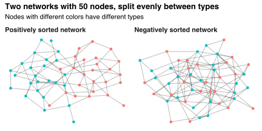
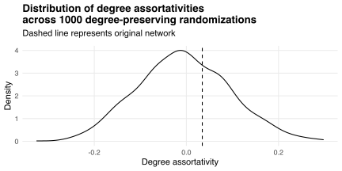

Let `\(N\)` be a network with `\(n\)` nodes, each of which has a "type" belonging to some set `\(T\)`.
We say that `\(N\)` is "[assortatively mixed](https://en.wikipedia.org/wiki/Assortative_mixing)" if nodes tend to have the same types as their neighbors.
For example, if `\(N\)` is a social network and `\(T\)` is a set of interests, then assortative mixing could arise because friends tend to share interests.

How can we measure the extent of assortative mixing in `\(N\)`?
[Newman (2003)](https://doi.org/10.1103/PhysRevE.67.026126) suggests the "assortativity coefficient"
`$$r=\frac{\sum_{t\in T}x_{tt}-\sum_{t\in T}y_t^2}{1-\sum_{t\in T}y_t^2},$$`
where `\(x_{st}\)` is the proportion of edges joining nodes of type `\(s\)` to nodes of type `\(t\)`, and where
`$$y_t=\sum_{s\in T}x_{st}$$`
is the proportion of edges incident with nodes of type `\(t\)`.
The coefficient `\(r\)` varies between -1 and 1, and takes larger values when `\(N\)` is more assortatively mixed.
We say that `\(N\)` is "positively sorted" if `\(r>0\)` and "negatively sorted" if `\(r<0\)`.

We can interpret `\(r\)` by thinking about the "mixing matrix" `\(X=(x_{st})\)`.
The numerator of `\(r\)` equals the sum of diagonal entries of `\(X\)` minus what that sum would be if the distributions of entries across rows and columns were independent.
The denominator of `\(r\)` is a normalizing constant ensuring `\(\lvert r\rvert\le1\)`.
Thus `\(r\)` indexes the frequency of within-type edges in `\(N\)` relative to the frequency we would expect in a random network with the same proportion of edges incident with each type.

As an example, suppose `\(N\)` is a realization of the [planted partition model](/blog/generating-random-graphs-communities/) with `\(n_1\)` nodes of type 1, `\(n_2=n-n_1\)` nodes of type 2, and some proportion
`$$p_{st}=\begin{cases} p & \text{if}\ s=t \\ q & \text{otherwise} \end{cases}$$`
of edges joining nodes of type `\(s\)` to nodes of type `\(t\)`.
Then `\(N\)` has assortativity coefficient
`$$r=\frac{p^2(n_1-1)(n_2-1)-q^2n_1n_2}{p^2(n_1-1)(n_2-1)+pq(n_1(n_1-1)+n_2(n_2-1))+q^2n_1n_2},$$`
which equals -1 if `\(p=0\)` and `\(q>0\)` (i.e., there are no within-type edges), and equals 1 if `\(p>0\)` and `\(q=0\)` (i.e., there are no between-type edges).
If `\(p=q\)` then
`$$r=-\frac{1}{n-1},$$`
which converges to zero from below as `\(n\)` becomes large.
Intuitively, if `\(p=q\)` then within-type and between-type edges occur at the same rate, but the network is slightly negatively sorted because there are slightly fewer potential within-type edges than potential between-type edges.

If `\(n_1=n_2\)` then
`$$r=\frac{p^2(n-2)-q^2n}{p^2(n-2)+q^2n},$$`
which converges to `\((p^2-q^2)/(p^2+q^2)\)` as `\(n\)` becomes large.
The figure below demonstrates this case with `\(n_1=n_2=25\)`.
The network on the left has edge frequencies `\((p,q)=(0.15,0.02)\)` and assortativity coefficient `\(r=0.75\)`; the network on the right has edge frequencies `\((p,q)=(0.02,0.15)\)` and assortativity coefficient `\(r=-0.79\)`.
Both networks are drawn so that adjacent nodes are closer together.
Nodes in the positively sorted network tend to have neighbors with the same type, while nodes in the negatively sorted network tend to have neighbors with a different type.

The assortativity coefficient `\(r\)` can be used when `\(T\)` is a set of categorical types.
In contrast, if `\(T\)` is set of scalar quantities then we can measure the extent of assortative mixing via the Pearson correlation coefficient
`$$\DeclareMathOperator{\E}{E}
\DeclareMathOperator{\Var}{Var}
\DeclareMathOperator{\Cov}{Cov}
\rho=\frac{\Cov(t_i,t_j)}{\sqrt{\Var(t_i)\Var(t_j)}},$$`
where `\(t_i\in T\)` and `\(t_j\in T\)` are the "types" of nodes `\(i\)` and `\(j\)`, and where (co)variances are computed with respect to the frequency at which nodes of type `\(t_i\)` and `\(t_j\)` are adjacent in the network.[^equal]
To see how this works, let `\(A=(a_{ij})\)` be the `\(n\times n\)` adjacency matrix for `\(N\)` and let `\(W=(w_{ij})\)` be the `\(n\times n\)` "weighting matrix" with entries
`$$w_{ij}=\frac{a_{ij}}{\lvert\rvert A\rvert\rvert},$$`
where `\(\lvert\rvert A\rvert\rvert\)` denotes the sum of elements in `\(A\)`.
Then the vector `\(t=(t_1,t_2,\ldots,t_n)\)` of node types has mean
`$$\E[t]=s^Tt,$$`
where `\(s=(s_1,s_2,\ldots,s_n)\)` is the vector of row sums
`$$s_i=\sum_{j=1}^nw_{ij}.$$`
Intuitively, `\(s\)` describes the probability mass function for the (marginal) distribution of node types.
Treating `\(t_i\)` and `\(t_j\)` as draws from this distribution, we have
`$$\begin{align*}
\Cov(t_i,t_j)
&= \E[t_it_j]-\E[t_i]\E[t_j] \\
&= \sum_{i=1}^n\sum_{j=1}^nw_{ij}t_it_j-(s^Tt)(s^Tt) \\
&= t^TWt-(s^Tt)^2
\end{align*}$$`
and similarly
`$$\begin{align*}
\Var(t_i)
&= \E[t_i^2]-\E[t_i]^2 \\
&= \sum_{i=1}^ns_it_i^2-(s^Tt)^2 \\
&= t^TSt-(s^Tt)^2,
\end{align*}$$`
where `\(S\)` is the `\(n\times n\)` matrix with principal diagonal equal to `\(s\)` and off-diagonal entries equal to zero.
Then
`$$\rho=\frac{t^TWt-(s^Tt)^2}{t^TSt-(s^Tt)^2}.$$`
For example, if the nodes in `\(N\)` are arranged such that
`$$a_{ij}=\begin{cases}1 & \text{if}\ t_i=t_j \\ 0 & \text{otherwise} \end{cases}$$`
then
`$$\begin{align*}
t^TWt
&= \sum_{i=1}^n\sum_{j=1}^nw_{ij}t_it_j \\
&= \sum_{i=1}^nt_i^2\sum_{j=1}^nw_{ij} \\
&= \sum_{i=1}^nt_i^2s_i \\
&= t^TSt
\end{align*}$$`
and so `\(\rho=1\)`---that is, if all adjacent nodes have the same scalar type then the coefficient `\(\rho\)` obtains its maximum value of unity.

[^equal]: Numerical experimentation suggests `\(r=\rho\)` whenever `\(\lvert T\rvert=2\)`, but I haven't proved this yet...

One common use of the correlation coefficient `\(\rho\)` is to measure assortativity with respect to nodes' degrees (see, e.g., [Newman, 2002](https://journals.aps.org/prl/abstract/10.1103/PhysRevLett.89.208701)).
For example, the left-hand network in the figure above has `\(\rho=0.03\)`: although nodes are sorted strongly by color, they are approximately unsorted by degree because the planted partition model from which the network is generated has no mechanism for connecting high-degree nodes.
Performing a [degree-preserving randomization](/blog/degree-preserving-randomisation/) of the network changes its assortativity with respect to nodes' degrees by changing the joint distribution of those degrees across node pairs:

