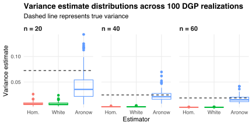

Let `\([n]\equiv\{1,2,\ldots,n\}\)` be a set of individuals.
Suppose I have data `\(\{(y_{ij},x_{ij}):i,j\in[n]\ \text{with}\ i<j\}\)` on pairs in `\([n]\)` generated by the process
`$$\renewcommand{\epsilon}{\varepsilon}
y_{ij}=x_{ij}\beta+\epsilon_{ij},$$`
where `\(x_{ij}\)` is a row vector of pair `\(\{i,j\}\)`'s characteristics, `\(\beta\)` is a vector of coefficients to be estimated, and `\(\epsilon_{ij}\)` is a random error term with zero mean and zero correlation with the `\(x_{ij}\)`.
For example, `\([n]\)` could be the nodes in a network, `\(x_{ij}\)` the dimensions along which nodes `\(i\)` and `\(j\)` interact, and `\(y_{ij}\)` the outcome of such interaction.

We can rewrite the data-generating process (DGP) in matrix form as
`$$y=X\beta+\epsilon,$$`
where `\(y\)` is the vector of outcomes, `\(X\)` is the design matrix, and `\(\epsilon\)` is the vector of errors.
Here `\(X\)` has
`$$N\equiv\frac{n(n-1)}{2}$$`
rows, each corresponding to a(n unordered) pair of individuals in `\([n]\)`.
Since the `\(x_{ij}\)` and `\(\epsilon_{ij}\)` are uncorrelated, the ordinary least squares estimator
`$$\hat\beta=(X^T\!X)^{-1}X^T\!y$$`
of `\(\beta\)` is unbiased.
However, `\(\hat\beta\)` may not be [efficient](https://en.wikipedia.org/wiki/Gauss–Markov_theorem) because the errors `\(\epsilon_{ij}\)` may be correlated.
For example, if
`$$\epsilon_{ij}=u_i+u_j+v_{ij}$$`
with `\(u_i\)`, `\(u_j\)`, and `\(v_{ij}\)` independent then
`$$\DeclareMathOperator{\Cov}{Cov}
\DeclareMathOperator{\Var}{Var}
\Cov(\epsilon_{ij},\epsilon_{jk})=\Var(u_j).$$`
Intuitively, the pairs `\(\{i,j\}\)` and `\(\{j,k\}\)` are linked through individual `\(j\)`, and so any errors specific to that individual affect the errors for both pairs.
Consequently, the [homoskedastic](https://en.wikipedia.org/wiki/Homoscedasticity) estimator
`$$\widehat{\Var}_{\text{Hom.}}(\hat\beta)=\hat\sigma^2(X^T\!X)^{-1}$$`
with
`$$\hat\sigma^2=\frac{1}{N}\sum_{ij}\hat\epsilon_{ij}^2$$`
and
`$$\hat\epsilon_{ij}=y_{ij}-x_{ij}\hat\beta$$`
will typically under-estimate the variance in `\(\hat\beta\)` by failing to account for linked pairs having dependent errors.

So, how can we account for such dependence?
Consider the "sandwich" form
`$$\Var(\hat\beta)=BMB$$`
of the (co)variance matrix for `\(\hat\beta\)`, where `\(B=(X^T\!X)^{-1}\)` is the "bread" matrix and `\(M=X^T\!VX\)` is the "meat" matrix with `\(V=\Var(\epsilon)\)` the error (co)variance matrix.
We need to estimate `\(M\)` because we don't observe the `\(\epsilon_{ij}\)`.
Indexing pairs by `\(p\)`, the homoskedastic estimator defined above uses
`$$\begin{align}
\hat{M}_{\text{Hom.}}
&= \hat\sigma^2X^T\!X \\
&= \hat\sigma^2\sum_{p=1}^Nx_p^T\!x_p,
\end{align}$$`
which assumes all errors have equal variance.
In contrast, [White (1980)](https://doi.org/10.2307/1912934) suggests using
`$$\begin{align}
\hat{M}_{\text{White}}
&= X^T\!\mathrm{diag}\left(\hat\epsilon_p^2\right)X \\
&= \sum_{p=1}^N\hat\epsilon_p^2x_p^T\!x_p,
\end{align}$$`
which allows for unequal error variances ([heteroskedasticity](https://en.wikipedia.org/wiki/Heteroscedasticity)).
But neither `\(\hat{M}_{\text{Hom.}}\)` nor `\(\hat{M}_{\text{White}}\)` allow for dyadic dependence among the errors.
To that end, [Aronow et al. (2017)](https://doi.org/10.1093/pan/mpv018) suggest augmenting White's estimator via 
`$$\begin{align}
\hat{M}_{\text{Aronow}}
&= \hat{M}_{\text{White}}+\sum_{p=1}^N\sum_{q\in\mathcal{D}(p)}\hat\epsilon_p\hat\epsilon_qx_p^T\!x_q,
\end{align}$$`
where `\(\mathcal{D}(p)\)` is the set of pairs `\(q\not=p\)` linked to `\(p\)` by a shared individual.
We can express `\(\hat{M}_{\text{Aronow}}\)` in matrix form as
`$$\hat{M}_{\text{Aronow}}=X^T\!\left(D\odot\hat\epsilon\hat\epsilon^T\!\right)X,$$`
where `\(D=(d_{pq})\)` is the dyadic dependence matrix with
`$$d_{pq}=\begin{cases}
1 & \text{if pairs}\ p\ \text{and}\ q\ \text{are linked}\\
0 & \text{otherwise},
\end{cases}$$`
and where `\(\odot\)` denotes element-wise multiplication.
Aronow et al. show that, under mild conditions, `\(B\hat{M}_{\text{Aronow}}B\)` is a consistent estimator for `\(\Var(\hat\beta)\)` when the data exhibit dyadic dependence.[^fafchamps]

[^fafchamps]: [Fafchamps and Gubert (2007)](https://doi.org/10.1016/j.jdeveco.2006.05.005) describe a similar variance estimator to Aronow et al. but do not establish its consistency.

To see Aronow et al.'s estimator in action, suppose the DGP is given by the system
`$$\begin{align}
y_{ij} &= \beta x_{ij}+\epsilon_{ij} \\
x_{ij} &= z_i+z_j \\
\epsilon_{ij} &= u_i+u_j+v_{ij},
\end{align}$$`
where `\(z_i\)`, `\(z_j\)`, `\(u_i\)`, `\(u_j\)` and `\(v_{ij}\)` are iid standard normal, and `\(\beta=1\)` is the (scalar) coefficient to be estimated.
Both the `\(x_{ij}\)` and the `\(\epsilon_{ij}\)` exhibit dyadic dependence, so we expect the homoskedastic and White estimators to under-estimate the true variance in `\(\hat\beta\)`.
Indeed, the box plots below show that Aronow et al.'s estimator is less biased than the homoskedastic and White estimators, and gets more accurate as the number of individuals `\(n\)` grows.

Aronow et al.'s estimator can also be applied to generalized linear models.
For example, suppose
`$$y_{ij}=\begin{cases}
1 & \text{if nodes}\ i\ \text{and}\ j\ \text{are adjacent} \\
0 & \text{otherwise}
\end{cases}$$`
is an indicator for the event in which nodes `\(i\)` and `\(j\)` are adjacent in a network.
We can model the link formation process as
`$$\Pr(y_{ij}=1)=\Lambda^{-1}(x_{ij}\beta+\epsilon_{ij}),$$`
where `\(\Lambda(x)\equiv\log(x/(1-x))\)` is the logit link function.
The [logistic regression](https://en.wikipedia.org/wiki/Logistic_regression) estimate `\(\hat\beta\)` of `\(\beta\)` reveals how the observable characteristics `\(x_{ij}\)` of nodes `\(i\)` and `\(j\)` determine their probability of being adjacent.
We can estimate the variance of `\(\hat\beta\)` consistently by letting `\(\hat{P}_{ij}=\Lambda^{-1}(x_{ij}\hat\beta)\)` be the predicted probability for pair `\(\{i,j\}\)`, replacing the bread matrix `\(B=(X^T\!X)^{-1}\)` with
`$$\hat{B}=\left(X^T\mathrm{diag}\left(\hat{P}_{ij}\left(1-\hat{P}_{ij}\right)\right)X\right)^{-1},$$`
and computing `\(\hat{B}\hat{M}_{\text{Aronow}}\hat{B}\)`.
My co-authors and I use this approach in "[Research Funding and Collaboration](/blog/research-funding-collaboration):" we estimate how grant proposal outcomes determine the probability with which pairs of researchers co-author, and we compare `\(\hat\sigma^2\hat{B}\)` and `\(\hat{B}\hat{M}_{\text{Aronow}}\hat{B}\)` to show that our inferences are robust to dyadic dependence.

