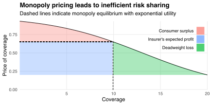
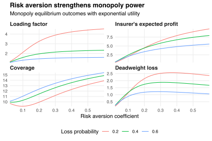

This post shows how monopoly insurance pricing can lead to inefficient risk sharing.
I describe [a mathematical model](#model) of the monopoly equilibrium, present [a numerical example](#numerical-example), and discuss [some limitations](#limitations) of my analysis.

## Model

Suppose I have initial wealth `\(w_0\)` and suffer a loss of size `\(L\)` with probability `\(p\)`.
I can buy `\(c\in[0,L]\)` units of insurance coverage at per-unit price `\(\lambda p\)`, where `\(\lambda\ge1\)` is a loading factor set by my insurer.
I choose the amount of coverage `\(c^*\)` that maximizes my expected utility
`$$EU(c)\equiv(1-p)u(w_0-\lambda p c)+pu(w_0-\lambda pc-L+c),$$`
where
`$$u(w)\equiv-\frac{1}{a}\exp(-aw)$$`
is my utility function and `\(a>0\)` is my [coefficient of absolute risk aversion](https://en.wikipedia.org/wiki/Risk_aversion#Absolute_risk_aversion).
Solving the first-order condition for `\(c^*\)` gives
`$$c^*=L-\frac{1}{a}\log\left(\frac{\lambda(1-p)}{1-\lambda p}\right),$$`
which equals `\(L\)` when `\(\lambda=1\)` (i.e, the premium is actuarially fair) and equals zero when `\(\lambda\)` equals
`$$\lambda_{\text{max}}=\frac{1}{p+(1-p)\exp(-aL)}.$$`
This limiting value of `\(\lambda\)` approaches one as `\(aL\)` approaches zero---I won't buy insurance if I am risk neutral or face no risk---and is always less than `\(1/p\)`.
For `\(\lambda\in(1,\lambda_{\text{max}})\)`, the slope
`$$\newcommand{\parfrac}[2]{\frac{\partial #1}{\partial #2}}
\parfrac{c^*}{\lambda}=-\frac{1}{a\lambda(1-\lambda p)}$$`
of my inverse demand curve is strictly decreasing, implying that I view insurance as an ordinary good.

Now suppose my insurer knows my demand for coverage `\(c^*\equiv C(\lambda)\)` given the loading factor `\(\lambda\)`, as well as the other parameters in my choice environment.
Then they can choose `\(\lambda\)` to maximize their expected profit
`$$\pi(\lambda)\equiv(\lambda-1)pC(\lambda),$$`
which equals the premium I pay minus the expected cost of indemnifying me.
If `\(L>0\)` then the profit-maximizing loading factor `\(\lambda^*\)` is strictly between one and `\(\lambda_{\text{max}}\)`, and setting `\(\lambda=\lambda^*\)` gives my insurer positive expected profit.
But then I demand partial coverage `\(C(\lambda^*)<L\)`, which is allocatively inefficient because I am risk averse but my insurer is risk neutral: having the insurer bear more of my risk would make me better off but my insurer no worse off.
Consequently, we suffer a deadweight loss relative to the equilibrium in which my insurer sets `\(\lambda=1\)`, I demand full coverage, and my insurer bears all of my risk.

## Numerical example

The figure below describes the monopoly equilibrium when `\(w_0=100\)`, `\(L=20\)`, `\(p=0.2\)`, and `\(a=0.2\)`.
My insurer best-responds to my demand schedule (the downward-sloping curve) by setting the loading factor equal to `\(\lambda^*=3.26\)`, which earns them expected profit `\(\pi=4.49\)`.
At the price `\(\lambda^* p=0.65\)`, I buy `\(c^*=9.94\)` units of coverage and enjoy
`$$p\int_{\lambda^*}^{\lambda_{\text{max}}}C(\lambda)\,\mathrm{d}\lambda=1.68$$`

units of consumer surplus.
In contrast, at the actuarially fair price `\(p\)` I would have bought full coverage, and although my insurer would have made zero expected profit we would have avoided the deadweight loss of 2.14 generated by our inefficient risk-sharing arrangement at the monopoly equilibrium.

One way to make sense of these numbers is to compute the certainty-equivalent wealth
`$$CE(\lambda)=u^{-1}(EU(C(\lambda)))$$`
that, if held with certainty, would give me as much utility as I expect to enjoy if I buy `\(C(\lambda)\)` units of coverage at per-unit price `\(\lambda p\)`.
Buying insurance at the monopoly equilibrium price raises my certainty equivalent wealth by `\(CE(\lambda^*)-CE(\lambda_{\text{max}})=1.68\)`, the consumer surplus I enjoy at that equilibrium.
Making the premium actuarially fair would further raise my certainty-equivalent wealth by `\(CE(1)-CE(\lambda^*)=6.63\)` but lower my insurer's expected profit by `\(\pi(\lambda^*)=4.49\)`; the sum of our surpluses would rise by `\(6.63-4.49=2.14\)`, the deadweight loss at the monopoly equilibrium.

The chart below presents some comparative statics of the monopoly equilibrium.
I maintain the parameters `\(w_0=100\)` and `\(L=20\)` from above, but vary my risk aversion coefficient `\(a\)` and the probability `\(p\)` with which I incur the loss.

My insurer sets a higher loading factor and earns more profit when my risk aversion rises.
This is because the mixed partial derivative
`$$\parfrac{^2c^*}{\lambda\partial a}=\frac{1}{a^2\lambda(1-\lambda p)}$$`
is strictly positive, which means that my demand is less sensitive to price changes when `\(a\)` is high.
My insurer exploits this lower sensitivity by charging me higher prices.
When `\(a\)` is small, this exploitation moves us away from the actuarially fair equilibrium and so raises the deadweight loss; when `\(a\)` is large, I want to buy a lot of insurance despite its high price, and so the deadweight loss is small because having the insurer bear my risk is allocatively efficient.

On the other hand, my insurer sets a lower loading factor when the probability of loss rises.
This is because the mixed partial derivative
`$$\parfrac{^2c^*}{\lambda\partial p}=-\frac{\lambda}{\alpha(1-\lambda p)^2}$$`
is strictly negative, which means that my demand is more sensitive to price changes when `\(p\)` is high.
My insurer responds to this sensitivity by forfeiting some of its monopoly power, moving us closer to the actuarially fair equilibrium and lowering the deadweight loss.

## Limitations

One issue with my analysis is the assumption that I have exponential utility, which implies that my tolerance for, and demand for insurance against, additive risks does not depend on how rich I am.
Under this assumption, I am equally willing to pay for insurance to avoid a \$10 loss when I have \$10 as I am when I have \$10 million, which seems implausible.
I could instead assume that I have [isoelastic utility](https://en.wikipedia.org/wiki/Isoelastic_utility)
`$$u(w)\equiv\frac{w^{1-r}-1}{1-r}$$`
for some `\(r>0\)`, which would imply that my willingness to pay for insurance falls as I become richer.
However, replacing exponential with isoelastic utility in the plots above delivers qualitatively identical patterns.

Another issue is the supposition that the insurer knows my demand schedule.
In reality, my insurer would have imperfect information about my utility function and the parameters of my choice environment, and so would not know my inverse demand function `\(C(\lambda)\)`.
But they could estimate `\(C(\lambda)\)` by, for example, asking how much insurance I would buy at a range of prices.
They would have to be clever to prevent me from over-reporting my price-sensitivity in an attempt to get cheaper coverage, but I'm sure real-world insurers have solved this problem (at least approximately) given their financial incentives.

