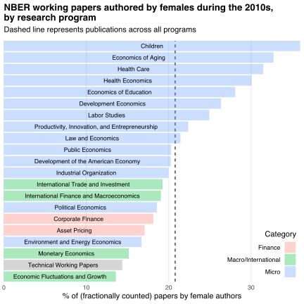
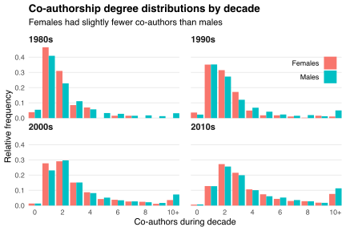

This post analyzes the [representation](#representation-across-research-programs) of, and [collaboration](#co-authorship-patterns) among, female authors of [NBER working papers](https://www.nber.org/papers) over the last four decades.
My analysis uses paper-author correspondences provided by the R package [nberwp](https://github.com/bldavies/nberwp).

## Estimating sexes

I estimate authors' sexes using the R package [gender](https://cran.r-project.org/package=gender), which provides access to historical baby name data from the US Social Security Administration.
I focus on baby names between 1940 and 1995 because these roughly correspond to (what I expect are) the birth years of authors who published NBER working papers during the 1980s through 2010s.

Comparing authors' first names to the frequency of female and male baby names allows me to estimate the probability that each author is female.
For example, 3% of babies named Alex between 1940 and 1995 were female, so the estimated probability that an author named Alex is female is 0.03.
Rounding each probability to the nearest integer estimates the binary indicator variable for whether each author is female.

The table below reports the number of NBER working papers and authors during the 1980s, 1990s, 2000s, and 2010s.
It also reports the percentage of those authors whom I estimate to be female, as well as the percentage of authors whose sexes I can estimate.
The number of authors roughly doubled each decade, and the percentage of those authors whom I estimate to be female almost doubled between the 1980s and 2010s.

| Decade | Papers | Authors | % authors female | % authors with estimable sex |
|:------:|:------:|:-------:|:----------------:|:----------------------------:|
| 1980s  | 2,820  |   972   |       14.1       |             93.9             |
| 1990s  | 4,213  |  2,211  |       19.7       |             88.3             |
| 2000s  | 8,188  |  5,118  |       24.0       |             85.5             |
| 2010s  | 10,970 |  9,519  |       27.0       |             84.1             |

The percentage of authors with estimable sex is less than 100% because some authors (i) never listed their first names on their papers' bylines (e.g., always published as "J. Smith") or (ii) have first names that do not appear in the baby name data.
Throughout this post, I assume that conditions (i) and (ii) occur at the same rate for both sexes.
Almost all (99.9%) of the authors satisfying either condition satisfy (ii) because they have foreign names.
The decrease in sex estimability over time reflects the increase in (co-)authorship of NBER working papers by researchers born outside the United States.

## Representation across research programs

The NBER organizes its research into [programs](https://www.nber.org/programs-projects/programs-working-groups), each of which "corresponds loosely to a traditional field of study within economics."
I count the papers associated with each program in [the appendix below](#appendix).
The largest programs are Labor Studies, Economic Fluctuations and Growth, and Public Economics, reflecting the NBER's focus on policy-relevant economic research.

The table below reports the percentage of authors whom I estimate to be female in each of the NBER's ten largest research programs.
I pool the remaining eleven programs into an "Other" program and report separate percentages for each decade.
The percentage of female authors grew over time, both overall and within each of the tabulated programs, and was larger in programs that are relatively focused on individual-level outcomes (e.g., Labor Studies and Health Economics).
I omit the percentages for Asset Pricing and Corporate Finance in the 1980s because there was only one paper associated with those programs during that decade.

|Program                                             | 1980s| 1990s| 2000s| 2010s|
|:---------------------------------------------------|-----:|-----:|-----:|-----:|
|Labor Studies (LS)                                  |  19.1|  26.2|  27.1|  29.9|
|Economic Fluctuations and Growth (EFG)              |   5.9|   9.2|  17.4|  18.9|
|Public Economics (PE)                               |   8.5|  16.7|  21.9|  26.3|
|International Finance and Macroeconomics (IFM)      |  14.5|  13.8|  16.5|  20.7|
|International Trade and Investment (ITI)            |  14.7|  15.9|  23.6|  23.2|
|Monetary Economics (ME)                             |   5.3|  11.8|  13.9|  17.5|
|Asset Pricing (AP)                                  |     -|  10.7|  16.5|  18.1|
|Productivity, Innovation, and Entrepreneurship (PR) |  15.4|  23.4|  22.2|  24.1|
|Corporate Finance (CF)                              |     -|  12.9|  22.4|  20.6|
|Health Economics (HE)                               |  20.4|  23.3|  33.9|  33.5|
|Other                                               |  11.2|  22.7|  26.4|  28.4|
|All                                                 |  14.1|  19.7|  24.0|  27.0|

Another way to analyze female representation is to compare the density of female-authored working papers across programs.
I present this comparison in the chart below, focusing on papers published during the 2010s.
The horizontal axis measures the percentage of working papers published by female authors in each program.
I compute these percentages by counting papers "fractionally" so that, for example, papers with two authors and three associated programs contribute a sixth of a paper to the count for each author-program pair.
This method avoids double-counting papers across programs and sexes.
Aggregating fractional counts by program and sex allows me to estimate the percentage of working papers published in each program by female authors.
I order programs by percentage of female authorship and color them according to a categorization based on that used by [Chari and Goldsmith-Pinkham (2017)](https://www.nber.org/papers/w23953).

Overall, females wrote about 21% of the working papers published during the 2010s.
These papers were relatively concentrated among programs focused on applied microeconomics rather than on macroeconomics or finance.
These patterns echo those presented by Chari and Goldsmith-Pinkham (2017), and could reflect differences in academic culture between different branches of economics (see, e.g., [Dupas et al., 2021](https://www.nber.org/papers/w28494)).

## Co-authorship patterns

I infer the collaboration patterns among NBER authors from the working paper co-authorship network for each decade.
In each network, nodes correspond to authors who published at least one working paper during that decade, and edges join authors who co-authored at least one working paper during that decade.
The table below summarizes each network.
The networks grew larger and less dense over time, while the rise in mean degree---that is, the mean number of co-authors---reflects the rise in co-authorship among economists documented in other studies (e.g., [Rath and Wohlrabe, 2017](https://doi.org/10.1080/13504851.2015.1119783)).

| Decade | Nodes | Edges  | Edge density (%) | Mean degree |
|:------:|:-----:|:------:|:----------------:|:-----------:|
| 1980s  |  972  | 1,197  |       0.25       |    2.46     |
| 1990s  | 2,211 | 3,062  |       0.13       |    2.77     |
| 2000s  | 5,118 | 8,890  |       0.07       |    3.47     |
| 2010s  | 9,519 | 21,455 |       0.05       |    4.51     |

The figure below compares the co-authorship network degree distributions for each sex.
Females tended to have fewer co-authors than males, but the mean difference was small and fell over time (from 0.78 during the 1980s to 0.66 during the 2010s).

The next three tables describe structural properties of each decade's co-authorship network based on authors' estimated sexes.
These properties may be sensitive to estimation errors.
Therefore, rather than report point estimates for each property, I report 95% confidence intervals obtained using the following bootstrap procedure:

1. Randomly assign each author to be female according to the probabilities obtained from the baby name data.
2. Compute each structural property under the randomized assignment.
3. Repeat the preceding two steps 1,000 times to obtain bootstrap distributions of each property.
4. Use the 2.5% and 97.5% quantiles of the bootstrap distributions as the lower and upper confidence bounds.

The first property I examine is the [clustering coefficient](https://en.wikipedia.org/wiki/Clustering_coefficient): the probability that two authors were co-authors given that they shared a common co-author.
The table below compares the clustering coefficient of the full co-authorship network in each decade with the clustering coefficient of the sub-networks [induced](https://en.wikipedia.org/wiki/Induced_subgraph) by the sets of authors whom I estimate to be female and male.

|Clustering coefficient |    1980s     |    1990s     |    2000s     |    2010s     |
|:----------------------|:------------:|:------------:|:------------:|:------------:|
|Overall                |     0.17     |     0.18     |     0.21     |     0.24     |
|Among females (95% CI) | (0.39, 0.50) | (0.41, 0.50) | (0.30, 0.35) | (0.32, 0.35) |
|Among males (95% CI)   | (0.16, 0.17) | (0.17, 0.17) | (0.20, 0.21) | (0.23, 0.23) |

The female sub-networks were much more clustered than the full and male networks.
Such clustering suggests a stronger tendency among females to [close triads](/blog/triadic-closure-nber) by collaborating with other females with whom they share a common (female) co-author.
The decline in clustering among females over time could reflect the rise in between-sex co-authorship: the percentage of co-authored papers with at least one author of each sex was about 16% in the 1980s, and rose to 25%, 35%, and 42% in the subsequent three decades.

The next property I examine is the [assortativity coefficient](/blog/assortative-mixing), which measures the extent to which authors tended to co-author with members of the same sex.
The coefficient equals 1 when there is perfect sorting (i.e., no between-sex edges), &minus;1 when there is perfect dis-sorting (i.e., no within-sex edges), and 0 when there is no sorting (i.e., the network is "as random").
The table below shows that each network's assortativity coefficient was positive, implying that within-sex co-authorship was more common than we would expect if co-authorships were random.

| Decade | Assort. coeff. (95% CI) |
|:------:|:-----------------------:|
| 1980s  |      (0.05, 0.09)       |
| 1990s  |      (0.08, 0.11)       |
| 2000s  |      (0.07, 0.09)       |
| 2010s  |      (0.08, 0.10)       |

Computing assortativity coefficients across all programs may mask program-specific patterns.
I explore these patterns in my final table below, which reports 95% confidence intervals for the assortativity coefficient of the co-authorship network within each of the NBER's ten largest research programs.
I label programs by their abbreviations so that the table is not too wide.

| Program |     1980s      |     1990s     |     2000s      |    2010s     |
|:-------:|:--------------:|:-------------:|:--------------:|:------------:|
|   LS    |  (0.16, 0.27)  | (0.13, 0.19)  |  (0.05, 0.09)  | (0.09, 0.11) |
|   EFG   | (-0.07, 0.08)  | (-0.07, 0.01) | (-0.02, 0.02)  | (0.02, 0.06) |
|   PE    |  (0.04, 0.14)  | (-0.01, 0.05) |  (0.03, 0.07)  | (0.05, 0.07) |
|   IFM   | (-0.05, 0.04)  | (-0.01, 0.08) | (-0.01, 0.05)  | (0.03, 0.08) |
|   ITI   | (-0.06, 0.04)  | (0.01, 0.09)  |  (0.00, 0.07)  | (0.05, 0.10) |
|   ME    | (-0.07, 0.04)  | (-0.03, 0.06) | (-0.10, -0.03) | (0.03, 0.09) |
|   AP    |       -        | (-0.06, 0.07) | (-0.01, 0.05)  | (0.00, 0.05) |
|   PR    | (-0.15, -0.01) | (0.12, 0.22)  |  (0.02, 0.09)  | (0.07, 0.11) |
|   CF    |       -        | (-0.04, 0.07) | (-0.03, 0.04)  | (0.03, 0.09) |
|   HE    | (-0.14, -0.01) | (0.01, 0.09)  |  (0.01, 0.05)  | (0.07, 0.10) |
|   All   |  (0.05, 0.09)  | (0.08, 0.11)  |  (0.07, 0.09)  | (0.08, 0.10) |

The network among authors in the Labor Studies (LS) program became less sorted over time, whereas the network among authors in the Health Economics (HE) program became more sorted over time.
But the representation of women in both of those programs grew over time, suggesting that the mechanisms promoting female representation were different than the mechanisms promoting female collaboration.
It would be interesting to explore these mechanisms further, but I'll leave that for a future post.

## Acknowledgements

Thanks to Mohamad Adhami, Florencia Hnilo and Akhila Kovvuri for reading draft versions of this post.

## Appendix

The table below (fractionally) counts working papers by program and decade.
I present programs in decreasing order of associated papers across all four decades.

|Program                                             | 1980s| 1990s| 2000s|  2010s|
|:---------------------------------------------------|-----:|-----:|-----:|------:|
|Labor Studies (LS)                                  |   454|   635|   868|  1,081|
|Economic Fluctuations and Growth (EFG)              |   458|   471|   921|  1,083|
|Public Economics (PE)                               |   445|   557|   827|    993|
|International Finance and Macroeconomics (IFM)      |   374|   466|   731|    662|
|International Trade and Investment (ITI)            |   370|   517|   631|    525|
|Monetary Economics (ME)                             |   418|   327|   389|    514|
|Asset Pricing (AP)                                  |     0|   221|   610|    627|
|Productivity, Innovation, and Entrepreneurship (PR) |    96|   231|   371|    563|
|Corporate Finance (CF)                              |     1|   131|   436|    560|
|Health Economics (HE)                               |    82|   115|   355|    497|
|Development of the American Economy (DAE)           |    45|    78|   311|    379|
|Industrial Organization (IO)                        |     0|    82|   300|    432|
|Economics of Aging (AG)                             |    33|   126|   237|    340|
|Health Care (HC)                                    |     0|   100|   248|    316|
|Environment and Energy Economics (EEE)              |     1|     6|   138|    483|
|Economics of Education (ED)                         |     0|     1|   209|    411|
|Children (CH)                                       |     2|    35|   246|    297|
|Political Economics (POL)                           |     0|     0|   141|    415|
|Law and Economics (LE)                              |    20|    57|   188|    231|
|Development Economics (DEV)                         |     0|     0|     0|    462|
|Technical Working Papers (TWP)                      |     0|     0|    25|     95|
|None                                                |    24|    58|     7|      0|
|Total                                               | 2,820| 4,213| 8,188| 10,970|

