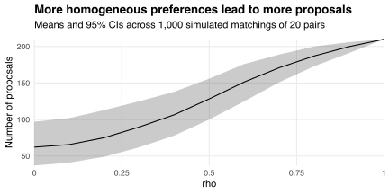

Let `\(A\)` and `\(B\)` be sets of `\(n\)` people.
A "[matching](https://en.wikipedia.org/wiki/Matching_%28graph_theory%29)" is a collection of pairs `\((a,b)\)` with `\(a\in A\)` and `\(b\in B\)` such that everyone in `\(A\cup B\)` belongs to exactly one pair.
For example, if `\(A\)` and `\(B\)` are sets of men and women then a matching could define a collection of monogamous, heterosexual marriages.

Suppose the people in each set have (complete, strict) preferences over potential matches in the other set.
A matching is "[stable](https://en.wikipedia.org/wiki/Stable_marriage_problem)" if there are no unmatched pairs who prefer each other to their match.
[Gale and Shapley (1962)](https://doi.org/10.2307/2312726) show that a stable matching always exists and describe an [algorithm](https://en.wikipedia.org/wiki/Gale–Shapley_algorithm) for finding it:
Let each person `\(a\in A\)` without a match "propose" to their most preferred person in `\(b\in B\)` to whom they haven't already proposed.
If `\(b\)` is unmatched then they tentatively accept the proposal;
if `\(b\)` is matched to `\(a'\)` but prefers `\(a\)` then they tentatively accept the proposal and reject `\(a'\)`;
otherwise, `\(b\)` rejects the proposal.
Repeat this process until everyone is matched.

## Optimality and strategy-proofness

The Gale-Shapley (GS) algorithm always delivers a stable matching that is best for everyone in `\(A\)` among all stable matchings.
To see why, suppose `\(a\in A\)` is matched to `\(b\in B\)` but prefers `\(b'\in B\setminus\{b\}\)`.
Then `\(b'\)` must have received a proposal from some `\(a'\in A\setminus\{a\}\)` whom they prefer to `\(a\)`.
Consequently, `\(a\)` cannot form a "blocking pair" with `\(b'\)` (and thereby break the stable matching) because `\(b'\)` would rather be matched to `\(a'\)`.
Thus `\(b\)` is the best match `\(a\)` can get if the matching is stable.

On the other hand, the GS algorithm always delivers a stable matching that is *worst* for everyone in `\(B\)` among all stable matchings.
To see why, suppose `\(b\in B\)` is matched to `\(a\in A\)` in some matching `\(\mathcal{M}\)` obtained using the GS algorithm.
Suppose further that `\(b\)` prefers `\(a\)` to some `\(a'\in A\setminus\{a\}\)` and assume towards a contradiction that there is a stable matching `\(\mathcal{M}'\)` in which `\(b\)` is matched to `\(a'\)`.
Then `\(a\)` is matched to some `\(b'\in B\setminus\{b\}\)` in `\(\mathcal{M}'\)`.
Now `\(\mathcal{M}\)` was obtained using the GS algorithm, so it gives `\(a\)` their top preference among all stable matchings.
Consequently, `\(a\)` must prefer `\(b\)` to `\(b'\)`.
But then `\(a\)` and `\(b\)` form a blocking pair in `\(\mathcal{M}'\)`, contradicting its stability.
Thus `\(a'\)` cannot exist; that is, `\(a\)` is the worst match `\(b\)` can get among all stable matchings.

The GS algorithm is [strategy-proof](https://en.wikipedia.org/wiki/Strategyproofness) for everyone in `\(A\)`: no-one in `\(A\)` can do better by misreporting their preferences ([Roth, 1982](https://doi.org/10.1287/moor.7.4.617)), nor can any subset of `\(A\)` coordinate to do (strictly) better ([Dubins and Freedman, 1981](https://doi.org/10.2307/2321753)).
However, people in `\(B\)` may be able to do better.
For example, suppose the preferences among people in `\(A=\{a_1,a_2,a_3\}\)` and `\(B=\{b_1,b_2,b_3\}\)` are given by
`$$\begin{align*}
b_2&\succ_{a_1}b_1\succ_{a_1}b_3 \\
b_1&\succ_{a_2}b_2\succ_{a_2}b_3 \\
b_1&\succ_{a_3}b_2\succ_{a_3}b_3 \\
a_1&\succ_{b_1}a_3\succ_{b_1}a_2 \\
a_3&\succ_{b_2}a_1\succ_{b_2}a_2 \\
a_1&\succ_{b_3}a_2\succ_{b_3}a_3,
\end{align*}$$`
where `\(j\succ_ik\)` means that `\(i\)` prefers `\(j\)` to `\(k\)`.
Applying the GS algorithm to these preferences delivers the stable matching `\(\{(a_1,b_2),(a_2,b_3),(a_3,b_1)\}\)`.
But if `\(b_1\)` misreported their preferences as `\(a_1\succ_{b_1}a_2\succ_{b_1}a_3\)` then the algorithm would deliver `\(\{(a_1,b_1),(a_2,b_3),(a_3,b_2)\}\)`, which `\(b_1\)` prefers.

## Convergence

Since everyone in `\(A\)` proposes to everyone in `\(B\)` at most once, the GS algorithm never requires more than `\(n^2\)` proposals.
However, the algorithm typically requires fewer proposals.
For example, suppose the utility `\(a\in A\)` derives from being matched to `\(b\in B\)` is
`$$U_{ab}=\rho W_b+(1-\rho)X_{ab},$$`
where `\(W_b\)` and `\(X_{ab}\)` are iid uniformly distributed on the unit interval `\([0,1]\)`, and where `\(\rho\)` indexes the correlation of match utilities.
Similarly, suppose the utility `\(b\)` derives from being matched to `\(a\)` is
`$$V_{ba}=\rho Y_a+(1-\rho)Z_{ba},$$`
where `\(Y_a\)` and `\(Z_{ba}\)` are also iid uniform on `\([0,1]\)`.
The utilities `\(U_{ab}\)` and `\(V_{ba}\)` determine peoples' preferences over matches, and increasing `\(\rho\)` makes those preferences more homogeneous.
The chart below shows how the number of proposals required by the GS algorithm covaries with `\(\rho\)` when `\(n=20\)`.

On average, more proposals are required when preferences are more homogeneous.
Intuitively, increasing `\(\rho\)` makes it more likely that an early tentative acceptance will become a rejection, forcing the rejected person to make another proposal.
If `\(\rho=1\)` then the GS algorithm always requires
`$$\sum_{x=1}^nx=\frac{n(n+1)}{2}$$`
proposals.
To see why, notice that if `\(\rho=1\)` then everyone in `\(A\)` has the same preferences over everyone in `\(B\)` and vice versa.
Consequently, the person in `\(A\)` most preferred by the people in `\(B\)` always gets their first choice, the person in `\(A\)` second-most preferred by the people in `\(B\)` always gets their second choice, and so on.
But since everyone in `\(A\)` has the same preferences, each has to make as many proposals as is their position on the (common) preference ordering among the people in `\(B\)`.

## Limitations

One limitation of the GS algorithm is that it assumes everyone has strict, complete preferences over potential matches.
This assumption may not hold in practice: `\(a\in A\)` could be indifferent between `\(b\in B\)` and `\(b'\in B\)`, or `\(a\)` may not even know who is in `\(B\)` let alone the utilities derived from being matched to them.
[Irving (1994)](https://doi.org/10.1016/0166-218X%2892%2900179-P) generalizes the GS algorithm to handle situations with indifferences, while [Manlove et al. (2002)](https://doi.org/10.1016/S0304-3975%2801%2900206-7) describe the computational complexity generated by allowing for incomplete preferences.

Another limitation of the GS algorithm is that it always delivers a stable matching that is best for people in `\(A\)` and worst for people in `\(B\)`.
This "extremal" property of the algorithm's output motivates alternative algorithms (e.g., those by [Roth and Vande Vate (1990)](https://doi.org/10.2307/2938326) and [Romero-Medina (2005)](https://doi.org/10.1007/s11238-005-6846-0), and more recently [Dworczak (2021)](https://doi.org/10.1287/opre.2020.2042) and [Kuvalekar and Romero-Medina (2021)](https://ideas.repec.org/p/cte/werepe/31711.html)) that deliver *ex ante* fairer matchings by randomizing whose preferences (i.e., people in `\(A\)` or people in `\(B\)`) are used to form matches.

A third limitation is that the GS algorithm assumes match utilities do not depend on the sequence of proposals.
In particular, the algorithm assumes that `\(a\in A\)` derives the same utility from being matched to `\(b\in B\)` regardless of how much `\(b\)` wants to be matched to `\(a\)`.
This assumption seems unrealistic: if I proposed to someone but later learned I was *the last person* they wanted to marry then that lesson would surely affect my comfort with the proposal.
One way to resolve this issue could be to run the algorithm many times, allowing people to revise their preferences at each run based on the matching obtained in the previous run.
However, this approach could be expensive---computationally, cognitively, and emotionally---and might not converge if peoples' preference revisions aren't well-behaved.

