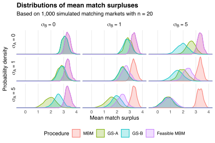

My [previous post](/blog/stable-matchings/) described [Gale and Shapley's (1962)](https://doi.org/10.2307/2312726) algorithm for solving [the stable matching problem](https://en.wikipedia.org/wiki/Stable_marriage_problem).
The algorithm delivers a matching between two sets `\(A\)` and `\(B\)` of `\(n\)` people with preferences over matches in the other set.

The Gale-Shapley (GS) algorithm works by letting people in `\(A\)` make proposals to people in `\(B\)`, who "tentatively accept" or reject proposals until the matching market clears.
Consequently, if one side of the market is more informed about match qualities than the other side then the algorithm could generate different levels of welfare depending on which side makes proposals.

For example, suppose `\(a\in A\)` and `\(b\in B\)` generate surplus `\(S_{ab}\)` from being matched.
This surplus has a monetary value (representing, e.g., the price `\(a\)` and `\(b\)` would pay to be matched) so can be aggregated across pairs meaningfully.
Both `\(a\)` and `\(b\)` want the match that gives them the greatest surplus.
However, they perceive match surpluses noisily: person `\(a\)` thinks their surplus from matching with `\(b\)` is
`$$S_{ab}^A=S_{ab}+\epsilon_{ab}^A,$$`
while `\(b\)` thinks their surplus from matching with `\(a\)` is
`$$S_{ab}^B=S_{ab}+\epsilon_{ab}^B.$$`
The `\(S_{ab}\)` are iid standard normal, the `\(\epsilon_{ab}^A\)` are iid normal with mean zero and variance `\(\sigma_A^2\)`, and the `\(\epsilon_{ab}^B\)` are iid normal with mean zero and variance `\(\sigma_B^2\)`.
Increasing `\(\sigma_A\)` and `\(\sigma_B\)` increases the errors in perceived surpluses.
These errors disappear when the matching is made and the "true" surpluses `\(S_{ab}\)` (representing peoples' true preferences) are realized.

I compare the distribution of mean match surpluses delivered by four matching procedures:

1. *MBM*: the [maximum-weight bipartite matching](https://en.wikipedia.org/wiki/Maximum_weight_matching) based on the true match surpluses `\(S_{ab}\)`;
2. *GS-A*: the GS algorithm with people in `\(A\)` proposing based on their perceived match surpluses `\(S_{ab}^A\)`;
3. *GS-B*: the GS algorithm with people in `\(B\)` proposing based on their perceived match surpluses `\(S_{ab}^B\)`;
4. *Feasible MBM*: the maximum-weight bipartite matching based on the precision-weighted mean perceived match surpluses
  `$$\hat{S}_{ab}=\begin{cases}
  S_{ab} & \text{if}\ \sigma_A=0\ \text{or}\ \sigma_B=0 \\
  \lambda S_{ab}^A+(1-\lambda)S_{ab}^B & \text{otherwise},
  \end{cases}$$`
  where
  `$$\lambda=\frac{1/\sigma_A^2}{1/\sigma_A^2+1/\sigma_B^2}$$`
  is the relative precision of `\(A\)` members' perceptions when `\(\min\{\sigma_A,\sigma_B\}>0\)`.
  *Feasible MBM* replicates *MBM* when `\(\min\{\sigma_A,\sigma_B\}=0\)`.

The *MBM* procedure maximizes the sum of true match surpluses, while the *Feasible MBM* procedure maximizes the sum of the best match surplus estimates that people in `\(A\)` and `\(B\)` could obtain by communicating.
The *GS-A* and *GS-B* procedures do not allow such communication, but guarantee that the ultimate matching is stable.
I run all four procedures 1,000 times for `\(\sigma_A\in\{0,1,5\}\)` and `\(\sigma_B\in\{0,1,5\}\)`, and summarize my results in the figure below.
All four procedures deliver mean match surpluses greater than zero, implying that people tend to do better by following the procedures than by forming matches randomly.

The mean match surpluses delivered by the *GS-A*, *GS-B*, and *Feasible MBM* procedures fall as `\(\sigma_A\)` and `\(\sigma_B\)` rise.
Intuitively, these three procedures rely on preferences reported by the people in `\(A\)` and `\(B\)`, and if those preferences become noisier then the procedures become worse at finding good matches.

*Feasible MBM* tends to outperform *GS-A* and *GS-B* when `\(\sigma_A\)` or `\(\sigma_B\)` are small.
However, the performance gain is neglible when `\(\sigma_A\)` and `\(\sigma_B\)` are large.
Intuitively, if perceived match surpluses are mostly noise then sharing that noise doesn't help with finding better matches.

The GS algorithm tends to find better matches when the people making proposals are the ones with less noisy preferences.
Both sides of the matching market provide information that determines the ultimate matching: the proposing side provides information *actively* through proposals, whereas the non-proposing side provides information *passively* through proposal acceptances and rejections.
Letting the more-informed side make proposals allows more information to feed into the matching process, leading to better matches on average.

---

*Thanks to Spencer Pantoja for inspiring this post and to [Al Roth](https://web.stanford.edu/~alroth/) for his comments.*

