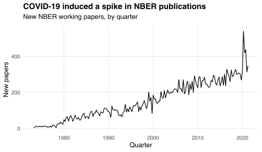

nberwp, an R package providing information on [NBER working papers](https://www.nber.org/papers) and their authors, is now [available on CRAN](https://cran.r-project.org/package=nberwp).
The current version (1.0.0) covers 29,434 papers published between June 1973 and June 2021.
It can be installed via

```r
install.packages('nberwp')
```

nberwp has evolved since [its initial release](/blog/introducing-nberwp/) on GitHub nearly two years ago.
This post describes some of the main changes.

## More papers

The first version of nberwp covered papers published between June 1973 and December 2018.
The updated version adds papers published between January 2019 and June 2021, allowing one to visualize the spike in publications when COVID-19 emerged:

```r
library(dplyr)
library(ggplot2)
library(nberwp)

papers %>%
  count(Quarter = year + (ceiling(month / 3) - 1) / 4, name = 'New papers') %>%
  ggplot(aes(Quarter, `New papers`)) +
  geom_line() +
  labs(title = 'COVID-19 induced a spike in NBER publications',
       subtitle = 'New NBER working papers, by quarter')
```



nberwp now also includes papers published in the historical and technical working paper series.
The historical series contains 136 papers focused on (American) economic history, and the technical series contains 337 papers focused on analytical and empirical methods.

The working paper data exclude duplicates (e.g., papers published in multiple series) but include revisions, which capture continued development of (and collaboration on) research ideas that I believe should be acknowledged.

## Program affiliations

The NBER organizes its research into [programs](https://www.nber.org/programs-projects/programs-working-groups), each of which "corresponds loosely to a traditional field of study within economics."
nberwp now provides a table of paper-program correspondences

```r
paper_programs
```

```
## # A tibble: 53,996 x 2
##    paper program
##    <chr> <chr>  
##  1 w0074 EFG    
##  2 w0087 IFM    
##  3 w0087 ITI    
##  4 w0107 PE     
##  5 w0116 PE     
##  6 w0117 LS     
##  7 w0129 HE     
##  8 w0131 IFM    
##  9 w0131 ITI    
## 10 w0134 HE     
## # … with 53,986 more rows
```

as well as a table of program descriptions:

```r
programs
```

```
## # A tibble: 21 x 3
##    program program_desc                        program_category   
##    <chr>   <chr>                               <chr>              
##  1 AG      Economics of Aging                  Micro              
##  2 AP      Asset Pricing                       Finance            
##  3 CF      Corporate Finance                   Finance            
##  4 CH      Children                            Micro              
##  5 DAE     Development of the American Economy Micro              
##  6 DEV     Development Economics               Micro              
##  7 ED      Economics of Education              Micro              
##  8 EEE     Environment and Energy Economics    Micro              
##  9 EFG     Economic Fluctuations and Growth    Macro/International
## 10 HC      Health Care                         Micro              
## # … with 11 more rows
```

The `program_category` column categorizes programs similarly to [Chari and Goldsmith-Pinkham (2017)](https://www.nber.org/papers/w23953).
On average, each paper is affiliated with 1.83 programs and each program has 2,571 affiliated papers.

One use of the paper-program correspondences is to analyze the intellectual overlaps among programs.
For example, the table below presents the six pairs of programs with the most-overlapping sets of affiliated papers, with overlap sizes measured by [Jaccard indices](https://en.wikipedia.org/wiki/Jaccard_index).
The top index of 0.29 means that about 29% of the papers affiliated with the Children or Economics of Education programs are affiliated with both.

|Program 1                                |Program 2                          | Jaccard index|
|:----------------------------------------|:----------------------------------|-------------:|
|Children                                 |Economics of Education             |          0.29|
|Health Care                              |Health Economics                   |          0.29|
|International Finance and Macroeconomics |International Trade and Investment |          0.26|
|Economic Fluctuations and Growth         |Monetary Economics                 |          0.23|
|Asset Pricing                            |Corporate Finance                  |          0.17|
|Labor Studies                            |Public Economics                   |          0.15|

## Authorships

nberwp now contains information about working papers' (co-)authors:

```r
authors
```

```
## # A tibble: 15,437 x 4
##    author  name             user_nber        user_repec
##    <chr>   <chr>            <chr>            <chr>     
##  1 w0001.1 Finis Welch      finis_welch      <NA>      
##  2 w0002.1 Barry R Chiswick barry_chiswick   pch425    
##  3 w0003.1 Swarnjit S Arora swarnjit_arora   <NA>      
##  4 w0004.1 Lee A Lillard    <NA>             pli669    
##  5 w0005.1 James P Smith    james_smith      psm28     
##  6 w0006.1 Victor Zarnowitz victor_zarnowitz <NA>      
##  7 w0007.1 Lewis C Solmon   <NA>             <NA>      
##  8 w0008.1 Merle Yahr Weiss <NA>             <NA>      
##  9 w0008.2 Robert E Lipsey  robert_lipsey    pli259    
## 10 w0010.1 Paul W Holland   <NA>             <NA>      
## # … with 15,427 more rows
```

The `author` column contains unique author identifiers, constructed by concatenating each author's debut paper and their position on that paper's (alphabetized) byline.
This construction ensures that `author` values do not change when I add newly published papers to the data.
The `user_nber` column contains authors' usernames on the NBER website; the `user_repec` column contains authors' [RePEc](https://ideas.repec.org) IDs.
Some authors do not have an NBER username or RePEc ID, indicated by `NA` values in the appropriate column.

nberwp also provides a table of paper-author correspondences:

```r
paper_authors
```

```
## # A tibble: 67,090 x 2
##    paper author 
##    <chr> <chr>  
##  1 w0001 w0001.1
##  2 w0002 w0002.1
##  3 w0003 w0003.1
##  4 w0004 w0004.1
##  5 w0005 w0005.1
##  6 w0006 w0006.1
##  7 w0007 w0007.1
##  8 w0008 w0008.1
##  9 w0008 w0008.2
## 10 w0009 w0004.1
## # … with 67,080 more rows
```

This table can be used to construct a co-authorship network among the 15,437 authors identified in nberwp.
This network currently contains 38,968 edges, implying that 0.03% of pairs co-authored at least one working paper during the period covered by the data.
Authors in the network have a mean degree of 5.05.

I used previous versions of nberwp in blog posts on [triadic closure](/blog/triadic-closure-nber/) and [female representation](/blog/female-representation-collaboration-nber/).
These posts assumed that authors were uniquely identified by their full names.
This assumption was problematic: different authors could share the same name, or a single author could publish under many names (e.g., before and after marriage).
The updated version of nberwp builds on [previous efforts to disambiguate authors' names](/blog/nber-co-authorships/)---namely cross-referencing against NBER usernames, RePEc IDs, common co-authorships, and name edit distances---in three ways:

1. using paper-program correspondences to identify authors who have similar names and published papers in similar programs, and so are likely to be the same person;
2. manually merging (or splitting) authors whom I determine to be the same (or distinct) based on their personal or academic websites;
3. including an author ID variable (`author`) rather than relying on names for unique identification.

These enhancements support cleaner analyses of (co-)authorship behavior.
Nonetheless the data may still contain errors---if you find any, let me know by adding an issue on [GitHub](https://github.com/bldavies/nberwp).

