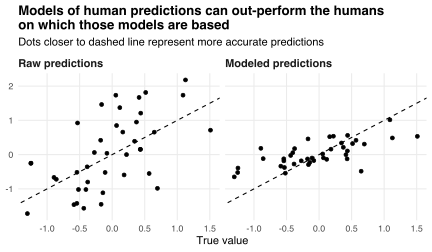

Chapter 9 of [Kahneman et al. (2021)](https://readnoise.com) discusses how predictions made by humans can be less accurate than predictions made using statistical models.
Part of the chapter describes research by [Goldberg (1970)](https://doi.org/10.1037/h0029230) and subsequent authors showing that models of human predictions can out-perform the humans on which those models are based.

For example, suppose I'm asked to make predictions in a range of contexts `\(i\in\{1,2,\ldots,n\}\)`.
My goal is to use some contextual data `\(x_i\in\mathbb{R}^k\)` to predict the value of a context-specific outcome `\(y_i\)`.
I generate predictions
`$$\newcommand{\abs}[1]{\lvert#1\rvert}
\bar{y}_i=y_i+u_i,$$`
where the `\(u_i\)` are context-specific errors.
The accuracy of my predictions can be measured via their [mean squared error](https://en.wikipedia.org/wiki/Mean_squared_error) (MSE)
`$$\frac{1}{n}\sum_{i=1}^n(\bar{y}_i-y_i)^2=\frac{1}{n}\sum_{i=1}^nu_i^2,$$`
where a lower MSE implies higher accuracy.
Another way to generate predictions could be to posit a linear model
`$$y_i=\theta x_i+\epsilon_i,$$`
where `\(\theta\)` is a row vector of coefficients and the `\(\epsilon_i\)` are random errors.
But I don't know the true outcomes `\(y_i\)`---hence needing to predict them---and so I can't just use ordinary least squares (OLS) to estimate `\(\theta\)`.
Instead, Goldberg (1970) suggests replacing this linear model with
`$$\bar{y}_i=\beta x_i+\varepsilon_i,$$`
where `\(\beta\)` is a (possibly different) vector of coefficients and the `\(\varepsilon_i\)` are (possibly different) random errors.
This second model describes the linearized relationship between my (possibly incorrect) predictions `\(\bar{y}_i\)` and the data `\(x_i\)` on which those predictions are based.
Since I know my predictions `\(\bar{y}_i\)`, I can use OLS to obtain an estimate `\(\hat\beta\)` of `\(\beta\)` and produce a set of "modeled predictions"
`$$\hat{y}_i=\hat\beta x_i.$$`
The difference between the `\(\bar{y}_i\)` and `\(\hat{y}_i\)` is that the latter ignore the non-linearities in my method for generating predictions.
Intuitively, the `\(\hat{y}_i\)` represent what I would predict using a simple, linear formula; my predictions `\(\bar{y}_i\)` may be generated using a formula that is much more complex, or may not be generated using a formula at all.

So, how do my raw predictions `\(\bar{y}_i\)` and their modeled counterparts `\(\hat{y}_i\)` compare?
The chart below plots the `\(\bar{y}_i\)` and `\(\hat{y}_i\)` against the true values `\(y_i\)` when

1. the `\(x_i\)` and `\(u_i\)` are iid standard normal, and
2. `\(y_i=(x_i+z_i)/2\)` with `\(z_i\)` iid standard normal.

The modeled predictions are far more accurate: they have an MSE of 0.22, whereas my raw predictions have an MSE of 0.76.
In this case, the true relationship between the `\(y_i\)` and `\(x_i\)` is linear, and so a linear model of my predictions is well-placed to out-perform those predictions.

However, modeling predictions does not always improve their accuracy.
For example, suppose the contextual data `\(x_i\)` are scalars, and the `\(x_i\)`, `\(y_i\)`, and `\(u_i\)` have zero means.
Then the MSE of the modeled predictions turns out to be
`$$\frac{1}{n}\sum_{i=1}^n(\hat{y}_i-y_i)^2=\sigma_y^2+\rho_{ux}^2\sigma_u^2-\rho_{xy}^2\sigma_y^2,$$`
where `\(\sigma_y^2\)` and `\(\sigma_u^2\)` are the variances of the `\(y_i\)` and `\(u_i\)`, where `\(\rho_{ux}\)` is the correlation of the `\(u_i\)` and `\(x_i\)`, and where `\(\rho_{xy}\)` is the correlation of the `\(x_i\)` and `\(y_i\)`.
Consequently, replacing my raw predictions `\(\bar{y}_i\)` with their modeled counterparts `\(\hat{y}_i\)` leads to an accuracy improvement if and only if
`$$\sigma_y^2(1-\rho_{xy}^2)<\sigma_u^2(1-\rho_{ux}^2).$$`
This condition holds in the example plotted above: both `\(\sigma_u^2\)` and `\(\sigma_y^2\)` equal unity, but `\(\rho_{xy}=0.69\)` is much larger in absolute value than `\(\rho_{ux}=-0.09\)`.
In general, the condition is most likely to hold when

1. `\(\sigma_u^2\)` is larger than `\(\sigma_y^2\)` (i.e., my raw predictions are relatively noisy);
2. `\(\abs{\rho_{xy}}\)` is large (i.e., the relationship between the `\(y_i\)` and `\(x_i\)` is approximately linear and deterministic); and 
2. `\(\abs{\rho_{ux}}\)` is small (i.e., the errors `\(u_i\)` in my raw predictions are relatively uncorrelated with the `\(x_i\)`).

Intuitively, if the outcomes `\(y_i\)` are a linear function of the `\(x_i\)` (i.e., if `\(\abs{\rho_{xy}}=1\)`) then linearizing my predictions improves their accuracy by removing non-linear errors.
On the other hand, if *my prediction errors* `\(u_i\)` are a linear function of the `\(x_i\)` (i.e., if `\(\abs{\rho_{ux}}=1\)`) then linearizing my predictions cannot improve their accuracy because there are no non-linear errors to remove.

