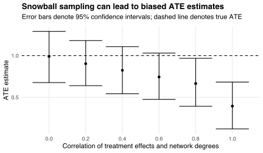

Suppose I want to run a pilot study of a mental health support program before rolling it out at scale.
The program has heterogeneous treatment effects, but tends to be more effective for people who have fewer social connections.
Such people tend to have lower mental health ([Kawachi and Berkman, 2001](https://doi.org/10.1093/jurban/78.3.458)) and so have more to gain from participating in the program.

I recruit people to my study via [snowball sampling](https://en.wikipedia.org/wiki/Snowball_sampling): I advertise it to a few initial seeds, who share the ads with their friends, who share the ads with their friends, and so on.
Everyone who sees an ad participates.
But some people are more likely to see ads than others: in particular, people with more friends have more chances to be sent an ad.
Consequently, I will tend to under-estimate the average treatment effect (ATE) of the program because people with more social connections, for whom the program is less effective, are more likely to appear in my pilot sample.
Such under-estimation may lead me to abandon the program even if its mental health benefits actually outweigh its implementation costs.

## Demonstration

As a concrete example, suppose each individual `\(i\)` has degree `\(d_i\)` in the social network from which I recruit my sample.
The treatment effect of the program on individual `\(i\)` is
`$$\beta_i=1-r\bar{d}_i+(1-r)z_i,$$`
where `\(\bar{d}_i\)` is a normalization of `\(d_i\)` with zero mean and unit variance across the network, the `\(z_i\)` are iid standard normal, and `\(r\)` is a parameter controlling the (negative) correlation between the `\(\beta_i\)` and `\(d_i\)`.
The treatment effects `\(\beta_i\)` give rise to individual-level outcomes
`$$y_i=\beta_it_i+\epsilon_i,$$`
where the `\(t_i\)` are binary treatment indicators and the `\(\epsilon_i\)` are iid standard normal errors.
The sample delivers an estimate
`$$\hat\beta=\frac{\sum_iy_it_i}{\sum_it_i}-\frac{\sum_iy_i(1-t_i)}{\sum_i(1-t_i)}$$`
of the program's ATE: the difference in mean outcomes between treated and untreated members of the pilot sample.
Treatments are assigned to sample members randomly.
But the sample is recruited non-randomly: individual `\(i\)` is recruited with probability proportional to their degree `\(d_i\)`.
This non-random recruitment leads to sampling bias when the `\(\beta_i\)` and `\(d_i\)` are correlated.

The chart below summarizes the distribution of ATE estimates across 500 snowball samples of 250 people from a random social network.
This network contains 1,000 bilateral friendships among 1,000 people.
Network degrees vary between zero and seven, producing variation in the probability of being sampled.
I randomize the treatment effects `\(\beta_i\)` and assignments `\(t_i\)` in each simulation run.

The ATE estimate is unbiased when treatment effects are uncorrelated with network degrees.
However, the estimate becomes more biased as the correlation becomes stronger.
Intuitively, the more the program's effectiveness is concentrated among low-degree individuals, the worse the program looks in pilot samples excluding those individuals (independently of how treatments are assigned).

## Potential solutions

How can we mitigate snowball sampling bias?
One approach is to collect information about sample members' degrees in the social network, and use this information to obtain weighted ATE estimates.[^rds]
The difference-in-means estimator `\(\hat\beta\)` equals the OLS estimator of `\(\beta\)` in the linear model
`$$y_i=\beta t_i+\varepsilon_i$$`
relating outcomes to treatment assignments.
Using [weighted least squares](https://en.wikipedia.org/wiki/Weighted_least_squares) (WLS) with weights `\(w_i=1/\sqrt{d_i}\)` may deliver less biased estimates by accounting for the probability of sampling each individual `\(i\)`.
Intuitively, individuals with lower degrees provide relatively more information about the true ATE because they are less likely to be sampled, and so giving these individuals higher weights in the estimation procedure leads to more informed estimates.[^sqrt]
However, the distribution of degrees `\(d_i\)` in the sample is different than the distribution of degrees in the full network, and so weighting by the (observed) `\(d_i\)` may still deliver different (and thus incorrect) estimates than weighting by the (unobserved) sampling probabilities.

[^rds]: This approach is conceptually similar to the "respondent-driven sampling" technique described by [Salganik and Heckathorn (2004)](https://doi.org/10.1111/j.0081-1750.2004.00152.x).

[^sqrt]: Taking square roots recognizes that the objective of WLS is to minimize the weighted sum of *squared* residuals.

Another approach, suggested by [Jackson et al. (2020)](https://dx.doi.org/10.2139/ssrn.3522256), is to model sample recruitment explicitly using game theory.
The authors describe a game wherein each individual's recruitment payoff depends on whether their peers are recruited.
The equilibrium of this game determines each individual's recruitment probability conditional on the network structure (and other covariates).
Jackson et al. embed this game in an estimation procedure based on [propensity score matching](https://en.wikipedia.org/wiki/Propensity_score_matching), and show theoretically and empirically that this procedure leads to better ATE estimates.

---

*Thanks to [Ryan Brennan](https://twitter.com/RyanBrennanEcon) for discussing the ideas presented in this post.*
