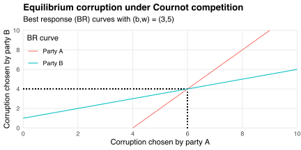
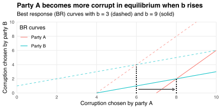

This post presents a simple model of corruption in two-party elections.
The model is similar to one of [Cournot competition](https://en.wikipedia.org/wiki/Cournot_competition): parties choose quantities of corruption in response to implicit "price" schedules determined by voter preferences.
I describe the [model](#model), [derive](#equilibrium) and [analyze](#comparative-statics) its equilibrium, provide a [numerical example](#numerical-example), and discuss some [alternatives](#alternative-models).

## Model

Two parties `\(A\)` and `\(B\)` compete for votes in an electoral system with [proportional representation](https://en.wikipedia.org/wiki/Proportional_representation).
Each party `\(k\)` chooses its corruption level `\(c_k\)` to maximize `\(c_ks_k(c_A,c_B)\)`, where party `\(k\)`'s vote share `\(s_k(c_A,c_B)\)` depends on both parties' chosen corruptions.
This objective captures how parties benefit from engaging in corrupt activities, but only insofar as voters give them power to do so.

Voters don't like corruption: voter `\(i\)`'s payoff from voting for `\(A\)` is `\((1-c_A+\epsilon_i)\)` and their payoff from voting for `\(B\)` is `\((1-c_B)\)`.
The `\(\epsilon_i\)` are iid uniformly distributed on `\([b-w,b+w]\)`, where `\(b\)` is the mean bias in favor of party `\(A\)` and `\(w>0\)` controls the noise in voter preferences.
Thus, party `\(A\)`'s vote share is
`$$\begin{aligned}
s_A(c_A,c_B)
&= \Pr(1-c_A+\epsilon_i\ge1-c_B) \\
&= \Pr(\epsilon_i\ge c_A-c_B) \\
&= \frac{b+w-(c_A-c_B)}{(b+w)-(b-w)} \\
&= \frac{1}{2}+\frac{b-(c_A-c_B)}{2w}
\end{aligned}$$`
while party `\(B\)`'s vote share is
`$$\begin{aligned}
s_B
&= 1-s_A(c_A,c_B) \\
&= \frac{1}{2}-\frac{b-(c_A-c_B)}{2w}.
\end{aligned}$$`
Parties `\(A\)` and `\(B\)` engage in a form of Cournot competition: they choose corruptions `\(c_k\)` independently and simultaneously, with full knowledge of the (inverse) demand curves `\(s_k(c_A,c_B)\)`.
These curves are downward-sloping: the "price" `\(s_k\)`, reflecting voters' willingness to spend their votes on party `\(k\)`, falls with the chosen "quantity" `\(c_k\)`.
Corruptions `\(c_A\)` and `\(c_B\)` are substitutes in the sense that, e.g., the price `\(s_A\)` rises with `\(c_B\)`.

## Equilibrium

The competition over corruption levels resolves at a [Nash equilibrium](https://en.wikipedia.org/wiki/Nash_equilibrium) in which each party chooses optimally given the other party's choice.
For party `\(A\)`, this means choosing `\(c_A^*\)` to satisfy the first-order condition
`$$\newcommand{\parfrac}[2]{\frac{\partial\,#1}{\partial\,#2}}
\begin{aligned}
0
&= \parfrac{}{c_A^*}\left(c_A^*\,s_A(c_A^*,c_B)\right) \\
&= \frac{1}{2}+\frac{b-2c_A^*+c_B}{2w},
\end{aligned}$$`
which can be rewritten as
`$$2c_A^*-c_B=w+b.$$`
Similarly, the first-order condition for party `\(B\)`'s optimal choice `\(c_B^*\)` can be written as
`$$-c_A+2c_B^*=w-b.$$`
Therefore, the Nash equilibrium `\((c_A^*,c_B^*)\)` levels of corruption satisfy the linear system
`$$\begin{bmatrix}2&-1\\-1&2\end{bmatrix}\begin{bmatrix}c_A^*\\c_B^*\end{bmatrix}=\begin{bmatrix}w+b\\w-b\end{bmatrix},$$`
which has unique solution
`$$\begin{bmatrix}c_A^*\\c_B^*\end{bmatrix}=\frac{1}{3}\begin{bmatrix}3w+b\\3w-b\end{bmatrix}.$$`
Party `\(A\)`'s vote share in this equilibrium is
`$$s_A(c_A^*,c_B^*)=\frac{1}{2}\left(1-\frac{b}{3w}\right),$$`
which exceeds 50% if and only if `\(b\)` is *negative*; that is, when voters are biased *against* party `\(A\)`.
In that case, party `\(A\)` can't "sell" as much corruption as party `\(B\)` because voters aren't as tolerant of `\(A\)`'s corruption as `\(B\)`'s.
But the price elasticity of corruption is party-invariant, so selling less corruption `\(c_A^*\)` allows party `\(A\)` to obtain a higher price `\(s_A(c_A^*,c_B^*)\)` than party `\(B\)`.
Nonetheless, both parties obtain the same "corruption revenue" in equilibrium:
`$$c_k^*s_k(c_A^*,c_B^*)=\frac{w}{2}-\frac{b^2}{18w}.$$`

## Comparative statics

Differentiating the Nash equilibrium corruption levels `\(c_A^*\)` and `\(c_B^*\)` with respect to the mean bias `\(b\)` gives
`$$\parfrac{c_A^*}{b}=\frac{1}{3}=-\parfrac{c_B^*}{b},$$`
implying that if `\(b\)` increases then party `\(A\)` becomes more corrupt by exactly the amount that party `\(B\)` becomes less corrupt.
Indeed, aggregate corruption `\(c_A^*+c_B^*=2w\)` is constant in `\(b\)` but increases with `\(w\)`.
Both parties become more corrupt (in equilibrium) when `\(w\)` rises:
`$$\parfrac{c_A^*}{w}=1=\parfrac{c_B^*}{w}.$$`
Intuitively, if `\(w\)` rises then voters become less sensitive to corruption because their preferences become noisier.
Both parties exploit this fall in sensitivity by becoming more corrupt, which makes them better off because
`$$\parfrac{}{w}\left(c_k^*\,s_k(c_A^*,c_B^*)\right)=\frac{1}{2}+\frac{b^2}{18w^2}$$`
is strictly positive.
On the other hand, if `\(b\)` rises then voters become more willing to tolerate party `\(A\)`'s corruption and less willing to tolerate party `\(B\)`'s.
Party `\(A\)` responds to this shift in relative tolerance by selling more corruption, albeit at a lower price `\(s_A(c_A^*,c_B^*)\)`.

## Numerical example

The Nash equilibrium corruption levels lie at the intersection of party `\(A\)`'s best response curve
`$$c_A^*=\frac{c_B+w+b}{2}$$`
and party `\(B\)`'s best response curve
`$$c_B^*=2c_A+w-b,$$`
obtained by rearranging the first-order conditions for `\(c_A^*\)` and `\(c_B^*\)`.
The chart below plots these curves when `\(b=3\)` and `\(w=5\)`.
The curves intersect at `\((c_A^*,c_B^*)=(6,4)\)`, where party `\(A\)` wins a vote share of `\(s_A(c_A^*,c_B^*)=40\%\)`.

Now suppose the mean bias in favor of party `\(A\)` rises to `\(b=9\)`.
The chart below shows how this rise shifts parties' best response curves in the `\(c_Ac_B\)` plane.
These shifts move the Nash equilibrium rightward to `\((c_A^*,c_B^*)=(8,2)\)`.
Party `\(A\)`'s vote share falls to `\(s_A(c_A^*,c_B^*)=20\%\)`, and both parties' corruption revenues `\(c_k^*s_k(c_A^*,c_B^*)\)` fall from `\(2.4\)` to `\(1.6\)`.

## Alternative models

With proportional representation, every vote for party `\(k\)` gives that party more power to engage in corrupt activities.
Consequently, the party trades off its corruption level `\(c_k\)` with its vote share `\(s_k(c_A,c_B)\)` continuously.
In contrast, if only the party with a majority vote share gains power then corruption revenues become discontinuous in vote shares.
This discontinuity changes the equilibrium choices of `\(c_A\)` and `\(c_B\)`.
For example, if electoral ties are resolved with a coin toss then the unique equilibrium gives each party a 50% vote share independently of `\(b\)` and `\(w\)`, and the corruption levels satisfy `\(c_A^*=c_B^*+b\)` (as opposed to `\(c_A^*=c_B^*+2b/3\)` under proportional representation).

One way to generalize the model with proportional representation is to introduce voting blocs: groups of voters with group-specific mean biases `\(b_j\)` and radii `\(w_j\)`.
Then the equilibrium corruption levels become
`$$c_A^*=\frac{3+\sum_jb_j\theta_j/w_j}{3\sum_j\theta_j/w_j}$$`
and
`$$c_B^*=\frac{3-\sum_jb_j\theta_j/w_j}{3\sum_j\theta_j/w_j},$$`
where `\(\theta_j\)` is group `\(j\)`'s share of the population.
Intuitively, the equilibrium depends on the aggregate bias and precision of voters' preferences, but these aggregates depend on the group-specific biases `\(b_j\)` and precisions `\(1/w_j\)` as well as the relative group sizes `\(\theta_j\)`.
Introducing voting blocs makes the comparative statics more intricate but preserves the underlying intuitions.

