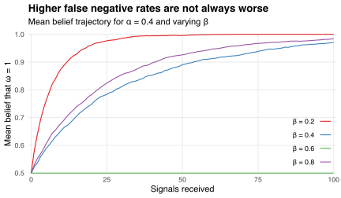

Suppose I want to learn the value of `\(\omega\in\{0,1\}\)`.
I observe a sequence of iid signals `\((s_n)_{n\ge1}\)` with
`$$\Pr(s_n=0\,\vert\,\omega=0)=1-\alpha$$`
and
`$$\Pr(s_n=1\,\vert\,\omega=1)=1-\beta,$$`
where `\(\alpha\)` and `\(\beta\)` are [false positive and false negative rates](https://en.wikipedia.org/wiki/Type_I_and_type_II_errors).
I let `\(\pi_n\)` denote my belief that `\(\omega=1\)` after observing `\(n\)` signals, and update this belief sequentially via [Bayes' formula](https://en.wikipedia.org/wiki/Bayes%27_theorem):
`$$\pi_{n}(s)=\frac{\Pr(s_n=s\,\vert\,\omega=1)\pi_{n-1}}{\Pr(s_n=s)}.$$`
In particular, if I observe `\(s_n=0\)` then I update my belief to
`$$\pi_n(0)=\frac{\beta\pi_{n-1}}{\beta\pi_{n-1}+(1-\alpha)(1-\pi_{n-1})},$$`
whereas if I observe `\(s_n=1\)` then I update my belief to
`$$\pi_n(1)=\frac{(1-\beta)\pi_{n-1}}{(1-\beta)\pi_{n-1}+\alpha(1-\pi_{n-1})}.$$`

The chart below shows how my belief `\(\pi_n\)` changes with `\(n\)`.
Each path in the chart corresponds to the sequence of beliefs `\((\pi_0,\pi_1,\ldots,\pi_{100})\)` obtained by updating my initial belief `\(\pi_0=0.5\)` in response to a signal sequence `\((s_1,s_2,\ldots,s_{100})\)`.
I simulate 10 such sequences, fixing `\(\omega=1\)` and `\(\beta=0.4\)` but varying `\(\alpha\in\{0.2,0.4,0.6,0.8\}\)`.

If `\(\alpha\not=0.6\)` then my belief converges to `\(\pi_n=1\)` as `\(n\)` grows.
However, if `\(\alpha=0.6\)` then `\(\pi_n=\pi_0\)` for each `\(n\)`; that is, I never update my beliefs regardless of the signals I observe.
This is because if `\(\alpha+\beta=1\)` then `\(\Pr(s_n=s\cap\omega=1)=\Pr(s_n=s)\)` for each `\(s\in\{0,1\}\)`, and so signals are uninformative because they are independent of `\(\omega\)`.

The chart below plots the mean of my beliefs `\(\pi_n\)` across 1,000 realizations of the signals simulated above.
Again, I fix `\(\omega=1\)` and the false negative rate `\(\beta=0.4\)` but vary the false positive rate `\(\alpha\in\{0.2,0.4,0.6,0.8\}\)`.
Higher values of `\(\alpha\)` are not always worse: my belief converges to the truth faster when `\(\alpha=0.8\)` than when `\(\alpha=0.4\)`.
Intuitively, if I know the false positive rate is close to 100% then observing a signal `\(s_n=1\)` gives me strong evidence that `\(\omega=0\)`.

