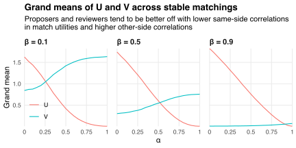

Suppose I use the [Gale-Shapley (GS) algorithm](https://en.wikipedia.org/wiki/Gale–Shapley_algorithm) to find a [stable matching](/blog/stable-matchings/) between two sets `\(P\)` and `\(R\)` of size `\(n\)`.
Proposer `\(p\in P\)` gets utility
`$$u_{rp}=\alpha w_r+(1-\alpha)x_{rp}$$`
from being matched with reviewer `\(r\in R\)`, where `\(w_r\)` is common to all proposers, `\(x_{rp}\)` is specific to proposer `\(p\)`, and `\(\alpha\in[0,1]\)` controls the correlation in utilities across proposers.[^correl]
Likewise, reviewer `\(r\)` gets utility
`$$v_{pr}=\beta y_p+(1-\beta)z_{pr}$$`
from being matched with proposer `\(p\)`, where `\(y_p\)` is common to all reviewers, `\(z_{pr}\)` is specific to reviewer `\(r\)`, and `\(\beta\in[0,1]\)` controls the correlation in utilities across reviewers.
The `\(w_r\)`, `\(x_{rp}\)`, `\(y_p\)`, and `\(z_{pr}\)` are iid standard normal.
I run the GS algorithm 200 times, each time (i) simulating new utility realizations and (ii) computing the means
`$$U\equiv\frac{1}{n}\sum_{p\in P}u_{rp}$$`
and
`$$V\equiv\frac{1}{n}\sum_{r\in R}v_{pr}$$`
of utilities under the resulting matching.
I then compute the [grand means](https://en.wikipedia.org/wiki/Grand_mean) of `\(U\)` and `\(V\)` across all 200 simulations.
The chart below shows how these grand means vary with `\(\alpha\)` and `\(\beta\)` when `\(n=50\)`.

[^correl]: If `\(\mathrm{Var}(w_r)=\sigma_w^2\)` and `\(\mathrm{Var}(x_{rp})=\sigma_x^2\)` then `\(\mathrm{Corr}(u_{rp},u_{rq})=[1+(1-\alpha)^2\sigma_x^2/\alpha^2\sigma_w^2]^{-1}\)` increases with `\(\alpha\)`.

Proposers and reviewers tend to be better off when (i) utilities on their side of the market are *less* correlated and (ii) utilities on the *other* side of the market are *more* correlated.
Intuitively, same-side correlations induce competition that makes the most desirable people on that side better off but the rest much worse off.
This competition benefits the other side of the market because it gives people on that side more power to choose "winners" according to their preferences.

