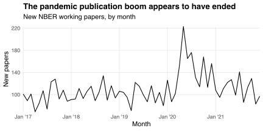
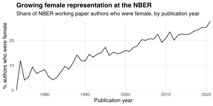

A new version of [nberwp](https://github.com/bldavies/nberwp), an R package containing data on [NBER working papers](https://www.nber.org/papers), is [available on CRAN](https://cran.r-project.org/package=nberwp).
This version adds information about (i) papers published in July--December 2021 and (ii) author sexes.

## Papers from late 2021

The second half of 2021 saw 649 new NBER working papers by 1,663 unique authors, 503 of whom had not published in the series previously.
Those counts were down (from 858, 2,094, and 683, respectively) from the second half of 2020, but roughly in-line with pre-pandemic trends:

nberwp 1.1.0 also corrects some [false merges and splits](/blog/nber-co-authorships/) among authors who published *before* July 2021.
These corrections lowered the number of such authors from 15,437 in version 1.0.0 to 15,430 in version 1.1.0.

## Author sexes

nberwp 1.1.0 adds information about author sexes, allowing one to, e.g., visualize the growing [female representation](/blog/female-representation-collaboration-nber/) among NBER working paper authors:

I obtain sex information by matching authors' names with baby name and Facebook data, and through manual identification.
I document my matching and manual procedures in "[Sex-based sorting among economists: Evidence from the NBER](https://doi.org/10.31235/osf.io/zeb7a)," a new paper comparing males' and females' co-authorship patterns.

