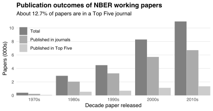
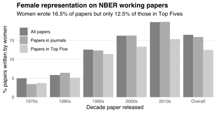
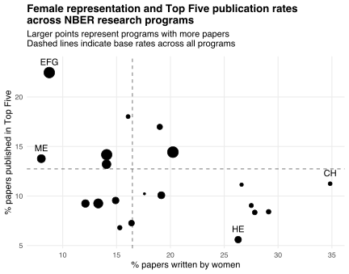

The latest version of [nberwp](https://github.com/bldavies/nberwp) (1.2.0) contains information on where NBER working papers are published:

|Outlet            | Papers| Share (%)|
|:-----------------|------:|---------:|
|Top Five journals |  3,832|      12.7|
|Other journals    | 14,792|      49.2|
|Book/chapters     |  3,096|      10.3|
|Unpublished       |  8,363|      27.8|

About 62% of working papers are published or forthcoming in peer-reviewed journals.
One in five of these papers are in the "Top Five:" the [*American Economic Review*](https://www.aeaweb.org/journals/aer), [*Econometrica*](https://www.econometricsociety.org/publications/econometrica/browse), the [*Journal of Political Economy*](https://www.journals.uchicago.edu/loi/jpe), the [*Quarterly Journal of Economics*](https://academic.oup.com/qje/issue), and the [*Review of Economic Studies*](https://academic.oup.com/restud/issue).
These journals are the tallest peaks in the world of economic research.
Publishing in them [can be vital for career progression](https://www.aeaweb.org/research/charts/publishing-promotion-economics-top-five).

The chart below counts papers by decade and publication outcome.
As the number of NBER working papers grew, so did the number appearing in journals and the Top Five.
Yet the space available in Top Fives was relatively constant between the 1970s and 2010s ([Card and DellaVigna, 2013](https://doi.org/10.1257/jel.51.1.144)).
NBER working papers occupied an increasing share of that space.

Why are so many NBER working papers in the Top Five?
Here are four possible reasons:

1. The NBER working paper series is among [the most read series](https://logec.repec.org/scripts/seriesstat.pf) in economics.
  More readers means more feedback, which helps authors improve their papers and make them Top Five-worthy.
2. Each paper has an NBER-affiliated author.
  "Affiliates are selected through a rigorous and competitive process" (see [here](https://www.nber.org/affiliated-scholars)).
  This process may select authors more willing and able to pursue Top Five publications.
3. NBER working papers tend to apply cutting-edge methods to policy-relevant issues.
  This makes papers attractive to Top Five editors, who want to publish frontier, impactful research.
4. Top Five editors tend to be NBER affiliates.
  Club co-membership might help authors during peer-review.

## Gender differences

nberwp contains information on author genders, so we can compare the representation of women among papers with different publication outcomes.
Here's one approach:

1. Compute the fraction of authors on each paper who were women.
2. Sum these fractions across all papers.
3. Divide by the number of papers.

These three steps deliver an estimate of the share of papers written by women.
This estimate equals 16.5% across all NBER working papers.
The chart below separates by decade and publication outcome.
Female representation grew over time, both overall and among papers published in journals.
But the growth was slower among papers published in the Top Five.
Women were consistently less represented among papers published in the Top Five than among other papers.
Overall, only 12.5% of NBER working papers in the Top Five were written by women.

What explains the relative gender gap for papers in the Top Five?
Perhaps it reflects what men and women write about.
One way to explore this is to compare female representation and Top Five publication rates across the NBER's [research programs](https://www.nber.org/programs-projects/programs-working-groups), which "correspond loosely to traditional field[s] of study within economics."
I present that comparison in the chart below.[^next-post]
The horizontal axis measures female representation using the estimator defined above; the vertical axis measures the share of papers in each program published in the Top Five.

[^next-post]: I compare publication rates among men and women *within* each program [here](/blog/gender-differences-publication-rates-nber-programs).

Programs with lower female representation tend to have proportionally more papers in the Top Five.
The Monetary Economics (ME) program, which has the lowest female representation, has more papers in the Top Five than the program on Children (CH), which has the highest female representation.
Papers in the Economic Fluctuations and Growth (EFG) program tend to focus on "big picture" questions and often land in Top Fives.
Papers in the Health Economics (HE) program tend to focus on more specific questions, and often land in field or medical journals.
But papers in the HE program are about three times as likely to be written by women than are papers in the EFG program.
This difference in likelihoods contributes to lower female representation among NBER working papers published in the Top Five.

But *why* are the likelihoods different?
Why do proportionally fewer women write papers on growth than on children?
Perhaps this reflects what men and women enjoy researching.
But, again, publishing in the Top Five can be vital for career progression.
So, at the margin, I'd expect researchers to choose topics more likely to land in Top Five journals.
These choices do not appear in my data.
I'm interested to learn more---[reach out](mailto:bldavies@stanford.edu) if you are too.

