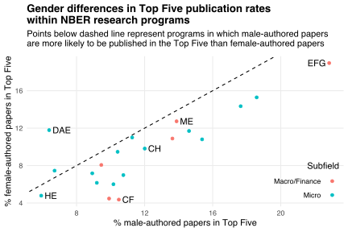
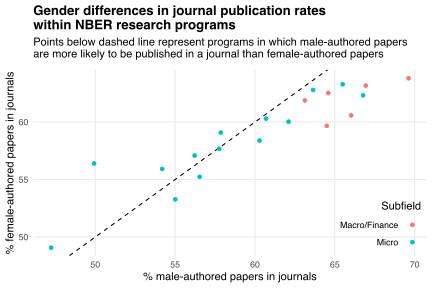

My [previous post](/blog/publication-outcomes-nber-working-papers/) showed that NBER research programs with higher female representation tend to have fewer papers published in the "Top Five" economics journals.
A reader suggested comparing Top Five publication rates among men and women *within* each program.
This comparison reveals whether men and women publish at different rates despite writing about similar topics.
Here's the chart:

Most points lie below the dashed diagonal line.
Such points represent programs in which male-authored papers are more likely to be in Top Fives than female-authored papers.
This "male premium" in Top Five publication rates doesn't appear to differ between programs in the "Micro" and "Macro/Finance" subfields defined in [Davies (2022)](https://doi.org/10.31235/osf.io/zeb7a).
The premium is largest for the Corporate Finance (CF) program and most negative for the Development of the American Economy (DAE) program.

How do these patterns compare to publication rates across *all* journals?
Here's the corresponding chart:

Looking at all journals, rather than only Top Fives, lowers the "male premium" in publication rates.
It also reveals differences between subfields: some Micro programs have negative premia, but all Macro/Finance programs have positive premia.

What explains these patterns?
Here are two theories:

1. Women submit papers to Top Fives less often.
  This would be consistent with evidence that women shy away from competition relative to equally competent men (see, e.g., [Niederle and Vesterlund, 2011](https://doi.org/10.1146/annurev-economics-111809-125122)).
2. Top Five referees and editors discriminate against women.
  This would be consistent with evidence that women are held to higher editorial standards ([Card et al., 2020](https://doi.org/10.1093/qje/qjz035); [Hengel, 2017](https://ideas.repec.org/p/cam/camdae/1753.html)).

Unfortunately I can't test these theories with my data.
I observe publication outcomes, but not journal submissions or referee/editor biases.
And the two theories aren't mutually exclusive: women may submit less often *because* they anticipate discrimination.

