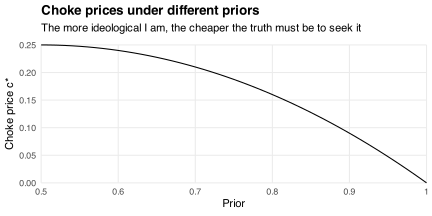
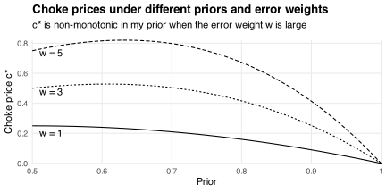

In a [previous post](/blog/truth-seekers-ideologues/), I showed that if the truth doesn't matter then I'm better off being an ideologue with ideological friends.
I discussed the trade-off between (i) experiencing reality and (ii) experiencing what my friends experience.
Truth-seeking made sense only when the benefit of (i) exceeded the cost of forgoing (ii).
This post discusses another cost of truth-seeking: having to pay---financially, cognitively, or emotionally---for information.

One way to model that cost is as follows.
Suppose the truth is determined by a random variable `\(\theta\in\{0,1\}\)`.
I learn about `\(\theta\)` by observing a signal `\(s(x)\in\{0,1\}\)` with precision
`$$\Pr(s(x)=\theta)=\frac{1+x}{2}.$$`
The parameter `\(x\in[0,1]\)` determines the signal's quality.
If `\(x=1\)` then the signal is fully informative; if `\(x=0\)` then it is uninformative.

My prior estimate `\(\theta_0\in[0.5,1]\)` of `\(\theta\)` is based on no information; it reflects my ideology.
I use the realization of `\(s(x)\)` and my prior `\(\theta_0\)` to form a posterior estimate
`$$\hat\theta(s(x))=\Pr\left(\theta=1\,\vert\,s(x)\right)$$`
via [Bayes' rule](/blog/learning-noisy-signals/).
I care about the [mean squared error](https://en.wikipedia.org/wiki/Mean_squared_error)
`$$\newcommand{\E}{\mathrm{E}}
\newcommand{\MSE}{\mathrm{MSE}}
\MSE(x)=\E\left[\left(\theta-\hat\theta(s(x))\right)^2\right]$$`
of my posterior estimate, where `\(\E\)` is the expectation operator taken with respect to the joint distribution of `\(\theta\)` and `\(s(x)\)` given my prior `\(\theta_0\)`.
But I also care about the cost `\(cx\)` I endure from observing a signal of quality `\(x\)`.
This cost reflects the resources I use to seek the information and process it (e.g., money, time, and mental energy).
I choose the quality `\(x^*\)` that minimizes
`$$f(x)=\MSE(x)+cx.$$`
The chart below plots my objective `\(f(x)\)` against `\(x\)` when I have prior `\(\theta_0\in\{0.5,0.7,0.9\}\)` and face marginal cost `\(c\in\{0,0.1,0.2,0.3\}\)`.
Since `\(f\)` is concave in `\(x\)`, it has (constrained) local minima at `\(x=0\)` and `\(x=1\)`.
My choice between these minima depends on the value of `\(c\)`.
If it's small then information is cheap and I "buy" as much as I can.
If it's large then information is expensive and I don't buy any.
But there's no middle ground: I seek *all* the truth or none of it.

Let `\(c^*\)` be the threshold value of `\(c\)` at which I stop paying for information: the "choke price" of truth.
How does `\(c^*\)` depend on my prior `\(\theta_0\)`?
Intuitively, increasing `\(\theta_0\)` has two competing effects:

1. it increases the error in my posterior estimate when `\(\theta=0\)`;
2. it increases my confidence that `\(\theta=1\)`.

The first effect makes me *want more* information, increasing `\(c^*\)`.
The second effect makes me think I *need less* information, decreasing `\(c^*\)`.
The chart below shows that the second effect dominates.
The more ideological I am about the value of `\(\theta\)`, the cheaper the truth must be for me to seek it.
If I'm a pure ideologue (i.e., `\(\theta_0=1\)`) then I won't seek the truth even if it's free.

One reason the first effect might dominate is if I care about errors when `\(\theta=0\)` more than when `\(\theta=1\)`.
For example, if `\(\theta\)` indicates whether it will be sunny then I'd rather bring an umbrella I don't use than be caught wearing flip-flops in the rain.
I can capture that asymmetry by replacing the MSE component of my objective with a weighted version
`$$\newcommand{\WMSE}{\mathrm{WMSE}}
\WMSE(x)=\E\left[W(\theta)\cdot\left(\theta-\hat\theta(s(x))\right)^2\right],$$`
where the weighting function
`$$W(\theta)=\begin{cases}
1 & \text{if}\ \theta=1 \\
w & \text{if}\ \theta=0
\end{cases}$$`
has `\(w\ge1\)`.
Increasing `\(w\)` nudges my optimal posterior estimate towards zero because I want to avoid being "confidently wrong" when `\(\theta=0\)`.
Since `\(\WMSE(x)\)` is concave in `\(x\)`, I still optimally pay for all the truth or none of it.
But now the choke price `\(c^*\)` at which I stop paying for the truth depends on my prior `\(\theta_0\)` *and* the error weight `\(w\)`.

The chart below shows that `\(c^*\)` is non-monotonic in `\(\theta_0\)` when `\(w\)` is large.
This is due to the two competing effects described above.
The first effect dominates when `\(w\)` is large and my prior is low.
In that case, it's really bad to be wrong and I'm not confident I'll be right.
Whereas the second effect dominates when `\(w\)` is large and my prior is high.
In that case, I'm so confident I'll be right that I don't care what happens if I'm wrong.

This example raises a philosophical question: what does it mean for the estimate to be "wrong?"
For example, suppose I thought there was a 30% chance of rain.
If it rained, was I wrong?
What if I thought there was a 5% chance?
A 95% chance?
Where should I draw the line?
On those questions, I recommend Michael Lewis' discussion with Nate Silver about 17 minutes into [this podcast episode](https://www.pushkin.fm/podcasts/against-the-rules/respect-the-polygon).

