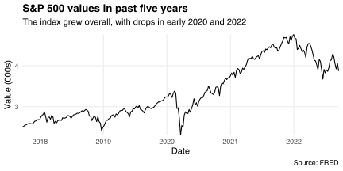
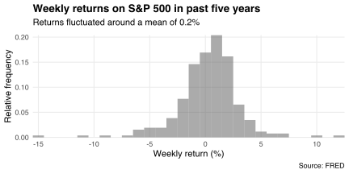
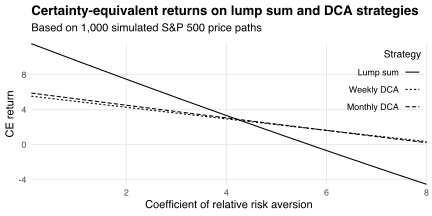
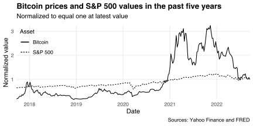
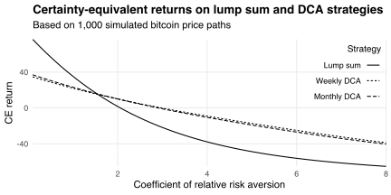

[Dollar cost averaging](https://en.wikipedia.org/wiki/Dollar_cost_averaging) (DCA) is a way to split a lump sum investment into many smaller investments.
It involves regular purchases of a fixed *value* (rather than *quantity*) of shares.
This leads to buying more shares when their price is low and fewer when their price is high.
DCA is less risky than investing the lump sum because:

1. it reduces the chance of buying lots of shares before their price rises or falls;
2. it reduces the time that invested cash spends earning capital gains and losses.

But DCA is also less rewarding if prices trend upward because uninvested cash does not earn capital gains.
In that case, choosing between DCA and lump sum investment requires trading off risks and rewards.

For example, suppose I have some cash to invest in a market index: the [S&P 500](https://en.wikipedia.org/wiki/S%26P_500).
Here's how that index evolved over the past five years (based on week-closing values from [FRED](https://fred.stlouisfed.org/series/SP500)):

The index grew overall, with a sharp drop at the start of the pandemic and slower drop at the start of this year.
The weekly return fluctuated around a mean of 0.2%:

Let's assume future weekly returns will follow this distribution.
Should I invest all my cash now (the "lump sum" strategy) or split it into equal weekly investments (the "weekly DCA" strategy)?
How about equal monthly investments (the "monthly DCA" strategy)?

We can answer these questions via simulation:[^assumptions]

[^assumptions]: I assume my uninvested cash earns interest at the inflation rate.
This means I can treat the simulated prices as real.
I also assume there are no transaction costs or brokerage fees.

1. Sample 52 values from the S&P 500's weekly return distribution.
2. Take the cumulative product of those returns to get a simulated price path.
3. Divide the cash invested each week by the simulated price for that week to get the number of shares bought that week.
4. Multiply the total number of shares bought by the price in the 52nd week to get the investments' final value.
5. Divide the final value by the amount of cash invested to get the annual return.

Repeating these five steps many times yields a distribution of annual returns offered by each strategy.
I compare those distributions in the table below, based on 1,000 simulated price paths.

|Strategy    |  Mean| Std. dev.|   Min.|  Max.|
|:-----------|-----:|---------:|------:|-----:|
|Lump sum    | 11.8%|     22.2%| -46.1%| 95.0%|
|Weekly DCA  |  5.6%|     11.9%| -26.1%| 56.2%|
|Monthly DCA |  6.0%|     12.5%| -27.0%| 57.3%|

The return on the lump sum strategy has the highest mean and variance.
Investing all my cash in the first week gives me more time "in the market" earning capital gains, but exposes me to lots of random gains and losses.
Investing in smaller chunks limits my exposure to gains and losses, narrowing the distribution of annual returns.

So, should I dollar cost average or not?
The answer depends on my risk tolerance.
If I don't care about risk then I should choose the strategy with the highest mean return.
But if I'm risk averse then I need to paid a [risk premium](https://en.wikipedia.org/wiki/Risk_premium).
The more risk averse I am and the riskier the strategy, the higher the risk premium.
I should choose the strategy with the highest return net of its risk premium.
This net, "certainty-equivalent" (CE) return equals the return on a riskless strategy that makes me indifferent between using it and using the risky strategy.

For example, the chart below plots the CE return on each strategy when I have [constant relative risk aversion](https://en.wikipedia.org/wiki/Risk_aversion#Relative_risk_aversion).
When my risk aversion is low, I prefer investing the lump sum.
But when my risk aversion is high, I prefer investing in smaller chunks.
Weekly and monthly chunks appear to deliver similar CE returns in my simulations.

The risk aversion level that makes me prefer DCA depends on the asset I invest in.
For example, suppose I'd rather invest in [bitcoin](https://en.wikipedia.org/wiki/Bitcoin).
Its recent prices were much more volatile than the S&P 500 (according to week-closing values from [Yahoo Finance](https://finance.yahoo.com/quote/BTC-USD/history?p=BTC-USD)):

Investing in bitcoin offered a mean weekly return of 1.3% in the past five years, six times that of the S&P 500.
But bitcoin's returns were riskier: they had a standard deviation of 11.0%, whereas the S&P 500's returns had a standard deviation of 2.8%.

The chart below compares the lump-sum, weekly DCA, and monthly DCA strategies for investing in bitcoin.
It shows the certainty-equivalent return on each strategy, based on 1,000 price paths simulated using the five steps described above.
My decision rule is the same as when investing in the S&P 500: use DCA if I'm sufficiently risk averse.
But the "sufficient" level of risk aversion for bitcoin is lower than for the S&P 500.
This is because bitcoin is riskier: its risk premium is a larger share of its mean return.

One benefit of DCA that my simulations don't capture is its simplicity: I don't have to think about *when* to invest the lump sum.
Indeed DCA removes the temptation to [time the market](https://en.wikipedia.org/wiki/Market_timing) that leads many investors astray.

---

*Disclaimer: I am not a financial advisor and this post is not financial advice.
Do you own research on the investments that feel right to you.
Don't invest money you can't afford to lose.*

