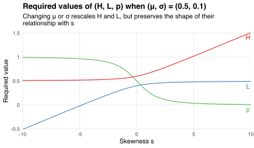

This post shows how binary random variables can be defined by their mean, variance, and skewness.
I use this fact to explain why variance does not (always) measure "riskiness."

Suppose I'm defining a random variable `\(X\)`.
It takes value `\(H\)` or `\(L<H\)`, with `\(\Pr(X=H)=p\)`.
I want `\(X\)` to have mean `\(\mu\)`, variance `\(\sigma^2\)`, and [skewness coefficient](https://en.wikipedia.org/wiki/Skewness#Fisher's_moment_coefficient_of_skewness)
`$$\DeclareMathOperator{\E}{E}
s\equiv\E\left[\left(\frac{X-\mu}{\sigma}\right)^3\right].$$`
The target parameters `\((\mu,\sigma,s)\)` uniquely determine `\((H,L,p)\)` via
`$$\begin{align}
H &= \mu+\frac{s+\sqrt{s^2+4}}{2}\sigma \\
L &= \mu+\frac{s-\sqrt{s^2+4}}{2}\sigma \\
p &= \frac{2}{4+s\left(s+\sqrt{s^2+4}\right)}.
\end{align}$$`

For example, if I want `\(X\)` to be symmetric (i.e., to have `\(s=0\)`) then I have to choose `\((H,L,p)=(\mu+\sigma,\mu-\sigma,0.5)\)`.
Increasing the target skewness `\(s\)` makes the upside `\((H-\mu)\)` larger but less likely, and the downside `\((\mu-L)\)` smaller but more likely:

This mapping between `\((\mu,\sigma,s)\)` and `\((H,L,p)\)` is useful for generating examples of "risky" gambles.
Intuition suggests that a gamble is less risky if its payoffs have lower variance.
But [Rothschild and Stiglitz (1970)](https://doi.org/10.1016/0022-0531(70)90038-4) define a gamble `\(A\)` to be less risky than gamble `\(B\)` if every [risk averse](https://en.wikipedia.org/wiki/Risk_aversion) decision-maker (DM) prefers `\(A\)` to `\(B\)`.
These two definitions of "risky" agree when

1. payoffs are normally distributed, or
2. DMs have quadratic utility functions.

Under those conditions, DMs' expected utility depends only on the payoffs' mean and variance.
But if neither condition holds then DMs also care about payoffs' skewness.
We can demonstrate this using binary gambles.
Consider these three:

* Gamble `\(A\)`'s payoffs have mean `\(\mu_A=10\)`, variance `\(\sigma_A^2=36\)`, and skewness `\(s_A=0\)`;
* Gamble `\(B\)`'s payoffs have mean `\(\mu_B=10\)`, variance `\(\sigma_B^2=144\)`, and skewness `\(s_B=5\)`;
* Gamble `\(C\)`'s payoffs have mean `\(\mu_C=10\)`, variance `\(\sigma_C^2=9\)`, and skewness `\(s_C=-3\)`.

The means are the same but the distributions are different.
Gamble `\(i\in\{A,B,C\}\)` gives me a random payoff `\(X_i\)`, which equals `\(H_i\)` with probability `\(p_i\)` and `\(L_i\)` otherwise.
We can compute the `\((H_i,L_i,p_i)\)` using the target parameters `\((\mu_i,\sigma_i,s_i)\)` and the formulas above:

| Gamble `\(i\)` | `\(H_i\)` | `\(L_i\)` | `\(p_i\)` |
|:----------:|:-----:|:-----:|:-----:|
|    `\(A\)`     | 16.00 | 4.00  | 0.50  |
|    `\(B\)`     | 72.31 | 7.69  | 0.04  |
|    `\(C\)`     | 10.91 | 0.09  | 0.92  |

Gamble `\(A\)` offers a symmetric payoff: its upside `\((H_A-\mu_A)\)` and downside `\((\mu_A-L_A)\)` are equally large and equally likely.
Gamble `\(B\)` offers a positively skewed payoff: a large but unlikely upside, and a small but likely downside.
Gamble `\(C\)` offers a negatively skewed payoff: a small but likely upside, and a large but unlikely downside.

These upsides and downsides affect my preferences over gambles.
Suppose I get utility `\(u(x)\equiv\log(x)\)` from receiving payoff `\(x\)`.
Then gamble `\(A\)` gives me expected utility
`$$\begin{align}
\E[u(X_A)]
&\equiv p_Au(H_A)+(1-p_A)u(L_A) \\
&= 0.5\log(16)+(1-0.5)\log(4) \\
&= 2.08,
\end{align}$$`
while `\(B\)` gives me `\(\E[u(X_B)]=2.12\)` and `\(C\)` gives me `\(\E[u(X_C)]=1.99\)`.
So I prefer gamble `\(B\)` to `\(A\)`, even though `\(B\)`'s payoffs have four times the variance of `\(A\)`'s.
I also prefer `\(B\)` to `\(C\)`, even though `\(B\)`'s payoffs have *sixteen* times the variance of `\(C\)`'s.
How can I be risk averse---that is, have a concave utility function---but prefer gambles with higher variance?
The answer is that I also care about skewness: I prefer gambles with large upsides and small downsides.
These "sides" of risk are not captured by variance.

So is gamble `\(C\)` "riskier" than gambles `\(A\)` and `\(B\)`?
Rothschild and Stiglitz wouldn't say so.
To see why, suppose my friend has utility function `\(v(x)=\sqrt{x}\)`.
Then gamble `\(A\)` gives him expected utility `\(\E[v(X_A)]=3\)`, while `\(B\)` gives him `\(\E[v(X_B)]=2.98\)` and `\(C\)` gives him `\(\E[v(X_C)]=3.05\)`.
My friend and I have *opposite* preferences: he prefers `\(C\)` to `\(A\)` to `\(B\)`, whereas I prefer `\(B\)` to `\(A\)` to `\(C\)`.
But we're both risk averse: our utility functions are both concave!
Thus, it isn't true that *every* risk-averse decision-maker prefers `\(A\)` or `\(B\)` to `\(C\)`.
Different risk-averse DMs have different preference rankings.
This makes the three gambles incomparable under Rothschild and Stiglitz's definition of "risky."

